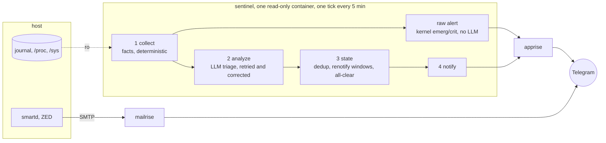

# OpsNanny

  [](#state-of-this-project) [](https://github.com/thiscantbeserious/ops-nanny/actions/workflows/ci.yml) 

   

 


### 24/7 AI Server-Supervisor

It watches the systemd journal,
disk health, ZFS pool state, and hardware sensors, turns what it finds into
a plain-language report, and delivers that report to Telegram.

Built on strong isolation principles with a deterministic first approach that doesn't stop when connection to the LLM-Engine gets lost.

It currently never writes to the host it watches. There is no remediation, no
self-healing, no action taken on your behalf, only observation and
notification. If a disk is failing, this tells you.

## Status

**I'm testing this with my real data on my Backup-Server**. To ensure stability this repo tests via real e2e-VM images to ensure we're not breaking any sensitive stuff with updates randomly (will exercise a full install from scratch). This will support interaction soon ("Did anything happen in the last week that needs my attention?"), might do Layer 3 meshing later. Not sure about self-healing or control-layers ... I'm not taking any PR's due to Security Reasons, neither will I randomly support other Chat Integrations (Slack might be supported later).

## 1. Check (read properly)

```bash
curl -fsSL https://raw.githubusercontent.com/thiscantbeserious/ops-nanny/main/install.sh | sudo bash -s -- --dry-run
```

## 2. Install (should be run interactively)

```bash
curl -fsSL https://raw.githubusercontent.com/thiscantbeserious/ops-nanny/main/install.sh | sudo bash
```

## 3. Run (and move away)
```bash
cd /opt/sentinel && docker compose up -d
```

The installer creates the compose stack and installs `rasdaemon` and
`lm-sensors`. Wiring `smartd` and ZED to send mail is asked separately and
defaults to no, and on a host that manages those files itself, such as
OpenMediaVault, it declines rather than asking, because overwriting them
would be reverted by the platform and could displace configuration you rely
on. Re-run it after `docker compose up -d` to seed apprise.

The stack directory is auto-detected: an OpenMediaVault compose root is used
when one is found, `/opt/sentinel` otherwise, and `--stack-dir` overrides
both. Details, including verifying delivery actually works:
[deploy/README.md](deploy/README.md).

## What it watches

- **The systemd journal**, kernel lines at `emerg`/`alert`/`crit` priority,
  `smartd` and ZED log entries, service failures.
- **`smartd`**, SMART health and pending/reallocated sector counts, per disk.
- **ZFS (`zed`)**, pool state, scrub results, checksum/degraded events.
- **`lm-sensors`**, temperatures, voltages, fan speeds.
- **`rasdaemon`**, MCE, ECC, and PCIe AER hardware error events.

Facts are collected deterministically, then handed to an LLM (Antigravity
CLI) for classification and a written recommendation, trend vs. transient,
what it means, what to check next. The LLM never runs commands and has no
access to the host beyond the facts it is given.

## The hardware alerting path does not depend on the LLM

This is the property that separates it from piping logs at a model and
hoping. `smartd` and ZED talk SMTP straight to the notification stack, with
no supervisor process and no LLM in that path at all. And inside the
supervisor itself, a kernel line at `emerg`/`alert`/`crit` is forwarded
immediately, unanalyzed, the moment it's seen, before the LLM step even
runs. If the analyzer is down, unreachable, unauthenticated, or returns
garbage, hardware alerts still arrive; only the triage and recommendation
text is lost. The LLM adds interpretation on top of a path that already
works without it, it is never the thing standing between a failing disk
and a notification.

## Architecture



Two paths reach Telegram without the LLM: `smartd` and ZED mail straight to
mailrise, and a kernel line at `emerg`, `alert` or `crit` forwarded by the raw
alert step inside the tick. The analyzer adds interpretation on top of those.

`sentinel` runs unprivileged, `read_only: true`, every mount but its own
state directory `:ro`. `apprise` holds the Telegram credential; the
supervisor never does. Full design and the reasoning behind each of these
choices: [ARCHITECTURE.md](ARCHITECTURE.md). Field-level behavior of every
component: [CONTRACTS.md](CONTRACTS.md) and [contracts/](contracts/).

## State of this project

The image builds, passes its test suite (unit, container and VM end-to-end,
including live checks against real `apprise`/`mailrise`/`msmtp`
containers), and publishes to GHCR for both `amd64` and `arm64`. It has
been running on a real OpenMediaVault NAS since late August 2026 under the
production security flags.

What the first days in the field showed, and what changed because of it:

- It finds real things. The analyzer surfaced a Samba Time Machine
  sparsebundle metadata error, collectd RRD timestamp races, a load spike,
  and a failed `sudo` attempt by the operator's own tooling, each classified
  as a first occurrence rather than a trend.
- It was too talkative. The quiet-tick "all systems normal" finding and every
  resolved watch each produced a message; both are gone, the daily heartbeat
  is the only routine message, and all-clears are sent for alerts only.
- The analyzer failed on a third to two thirds of ticks. The causes were
  found in order: a container pinned at its memory limit and timeouts too
  short for the prompt sizes, failures logged without their reason, and the
  model asking to run shell commands that the tool-deny policy refuses. The
  limits are raised, agy's own error text is logged, and a failed attempt is
  retried up to three times inside one time budget with a correction that
  names what went wrong.

Still open, tracked as issues: no dead-man's switch (a dead host is noticed
only by the missing daily heartbeat), no deterministic rule engine for
serious failures when the analyzer is down, unbounded growth of agy's
working state, and whether the raised memory limit is sufficient rather than
merely larger. No disk has failed under it, so the hardware-alerting path
has been exercised by the deterministic raw-alert path and by synthetic
events only. Treat it as prerelease until that changes.

## License

Copyright (C) 2026 Simon Sanladerer

Licensed under the **GNU Affero General Public License v3.0 only**
([LICENSE](LICENSE)). Free to use, run, and modify, for individuals and
companies alike, including commercially and in production. The condition is
reciprocity: if you distribute a modified version, or run one as a network
service others use, the corresponding source of your version has to be
available to those users under the same license.

Contributions are accepted under the same license (inbound = outbound).
