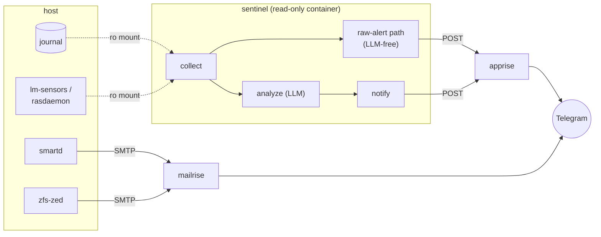

# agentic-server-supervisor

A read-only supervisor for a Linux host. It watches the systemd journal,
disk health, ZFS pool state, and hardware sensors, turns what it finds into
a plain-language report, and delivers that report to Telegram.

It never writes to the host it watches. There is no remediation, no
self-healing, no action taken on your behalf, only observation and
notification. If a disk is failing, this tells you; it does not touch the
disk.

## Run it

See what it would do, first. Nothing is written and nothing is installed:

```bash
curl -fsSL https://raw.githubusercontent.com/thiscantbeserious/agentic-server-supervisor/main/install.sh | sudo bash -s -- --dry-run
```

Then run it for real. It prompts for the stack directory (offering what it
detected), a Telegram bot token, a chat id, and a mailrise password:

```bash
curl -fsSL https://raw.githubusercontent.com/thiscantbeserious/agentic-server-supervisor/main/install.sh | sudo bash
```

Then bring the stack up, from the directory the installer reports:

```bash
cd /opt/sentinel && docker compose up -d
```

The installer creates the compose stack and installs `rasdaemon` and
`lm-sensors`. Wiring `smartd` and ZED to send mail is asked separately and
defaults to no, and on a host that manages those files itself, such as
OpenMediaVault, it declines rather than asking, because overwriting them
would be reverted by the platform and could displace configuration you rely
on. Re-run it after `docker compose up -d` to seed apprise.

The stack directory is auto-detected: an OpenMediaVault compose root is used
when one is found, `/opt/sentinel` otherwise, and `--stack-dir` overrides
both. Details, including verifying delivery actually works:
[deploy/README.md](deploy/README.md).

## What it watches

- **The systemd journal**, kernel lines at `emerg`/`alert`/`crit` priority,
  `smartd` and ZED log entries, service failures.
- **`smartd`**, SMART health and pending/reallocated sector counts, per disk.
- **ZFS (`zed`)**, pool state, scrub results, checksum/degraded events.
- **`lm-sensors`**, temperatures, voltages, fan speeds.
- **`rasdaemon`**, MCE, ECC, and PCIe AER hardware error events.

Facts are collected deterministically, then handed to an LLM (Antigravity
CLI) for classification and a written recommendation, trend vs. transient,
what it means, what to check next. The LLM never runs commands and has no
access to the host beyond the facts it is given.

## The hardware alerting path does not depend on the LLM

This is the property that separates it from piping logs at a model and
hoping. `smartd` and ZED talk SMTP straight to the notification stack, with
no supervisor process and no LLM in that path at all. And inside the
supervisor itself, a kernel line at `emerg`/`alert`/`crit` is forwarded
immediately, unanalyzed, the moment it's seen, before the LLM step even
runs. If the analyzer is down, unreachable, unauthenticated, or returns
garbage, hardware alerts still arrive; only the triage and recommendation
text is lost. The LLM adds interpretation on top of a path that already
works without it, it is never the thing standing between a failing disk
and a notification.

## Architecture



`sentinel` runs unprivileged, `read_only: true`, every mount but its own
state directory `:ro`. `apprise` holds the Telegram credential; the
supervisor never does. Full design and the reasoning behind each of these
choices: [ARCHITECTURE.md](ARCHITECTURE.md). Field-level behavior of every
component: [CONTRACTS.md](CONTRACTS.md) and [contracts/](contracts/).

## State of this project

The image builds, passes its test suite (including live checks against
real `apprise`/`mailrise`/`msmtp` containers), and publishes to GHCR for
both `amd64` and `arm64`. It has not yet completed a real rollout: no run
has reached the success path outside a container, and the extended trial
that would confirm it behaves correctly against real hardware over real
time has not happened. Treat it accordingly until that changes.
