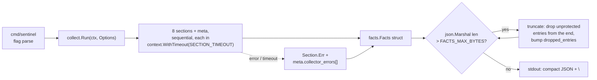

# Contract: collect (Go)

> Conventions C1–C9 in [CONTRACTS.md](../CONTRACTS.md) are binding and win on conflict. Read them first.

`sentinel collect` — deterministic, read-only, no LLM. Implements PLAN §2.1; satisfies A1, A2, A8; feeds ARCHITECTURE §5 rows "facts.json > 256 KB" and "Collector section failed". Wire contract: `internal/facts/facts.schema.json`.



### 0. Deviations from the original bash contract (forced by review; do not revert)

| # | Bash spec said | Now | Source |
|---|---|---|---|
| D1 | one `HOST_JOURNAL_DIR` with children `persistent/`, `volatile/` | two vars, `HOST_JOURNAL_DIR` (host `/var/log/journal`) and `HOST_JOURNAL_VOLATILE_DIR` (host `/run/log/journal`); both queried, results merged and de-duplicated on `(ts, message)` — not a fallback chain | consistency 3+4, gaps 2 |
| D2 | truncation drops the newest entries unconditionally | entries with `priority <= RAW_ALERT_MAX_PRIORITY` are **never** dropped in the normal loop; hard truncation keeps the `RAW_ALERT_MAX_LINES` newest protected kernel entries | gaps 8, consistency 35 |
| D3 | deep `history[]` `ts` came from the report body | `ts` is derived from the history **filename** (`<unix-seconds,10>-<tick_seq,6>.json`), falling back to the file mtime when the name does not match | consistency 11, gaps 10, minor note on volume restore |
| D4 | deep `zfs` had no SMART/dmesg context | deep `zfs` additionally emits `smart_entries[]` and `kernel_entries[]` over `DEEP_WINDOW` | gaps 17 (PLAN §2.1) |
| D5 | `/host/sys` is collect's read surface "via sensors" | collect does **not** remap sysfs. `sensors` reads the container's own `/sys`, which is the host kernel's sysfs (hwmon is not namespaced). `$HOST_ROOT`/`/host/sys` are not used by the `sensors` section | consistency 33, gaps 16 |
| D6 | `df -P`, `ls`, `head -c`, `jq` | `syscall.Statfs` + `$HOST_PROC/mounts`, `os.ReadDir`, byte-budget truncation on the marshaled section, `encoding/json` | binding tech decision |
| D7 | "output validated against facts.schema.json" at runtime | shape is guaranteed by the typed structs; schema validation runs in `go test` only | gaps 20 |
| D8 | collect owns `$STATE_DIR/tick-seq` | `internal/runtime` owns it. `collect.Run` receives `Seq int64` and writes **no** sequence file | consistency 21, gaps 5, 9 |
| D9 | "all sections failed ⇒ eight error objects" | **eight data sections + `meta`**; `meta` errors are additional | gaps 20 |
| D10 | malformed env ⇒ silent default + a `collector_errors[]` note | `internal/config.Load()` is the single loader; a malformed or out-of-range value is fatal, exit 78 naming the variable | consistency 41, gaps 15 |

**Normative for downstream consumers:** journal entries leave collect only in the normalized shape `{ts, priority, identifier, unit, message}`. `runtime` selects the raw-alert path with `.kernel.entries[].priority <= RAW_ALERT_MAX_PRIORITY` and renders `ts` directly.

### 1. CLI

```
sentinel collect [--deep zfs|smart|kernel|ras]
```

- `--deep <component>` takes exactly one of the four values. Any other value, a missing value, an unknown flag, or any positional argument ⇒ **exit 64**, usage on stderr, nothing on stdout.
- `--help` prints the usage block on **stderr** and exits 0 — stdout stays reserved for machine output (C7).
- Parsed with `flag.NewFlagSet("collect", flag.ContinueOnError)`, `SetOutput(io.Discard)`.
- Exactly one compact JSON object plus `\n` on stdout on success; stdout is never written on a non-zero exit. stdin is not read.

### 2. Inputs

Environment is read exclusively through `internal/config.Load()`. The variables collect consumes: `TICK_WINDOW`, `DEEP_WINDOW`, `SECTION_TIMEOUT`, `DEEP_TIMEOUT`, `FACTS_MAX_BYTES`, `SERVICES_MAX_BYTES`, `RAW_ALERT_MAX_PRIORITY`, `RAW_ALERT_MAX_LINES`, `STATE_DIR`, `HOST_JOURNAL_DIR`, `HOST_JOURNAL_VOLATILE_DIR`, `HOST_PROC`, `HOST_ROOT`, `HOST_RASDAEMON`, `SENTINEL_HOSTNAME`, `TZ`, `LOG_LEVEL`. A missing **mount** degrades to a section error; a malformed **variable** is exit 78 (D10).

`meta.hostname` is `Cfg.Hostname`. `internal/config` resolves it once, first non-empty wins: `$SENTINEL_HOSTNAME` → `$HOST_ROOT/etc/hostname` (trimmed) → `$HOST_PROC/sys/kernel/hostname` (trimmed) → `"unknown"`. This is the **only** hostname chain in the binary; `os.Hostname()` is never called anywhere (the container hostname is wrong).

**Files read (read-only)**

| Path | Section |
|---|---|
| `$HOST_JOURNAL_DIR`, `$HOST_JOURNAL_VOLATILE_DIR` (dirs, passed to `journalctl -D`) | kernel, ras, smart, zfs, services |
| `$HOST_RASDAEMON` (directory listing only — the SQLite DB is **never opened**, ARCHITECTURE §2.5) | ras |
| `$HOST_PROC/meminfo`, `loadavg`, `uptime`, `mounts` | resources |
| `$HOST_PROC/net/{tcp,tcp6,udp,udp6}` | network |
| `$HOST_PROC/spl/kstat/zfs/arcstats`, `$HOST_PROC/spl/kstat/zfs/` (dir listing) | zfs |
| `$HOST_ROOT/<mountpoint>` (`syscall.Statfs` only) | resources |
| `$STATE_DIR/baseline-ports` | network |
| `$STATE_DIR/history/*.json` | deep zfs only |

**Subprocesses** (`exec.CommandContext`, `cmd.WaitDelay = 2 * time.Second`, `cmd.Env = os.Environ()`, stdin `nil`, no shell, arguments never concatenated):
- `journalctl -D <dir> --since -<window> -o json --no-pager <filters...>`
- `sensors -j`

**Files written — exactly one:** `$STATE_DIR/baseline-ports`, tick mode, only when missing: `proto/port` per line, sorted, `\n`-terminated. Written per C4 (`os.CreateTemp($STATE_DIR, ".tmp-*")` → write → `Sync` → `Close` → `os.Rename`, mode `0o644`). Deep mode writes nothing. `$STATE_DIR` unwritable is **never fatal** for collect: the baseline is not created, `baseline_initialized` stays `false`, both diffs stay empty, and one `collector_errors[]` entry is appended. Exit code 69 belongs to the runtime preflight, not to `collect`.

### 3. Sections — exact behaviour

**Journal helper** (`internal/journal`): for each of `$HOST_JOURNAL_DIR`, `$HOST_JOURNAL_VOLATILE_DIR` that exists as a directory, run journalctl and stream-decode stdout with `json.Decoder`.

**Record cap.** Each query is bounded to `$JOURNAL_MAX_RECORDS` records (default 20000) and **keeps the NEWEST**, never the oldest: journalctl is invoked with `-n <JOURNAL_MAX_RECORDS>` so journald itself returns the most recent matching records, and the decoder additionally counts only **kept** records against the cap as a safety net. The remainder goes into that section's `dropped_entries` with `truncated: true`.

Keeping the newest is not interchangeable with §5's drop rule, which deliberately keeps the *oldest* entries. §5 can do that only because it states "the newest critical lines survive because the raw-alert path reads them" — a premise that holds solely while collect still *has* those lines. A read cap that discarded the newest would delete the active incident (the kernel panic happening right now) before either §5 or the raw-alert path ever saw it, and would do so silently. Read cap: newest wins. Byte-budget truncation: oldest wins. Both rules exist to protect the same lines.

Counting **kept** records rather than decoded ones also matters for `services`, which excludes `_TRANSPORT=kernel` records after decoding: counting excluded records against the cap would let a kernel log storm consume the entire budget and empty `failed_units` while reporting a corrupted `dropped_entries`. The decoder must then **drain stdout to EOF** (`io.Copy(io.Discard, stdout)`) before `cmd.Wait()`: journalctl blocks writing into a full 64 KB pipe buffer while the parent waits for it to exit, so abandoning the pipe early deadlocks the section until its timeout kills it. The same drain applies to every early exit from the decode loop, decode errors included. Without the cap, a 24h deep query on a busy host loads the whole journal into the heap and the OOM killer takes the container down — losing every alert, which is strictly worse than losing the oldest records of one query. Concatenate, sort by `ts` ascending (stable, ties broken by original order), de-duplicate on `(ts, message)`. Neither directory present ⇒ `ErrNoJournal` and the calling section records `"<dir> not readable"`.

**One directory failing does not discard the other.** If one of the two queries fails (permission denied, non-zero exit) while the other returned records, the section stays healthy with the records it got and appends a `collector_errors[]` entry naming the failed directory and reason. Only a failure of *every* directory fails the section. The persistent and volatile journals are two views of the same log: aborting the merge because the second one was unreadable would throw away entries — possibly `emerg` ones — that were already in hand.

**A mid-stream decode error is never silent.** `dec.Decode` returning anything other than `io.EOF` means the stream was corrupt or truncated: the remaining records are unread and must be accounted for. Drain the pipe, then fail the query with that error so the section reports it (§7 "anything else" ⇒ reason `err.Error()`, exit code 1). Treating a syntax error like a clean EOF would return a short slice with `err == nil` and `dropped == 0`, so every record after the corruption — including an `emerg` line — would vanish with no `truncated` flag, no `dropped_entries`, and no `collector_errors` row. Silence is the one failure mode this system may not have.

Normalization of one record into `facts.Entry`:

| facts field | journal field | rule |
|---|---|---|
| `ts` | `__REALTIME_TIMESTAMP` | microseconds since epoch, decimal string ⇒ `time.UnixMicro(n).UTC().Format(time.RFC3339)`; unparseable ⇒ record dropped |
| `priority` | `PRIORITY` | string or number ⇒ int 0..7; absent/unparseable ⇒ `6` |
| `identifier` | `SYSLOG_IDENTIFIER` | absent ⇒ `"-"` |
| `unit` | `_SYSTEMD_UNIT` | absent ⇒ `null` (the field is always present) |
| `message` | `MESSAGE` | string, **or** JSON array of byte values ⇒ `string([]byte{...})`; absent ⇒ `""` |

`_TRANSPORT` is decoded but never emitted (used by `services` only). Raw journal-export field names never leave `internal/journal`.

| # | Section | Source | Emitted fields |
|---|---|---|---|
| 1 | `kernel` | journal `-k -p err`, `TICK_WINDOW` | `count`, `truncated`, `dropped_entries`, `entries[]` |
| 2 | `ras` | journal `-t rasdaemon` **+** `os.ReadDir($HOST_RASDAEMON)` ⇒ `store[] {name,size,mtime}` (staleness evidence only, sorted by name) | `count`, `truncated`, `dropped_entries`, `entries[]`, `store[]` |
| 3 | `smart` | journal `-t smartd` | `count`, `truncated`, `dropped_entries`, `entries[]` |
| 4 | `sensors` | `sensors -j`, stdout into `map[string]any`; non-JSON stdout ⇒ section error `unparseable sensors output` (65) | `truncated`, `dropped_entries`, `chips` (verbatim document) |
| 5 | `zfs` | journal `-t zed` ⇒ `events[]`; `arc` = whitespace-split `$HOST_PROC/spl/kstat/zfs/arcstats` (skip the 2 header lines; field 1 = name, field 3 = value), keeping exactly `size, c, c_max, c_min, hits, misses, l2_size, l2_hits, l2_misses` as int64, missing key omitted; `pools[]` = names of directories directly under `$HOST_PROC/spl/kstat/zfs/`, sorted. **No `zpool` binary** (ARCHITECTURE §2.8) | `count`, `truncated`, `dropped_entries`, `events[]`, `arc`, `pools[]` |
| 6 | `resources` | `$HOST_PROC/mounts` ⇒ candidate mountpoints; skip fstypes in the pseudo-fs set `{proc, sysfs, devtmpfs, devpts, tmpfs, cgroup, cgroup2, mqueue, hugetlbfs, debugfs, tracefs, securityfs, pstore, bpf, configfs, fusectl, autofs, nsfs, ramfs, binfmt_misc, overlay, squashfs, efivarfs, rpc_pipefs, selinuxfs}` **and the remote-fs set `{nfs, nfs4, cifs, smb3, smbfs, ceph, glusterfs, fuse.sshfs, fuse.s3fs, fuse.rclone, afs, 9p}`** (see the note below); for each remaining mountpoint `m` call `syscall.Statfs(filepath.Join(HOST_ROOT, m))` — failure or `Blocks == 0` ⇒ skipped. `size_kb = Blocks*Bsize/1024`, `used_kb = (Blocks-Bfree)*Bsize/1024`, `avail_kb = Bavail*Bsize/1024`, `use_percent = ceil(used_kb*100 / (used_kb+avail_kb))` (0 when the denominator is 0). `mount` is the **host** path, `source` the mounts-file device field. Sorted by `mount`. `$HOST_PROC/meminfo` ⇒ `MemTotal, MemAvailable, MemFree, SwapTotal, SwapFree, Dirty` as kB int64. `$HOST_PROC/loadavg` ⇒ 5 fields. `$HOST_PROC/uptime` ⇒ field 1 truncated to int64 | `truncated`, `dropped_entries`, `filesystems[]`, `memory_kb`, `load`, `uptime_seconds` |
| 7 | `services` | journal `-p err`, then drop records with `_TRANSPORT == "kernel"` (covered by §1). `failed_units[]` = unique non-empty `unit` (fallback `identifier`) of entries whose `message` matches the compiled regexp `Failed to start\|entered failed state\|Start request repeated`, sorted. Then apply the `SERVICES_MAX_BYTES` budget to the marshaled `entries` array with the §5 drop rule | `count`, `truncated`, `dropped_entries`, `entries[]`, `failed_units[]` |
| 8 | `network` | parse `$HOST_PROC/net/{tcp,tcp6,udp,udp6}`, skipping the header line. Listening = TCP state `0A`, UDP state `07`. `addr` = hex local address before the `:`, verbatim; `port` = `strconv.ParseUint(hexAfterColon, 16, 16)`. Unique-sort by `(proto, port, addr)`. Compare `proto/port` strings against `$STATE_DIR/baseline-ports`: `new_listeners[]` = current − baseline, `closed_listeners[]` = baseline − current. Baseline missing ⇒ create it from the current list, `baseline_initialized: true`, both diffs empty | `truncated`, `dropped_entries`, `baseline_initialized`, `listeners[]`, `new_listeners[]`, `closed_listeners[]` |
| 9 | `meta` | §2 + below | — |

**Why remote filesystems are skipped (§3 row 6):** `syscall.Statfs` on a hung NFS/CIFS mount blocks in uninterruptible kernel sleep (D-state). Go cannot cancel a blocking syscall, so `SECTION_TIMEOUT` does **not** save the collector — the goroutine and its OS thread are stuck until the mount responds, which on a partitioned server may be never. The target host is a NAS, so this is a realistic every-tick risk, and disk usage of a remote share is not this supervisor's job anyway.

**Absent optional sources are not section failures.** A source that simply does not exist on this host degrades to an empty result, not an `{"error": …}` section:

| Missing | Behaviour |
|---|---|
| `$HOST_PROC/net/tcp6`, `udp6` (IPv6 disabled) | that file contributes no listeners; the IPv4 files still produce the section |
| `$HOST_RASDAEMON` (rasdaemon not installed) | `store: []`; the journal-backed `entries[]` are still collected |
| `$HOST_PROC/spl/kstat/zfs/**` (no ZFS module) | `arc: {}`, `pools: []`; the `zed` journal `events[]` are still collected |

A section error is reserved for a source that *should* be there and could not be read (permission denied, timeout, unparseable output). Failing a whole section because one optional input is absent would blind the analyzer to the parts that did work — and on a host where the absence is permanent, it would fire that error on every tick forever.

`count` is the number of entries **collected**, before any truncation. Invariant: `len(entries) + dropped_entries == count`.

`meta.tick_seq` = `Options.Seq`, passed in by `runtime` (D8). Collect neither reads nor writes `tick-seq`.
`meta.duration_ms` = wall clock of `collect.Run`, measured before marshaling.

**Explicitly not derived:** no `has_critical`/`critical_count`. `runtime` filters the raw-alert path itself over `.kernel.entries[].priority <= RAW_ALERT_MAX_PRIORITY`.

### 3b. Deep mode (`Options.DeepComponent != ""`)

Deep mode emits `{"meta": …, "deep": …}` — **no** section objects. `meta.mode = "deep"`, `meta.deep_component = "<component>"`, `meta.window = $DEEP_WINDOW`. `deep` counts as a single section named `deep` for timeouts, errors and truncation, and runs under **`DEEP_TIMEOUT`** (not `SECTION_TIMEOUT`).

| Component | `deep` contents |
|---|---|
| `zfs` | `zed_events[]` = journal `-t zed`, all priorities; `smart_entries[]` = journal `-t smartd` (D4); `kernel_entries[]` = journal `-k`, all priorities (D4 — the ±10 min surroundings of PLAN §2.1 are covered by the wider window; the analyzer slices by `ts`); `pool_kstat` = for each pool, every readable file directly under `$HOST_PROC/spl/kstat/zfs/<pool>/`, parsed as kstat key/value (int64 where the value parses, else string); `arc` as in §3; `history[]` = each `$STATE_DIR/history/*.json` reduced to `{ts, status, headline}` with `ts` from the filename (D3), keeping only reports that contain a finding with `component == "zfs"`, sorted by `ts` ascending |
| `smart` | `entries[]` = journal `-t smartd`, all priorities |
| `kernel` | `entries[]` = journal `-k`, all priorities |
| `ras` | `entries[]` = journal `-t rasdaemon`; `store[]` as in §3 |

### 4. Output shape

Tick mode, realistic example — `sensors` failed, `services` truncated, the real ZFS CKSUM case from ARCHITECTURE §2.7 (pretty-printed here; the emitted document is compact single-line):

```json
{
  "meta": {
    "schema_version": "1",
    "hostname": "bam",
    "timestamp": "2026-08-15T09:35:02Z",
    "tick_seq": 412,
    "mode": "tick",
    "deep_component": null,
    "window": "10m",
    "duration_ms": 1873,
    "truncated": true,
    "collector_errors": [
      { "section": "sensors", "reason": "command not found: sensors", "exit_code": 127 }
    ]
  },
  "kernel": {
    "count": 1, "truncated": false, "dropped_entries": 0,
    "entries": [
      { "ts": "2026-08-15T09:31:44Z", "priority": 3, "identifier": "kernel", "unit": null,
        "message": "ata3.00: exception Emask 0x0 SAct 0x0 SErr 0x0 action 0x6 frozen" }
    ]
  },
  "ras": {
    "count": 0, "truncated": false, "dropped_entries": 0, "entries": [],
    "store": [ { "name": "ras-mc_event.db", "size": 40960, "mtime": 1786864210 } ]
  },
  "smart": {
    "count": 1, "truncated": false, "dropped_entries": 0,
    "entries": [
      { "ts": "2026-08-15T09:30:01Z", "priority": 5, "identifier": "smartd", "unit": "smartd.service",
        "message": "Device: /dev/sdb [SAT], SMART Usage Attribute: 194 Temperature_Celsius changed from 118 to 117" }
    ]
  },
  "sensors": { "error": "command not found: sensors" },
  "zfs": {
    "count": 2, "truncated": false, "dropped_entries": 0,
    "events": [
      { "ts": "2026-08-15T09:12:03Z", "priority": 4, "identifier": "zed", "unit": "zfs-zed.service",
        "message": "eid=1841 class=checksum pool='hotstore' vdev=seagate-zvtazeam-crypt cksum_errors=1" },
      { "ts": "2026-08-15T09:12:04Z", "priority": 6, "identifier": "zed", "unit": "zfs-zed.service",
        "message": "eid=1842 class=scrub_start pool='hotstore'" }
    ],
    "arc": {
      "size": 8523441152, "c": 8589934592, "c_max": 17179869184, "c_min": 1073741824,
      "hits": 918273645, "misses": 3421887, "l2_size": 0, "l2_hits": 0, "l2_misses": 0
    },
    "pools": ["cache", "hotstore"]
  },
  "resources": {
    "truncated": false, "dropped_entries": 0,
    "filesystems": [
      { "mount": "/", "source": "/dev/mapper/bam-root", "size_kb": 61234560, "used_kb": 24118272, "avail_kb": 33988608, "use_percent": 42 },
      { "mount": "/srv/hotstore", "source": "hotstore", "size_kb": 7516192768, "used_kb": 5261334937, "avail_kb": 2254857831, "use_percent": 70 }
    ],
    "memory_kb": { "MemTotal": 32784332, "MemAvailable": 19233104, "MemFree": 2113044, "SwapTotal": 8388604, "SwapFree": 8388604, "Dirty": 1284 },
    "load": { "load1": 0.72, "load5": 0.61, "load15": 0.55, "running": 2, "total_procs": 431 },
    "uptime_seconds": 4127883
  },
  "services": {
    "count": 47, "truncated": true, "dropped_entries": 44,
    "entries": [
      { "ts": "2026-08-15T09:33:10Z", "priority": 3, "identifier": "smbd", "unit": "smbd.service",
        "message": "Failed to start Samba SMB Daemon." },
      { "ts": "2026-08-15T09:33:12Z", "priority": 3, "identifier": "smbd", "unit": "smbd.service",
        "message": "smbd: connection reset by peer" },
      { "ts": "2026-08-15T09:34:55Z", "priority": 3, "identifier": "nginx", "unit": "nginx.service",
        "message": "upstream timed out while reading response header from upstream" }
    ],
    "failed_units": ["smbd.service"]
  },
  "network": {
    "truncated": false, "dropped_entries": 0, "baseline_initialized": false,
    "listeners": [
      { "proto": "tcp", "addr": "00000000", "port": 22 },
      { "proto": "tcp", "addr": "00000000", "port": 445 },
      { "proto": "tcp", "addr": "0100007F", "port": 8000 },
      { "proto": "udp", "addr": "00000000", "port": 137 }
    ],
    "new_listeners": [ { "proto": "tcp", "addr": "0100007F", "port": 8000 } ],
    "closed_listeners": []
  }
}
```

Deep mode (abridged):

```json
{
  "meta": { "schema_version": "1", "hostname": "bam", "timestamp": "2026-08-15T09:35:09Z",
            "tick_seq": 412, "mode": "deep", "deep_component": "zfs", "window": "24h",
            "duration_ms": 640, "truncated": false, "collector_errors": [] },
  "deep": {
    "component": "zfs", "truncated": false, "dropped_entries": 0,
    "zed_events": [
      { "ts": "2026-08-15T09:12:03Z", "priority": 4, "identifier": "zed", "unit": "zfs-zed.service",
        "message": "eid=1841 class=checksum pool='hotstore' vdev=seagate-zvtazeam-crypt cksum_errors=1" }
    ],
    "smart_entries": [
      { "ts": "2026-08-15T02:10:01Z", "priority": 5, "identifier": "smartd", "unit": "smartd.service",
        "message": "Device: /dev/sdb [SAT], SMART Usage Attribute: 190 Airflow_Temperature_Cel changed from 62 to 61" }
    ],
    "kernel_entries": [
      { "ts": "2026-08-15T09:11:58Z", "priority": 6, "identifier": "kernel", "unit": null,
        "message": "ata5.00: configured for UDMA/133" }
    ],
    "pool_kstat": { "hotstore": { "state": 0, "reads": 88213, "writes": 12094 } },
    "arc": { "size": 8523441152, "c_max": 17179869184, "hits": 918273645, "misses": 3421887 },
    "history": [ { "ts": "2026-08-15T09:30:02Z", "status": "WATCH", "headline": "Single checksum error on hotstore" } ]
  }
}
```

**Invariants for every section object**

- A section is either healthy (its data fields, `truncated` and `dropped_entries` present — `sensors` included) or failed (`{"error": "<reason>"}` and nothing else). Never both.
- A failed section always has a matching `meta.collector_errors[]` entry with the identical `reason`.
- `truncated: true` implies `dropped_entries > 0` and `meta.truncated: true`.
- `meta.truncated` = OR over all section `truncated` flags.
- Timestamps are RFC 3339 UTC with `Z`. Sizes and counts are JSON integers, never strings. `entries`/`events`/`listeners`/`filesystems`/`collector_errors` are never `null` (`[]`).
- Tick mode: all eight sections present, `deep` absent. Deep mode: `deep` present, all eight sections absent.

### 5. Truncation algorithm (deterministic)

Operates on the assembled `*facts.Facts` before it is marshaled for stdout.

1. `b, _ := json.Marshal(f)`; if `len(b) <= FACTS_MAX_BYTES` ⇒ done.
2. While over budget:
   a. Candidates (fixed table, dot-path order): `kernel.entries`, `ras.entries`, `smart.entries`, `zfs.events`, `services.entries`, `network.listeners`, `resources.filesystems`, `deep.entries`, `deep.zed_events`, `deep.smart_entries`, `deep.kernel_entries`, `deep.history` — only those present with ≥1 **droppable** element.
   b. **Droppable** = every element, except journal entries with `priority <= RAW_ALERT_MAX_PRIORITY` (D2). `network.listeners`, `resources.filesystems` and `deep.history` carry no priority ⇒ all droppable.
   c. Pick the candidate whose own `json.Marshal` output is largest; ties broken by dot-path string ascending.
   d. Drop `ceil(len * 0.25)` elements scanning **from the end**, skipping protected elements — the **oldest entries are kept** (trends need the earliest occurrence; the newest critical lines survive because the raw-alert path reads them). Add the actual number dropped to that section's `dropped_entries`, set its `truncated: true`.
   e. Re-marshal, re-measure.
3. Fixed point — no candidate has a droppable element and the document is still over budget: reduce every candidate to its protected subset; additionally cap `kernel.entries` to its `RAW_ALERT_MAX_LINES` **newest** protected entries; set `meta.truncated: true`; append `{"section":"*","reason":"hard truncation, budget exhausted","exit_code":0}`; emit and exit 0. The emitted document may exceed `FACTS_MAX_BYTES` in this case — losing an emerg/crit line is worse than exceeding the budget (ARCHITECTURE design principle 4).

Termination: every pass of step 2 strictly shrinks a non-empty droppable set; step 3 is the fixed point.

The same routine, with `SERVICES_MAX_BYTES` and the single candidate `services.entries`, implements the per-section budget of §3.

### 6. Exit codes

Per C2, restricted to the codes `collect` can produce:

| Code | Meaning |
|---|---|
| `0` | JSON document written to stdout. **Includes** every case where sections failed, timed out, or the document was truncated — a partial facts document is a success. |
| `1` | Internal failure: marshaling or the stdout write failed. Diagnostic on stderr, nothing on stdout. `tick` treats this as "collector down" and sends its own collector fallback (exit 2 at tick level). |
| `64` | Usage error: unknown flag, `--deep` without a value, invalid component, positional argument. |
| `78` | Configuration error from `config.Load()` — the variable **name** on stderr, never its value. |

`collect` never exits non-zero because the host is unhealthy.

### 7. Error behaviour per ARCHITECTURE §5

Every section runs through one wrapper:

```go
// runSection executes fn under a per-section timeout and converts any error
// into the section-error form. It never returns an error.
func runSection[T any](ctx context.Context, m *facts.Meta, name string, timeout time.Duration,
    fn func(context.Context) (T, error)) *facts.Section[T]
```

Error → `(reason, exit_code)` mapping, applied in this order:

| Condition | reason | exit_code |
|---|---|---|
| `errors.Is(err, context.DeadlineExceeded)` | `timeout after <N>s` | `124` |
| `errors.Is(err, exec.ErrNotFound)` | `command not found: <bin>` | `127` |
| `errors.Is(err, journal.ErrNoJournal)`, `fs.ErrNotExist`, `fs.ErrPermission` | `<path> not readable` | `66` |
| `errors.Is(err, ErrUnparseable)` (invalid `sensors -j` JSON) | `unparseable sensors output` | `65` |
| `*exec.ExitError` | `<bin> exited <rc>` | process exit code |
| anything else | `err.Error()` | `1` |

| Failure | Behaviour |
|---|---|
| Section fails / times out / binary missing / mount absent | section = `{"error": …}`, one `collector_errors[]` entry, collection continues. Section failures are independent — a failing section never aborts the run and never affects another section's data. |
| `$STATE_DIR` unwritable | never fatal: `baseline-ports` not created (`baseline_initialized: false`, diffs empty), one `collector_errors[]` entry. |
| Document > `FACTS_MAX_BYTES` | §5 truncation, still exit 0. |
| **All** sections failed | still a valid document — `meta` plus eight error objects, exit 0. The analyzer sees an explicit "collector blind" state instead of silence. |
| `journalctl` writes to stderr | captured into the error reason (first 200 bytes), never forwarded verbatim to the process stderr. |

Diagnostics use `slog` with component `collect` per C7.

### 8. Filesystem contract

| Path | Mode | Note |
|---|---|---|
| `$HOST_JOURNAL_DIR`, `$HOST_JOURNAL_VOLATILE_DIR` | read | `:ro` binds, require `group_add ${JOURNAL_GID}` |
| `$HOST_PROC/**`, `$HOST_ROOT/**`, `$HOST_RASDAEMON/**` | read | `:ro` binds |
| `/sys/class/hwmon/**` | read | the container's own sysfs = host kernel sysfs, via `sensors` (D5) |
| `$STATE_DIR/baseline-ports` | write, create-if-missing only | tick mode only |
| `$STATE_DIR/history/*.json` | read | deep zfs only |
| everything else | — | never opened for writing; no `/tmp` staging, no in-place edits |

The `$HOST_RASDAEMON` SQLite database is listed (name/size/mtime) but **never opened** — ARCHITECTURE §2.5 rules the backend experimental; reading it from a foreign process risks lock contention with rasdaemon.

### 9. Package layout & exported types

```
cmd/sentinel/collect.go        // flag parsing, calls collect.Run, maps error → exit code
internal/facts/facts.go        // wire types — imported by collect, analyze, runtime, state
internal/facts/facts.schema.json
internal/journal/journal.go    // journalctl exec + normalization + merge/dedup
internal/collect/collect.go    // Run + section funcs
internal/collect/truncate.go   // Truncate
internal/collect/deep.go       // deep-mode components
```

```go
package facts

const SchemaVersion = "1"

//go:embed facts.schema.json
var SchemaJSON []byte // test-only consumer (D7)

// Section carries either a healthy payload or an error. Marshals to
// {"error": "..."} when Err != "", otherwise to Data. Consumers MUST probe Err
// before reading Data.
type Section[T any] struct {
	Err  string
	Data T
}

func (s Section[T]) MarshalJSON() ([]byte, error)
func (s *Section[T]) UnmarshalJSON(b []byte) error // "error" present ⇒ section failed, data ignored

type Facts struct {
	Meta      Meta                    `json:"meta"`
	Kernel    *Section[KernelData]    `json:"kernel,omitempty"`
	Ras       *Section[RasData]       `json:"ras,omitempty"`
	Smart     *Section[SmartData]     `json:"smart,omitempty"`
	Sensors   *Section[SensorsData]   `json:"sensors,omitempty"`
	ZFS       *Section[ZFSData]       `json:"zfs,omitempty"`
	Resources *Section[ResourcesData] `json:"resources,omitempty"`
	Services  *Section[ServicesData]  `json:"services,omitempty"`
	Network   *Section[NetworkData]   `json:"network,omitempty"`
	Deep      *Section[DeepData]      `json:"deep,omitempty"`
}

type Meta struct {
	SchemaVersion   string           `json:"schema_version"`
	Hostname        string           `json:"hostname"`
	Timestamp       string           `json:"timestamp"` // RFC3339 UTC, seconds
	TickSeq         int64            `json:"tick_seq"`  // supplied by runtime (D8)
	Mode            string           `json:"mode"`      // "tick" | "deep"
	DeepComponent   *string          `json:"deep_component"`
	Window          string           `json:"window"`
	DurationMs      int64            `json:"duration_ms"`
	Truncated       bool             `json:"truncated"`
	CollectorErrors []CollectorError `json:"collector_errors"` // never nil; [] when empty
}

type CollectorError struct {
	Section  string `json:"section"`
	Reason   string `json:"reason"`
	ExitCode int    `json:"exit_code"`
}

// Entry is the NORMALIZED journal entry (C5).
type Entry struct {
	TS         string  `json:"ts"`
	Priority   int     `json:"priority"`
	Identifier string  `json:"identifier"` // "-" when absent
	Unit       *string `json:"unit"`       // null when absent, always present
	Message    string  `json:"message"`
}

type KernelData struct {
	Count          int     `json:"count"`
	Truncated      bool    `json:"truncated"`
	DroppedEntries int     `json:"dropped_entries"`
	Entries        []Entry `json:"entries"` // never nil
}

type SmartData KernelData

type StoreFile struct {
	Name  string `json:"name"`
	Size  int64  `json:"size"`
	Mtime int64  `json:"mtime"`
}

type RasData struct {
	Count          int         `json:"count"`
	Truncated      bool        `json:"truncated"`
	DroppedEntries int         `json:"dropped_entries"`
	Entries        []Entry     `json:"entries"`
	Store          []StoreFile `json:"store"`
}

type SensorsData struct {
	Truncated      bool           `json:"truncated"`
	DroppedEntries int            `json:"dropped_entries"`
	Chips          map[string]any `json:"chips"`
}

type ZFSData struct {
	Count          int              `json:"count"`
	Truncated      bool             `json:"truncated"`
	DroppedEntries int              `json:"dropped_entries"`
	Events         []Entry          `json:"events"`
	Arc            map[string]int64 `json:"arc"`
	Pools          []string         `json:"pools"`
}

type Filesystem struct {
	Mount      string `json:"mount"`
	Source     string `json:"source"`
	SizeKB     int64  `json:"size_kb"`
	UsedKB     int64  `json:"used_kb"`
	AvailKB    int64  `json:"avail_kb"`
	UsePercent int    `json:"use_percent"`
}

type Load struct {
	Load1      float64 `json:"load1"`
	Load5      float64 `json:"load5"`
	Load15     float64 `json:"load15"`
	Running    int     `json:"running"`
	TotalProcs int     `json:"total_procs"`
}

type ResourcesData struct {
	Truncated      bool             `json:"truncated"`
	DroppedEntries int              `json:"dropped_entries"`
	Filesystems    []Filesystem     `json:"filesystems"`
	MemoryKB       map[string]int64 `json:"memory_kb"`
	Load           Load             `json:"load"`
	UptimeSeconds  int64            `json:"uptime_seconds"`
}

type ServicesData struct {
	Count          int      `json:"count"`
	Truncated      bool     `json:"truncated"`
	DroppedEntries int      `json:"dropped_entries"`
	Entries        []Entry  `json:"entries"`
	FailedUnits    []string `json:"failed_units"`
}

type Listener struct {
	Proto string `json:"proto"` // "tcp" | "udp"
	Addr  string `json:"addr"`  // hex, verbatim from /proc/net/*
	Port  int    `json:"port"`
}

type NetworkData struct {
	Truncated           bool       `json:"truncated"`
	DroppedEntries      int        `json:"dropped_entries"`
	BaselineInitialized bool       `json:"baseline_initialized"`
	Listeners           []Listener `json:"listeners"`
	NewListeners        []Listener `json:"new_listeners"`
	ClosedListeners     []Listener `json:"closed_listeners"`
}

type HistoryRef struct {
	TS       string `json:"ts"` // from the history filename (D3)
	Status   string `json:"status"`
	Headline string `json:"headline"`
}

type DeepData struct {
	Component      string                    `json:"component"` // zfs|smart|kernel|ras
	Truncated      bool                      `json:"truncated"`
	DroppedEntries int                       `json:"dropped_entries"`
	Entries        []Entry                   `json:"entries,omitempty"`        // smart|kernel|ras
	ZedEvents      []Entry                   `json:"zed_events,omitempty"`     // zfs
	SmartEntries   []Entry                   `json:"smart_entries,omitempty"`  // zfs (D4)
	KernelEntries  []Entry                   `json:"kernel_entries,omitempty"` // zfs (D4)
	Store          []StoreFile               `json:"store,omitempty"`          // ras
	PoolKstat      map[string]map[string]any `json:"pool_kstat,omitempty"`     // zfs
	Arc            map[string]int64          `json:"arc,omitempty"`            // zfs
	History        []HistoryRef              `json:"history,omitempty"`        // zfs
}
```

```go
package journal

var ErrNoJournal = errors.New("journal directory not found")

type Query struct {
	Dirs  []string // existing directories only
	Since string   // e.g. "10m"
	Args  []string // e.g. []string{"-k", "-p", "err"}

	// ExcludeTransport drops records by _TRANSPORT (e.g. "kernel" for the
	// services section, §3 row 7). The filter lives here because C5 forbids
	// _TRANSPORT from leaving internal/journal, so this is the last place
	// that still has the field.
	ExcludeTransport []string
}

// Run execs journalctl once per dir, decodes the JSON stream, normalizes,
// merges, sorts by ts and de-duplicates on (ts, message).
func Run(ctx context.Context, q Query) ([]facts.Entry, error)

// Dirs returns the subset of paths that exist as directories.
func Dirs(paths ...string) []string
```

```go
package collect

type Options struct {
	Cfg           *config.Config
	Seq           int64  // meta.tick_seq, owned by runtime (D8)
	DeepComponent string // "" ⇒ tick mode; otherwise zfs|smart|kernel|ras, run under DEEP_TIMEOUT
}

// Run collects everything, truncates, and returns the document.
// It returns an error only for internal failures.
func Run(ctx context.Context, o Options) (*facts.Facts, error)
```

`collect.Run` with `DeepComponent` set is the **only** deep entry point — `analyze.Deps.CollectDeep` calls it in-process (there is no `collect.Deep`).

### 10. Schema — `internal/facts/facts.schema.json`

Draft-07, `definitions` for `journalEntry`, `sectionError`, `listener`, `collectorError`. `dropped_entries` is required alongside `truncated` for **every** section, `sensors` included. `deep` carries `smart_entries` and `kernel_entries` (D4). `collector_errors` items are objects `{section, reason, exit_code}`, never strings. The mode-conditional requirement (tick ⇒ eight sections present + `deep` absent; deep ⇒ the inverse) is not expressible in the subset and is asserted by `TestTickModeSectionSet` instead.

Validation uses `github.com/santhosh-tekuri/jsonschema/v6` — **test-only** dependency, never linked into the runtime path (D7).

### 11. Test contract — `go test ./internal/collect/... ./internal/journal/...`

Table-driven, stdlib `testing` only, hermetic. Fixture trees under `internal/collect/testdata/` (fake `HOST_PROC`, journal dirs, `HOST_ROOT`); `STATE_DIR` is `t.TempDir()` per case; env via `t.Setenv`. `journalctl` and `sensors` are stubbed by prepending `testdata/bin` to `PATH` — the same suite runs unchanged inside the container image, where the real binaries are used for C4/C6.

RED first: the table exists and compiles against the empty `collect.Run` signature before any section is implemented.

| # | Test name | Assertion | Maps to |
|---|---|---|---|
| C1 | `TestRunProducesObject` | `Run` returns no error, `json.Marshal` yields a JSON object, CLI exit 0 | T3 AC |
| C2 | `TestOutputValidatesAgainstSchema` | marshaled output validates against the embedded `facts.schema.json` | T3 AC |
| C3 | `TestTickModeSectionSet` | all eight sections **plus** `meta` present, `deep` absent; deep mode ⇒ the inverse | §4, D9 |
| C4 | `TestSchemaRejectsMalformedFacts` | schema **rejects**: `priority` as a string, `size_kb` as a string, a section carrying both `error` and data, `truncated:true` with `dropped_entries:0`, `collector_errors` as `[]string`, `unit` missing | PLAN T2 AC (negative fixtures), gaps 21 |
| C5 | `TestInjectedKernelError` (`SENTINEL_CONTAINER=1`, else `t.Skip`) | after `logger -p kern.err "SENTINEL-TEST-<pid>"` the string appears in `.kernel.entries[].message` in one run | T3 AC |
| C6 | `TestSectionFailureIsolated` | `PATH` without `sensors` ⇒ no error from `Run`, `Sensors.Err != ""`, `collector_errors` has `{section:"sensors", exit_code:127}`, `Kernel`/`ZFS` still carry data | T3 AC |
| C7 | `TestSectionTimeout` | `sensors` stub sleeping 30s with `SECTION_TIMEOUT=1` ⇒ exit 0, `Sensors.Err` matches `timeout`, `exit_code == 124`, total `Run` wall time < 15s (proves per-section, not cumulative) | PLAN §2.1 |
| C8 | `TestTruncationBudget` | `FACTS_MAX_BYTES=8192` on an oversized journal fixture ⇒ output ≤ 8192 bytes, `meta.truncated`, ≥1 section `truncated && dropped_entries > 0`, `count == len(entries)+dropped_entries`, still schema-valid | ARCHITECTURE §5 |
| C9 | `TestTruncationKeepsOldest` | 100 timestamped non-critical entries ⇒ `entries[0].ts` identical to the untruncated run | §5 step 2d |
| C10 | `TestTruncationProtectsCritical` | `priority <= RAW_ALERT_MAX_PRIORITY` entries interleaved, budget forcing heavy truncation ⇒ **every** protected kernel entry survives; the hard-truncation case keeps the `RAW_ALERT_MAX_LINES` newest and appends the `"*"` collector error | D2 |
| C11 | `TestZFSCksumFixture` | ARCHITECTURE §2.7 case ⇒ the `cksum_errors=1` line verbatim in `.zfs.events[].message`, `.zfs.pools` contains `hotstore`, `arc` values decode as int64 | A8/A9 |
| C12 | `TestNetworkBaseline` | empty `STATE_DIR` ⇒ `baseline-ports` created, `baseline_initialized == true`, `new_listeners` empty; second run with an added fixture port ⇒ `baseline_initialized == false` and that listener in `new_listeners`; removed port ⇒ `closed_listeners`; read-only `STATE_DIR` ⇒ no error, one `{section:"network"}` collector error | PLAN §2.1, §7 |
| C13 | `TestTickSeqIsAnArgument` | `meta.tick_seq == Options.Seq` in tick **and** deep mode; no file named `tick-seq` is created or modified under `STATE_DIR` | D8 |
| C14 | `TestDeepMode` | `DeepComponent="zfs"` ⇒ `meta.mode=="deep"`, `meta.deep_component=="zfs"`, `deep.component=="zfs"`, `zed_events`/`smart_entries`/`kernel_entries` are arrays, `history[].ts` matches the fixture filename prefix, no top-level section keys, schema-valid; the whole component runs under `DEEP_TIMEOUT` (stub sleeping past `SECTION_TIMEOUT` still succeeds) | PLAN §2.3, D3, D4 |
| C15 | `TestCLIUsageErrors` | `--deep bogus`, `--deep` without a value, `--nonsense`, a positional argument ⇒ exit **64**, empty stdout, usage on stderr; `--help` ⇒ exit 0, usage on stderr, empty stdout; malformed `SECTION_TIMEOUT` ⇒ exit **78** with the variable name on stderr and no value | C2, C3 |
| C16 | `TestJournalNormalization` (`internal/journal`) | `PRIORITY` as string and as number, `MESSAGE` as string and as byte array, missing `SYSLOG_IDENTIFIER` ⇒ `"-"`, missing `_SYSTEMD_UNIT` ⇒ `null`, unparseable `__REALTIME_TIMESTAMP` ⇒ record dropped; both journal dirs merged, `(ts,message)` duplicates collapsed, ordering ascending | §3, D1 |
| C17 | `TestReadOnlyProof` | snapshot (mtime+size) of the fixture tree before and after ⇒ only `$STATE_DIR/baseline-ports` changed; fixture dirs `chmod 0555` ⇒ still exit 0 | A1, ARCHITECTURE principle 2 |
| C18 | `TestServicesSection` | kernel-transport records dropped, `failed_units` extracted and unique-sorted, `SERVICES_MAX_BYTES=512` ⇒ `truncated` + `dropped_entries` consistent with `count` | §3 |
| C19 | `TestAllSectionsFail` | every host path missing and both binaries absent ⇒ no error, exit 0, eight section errors + matching `collector_errors[]`, schema-valid | §7 "collector blind" |

---

