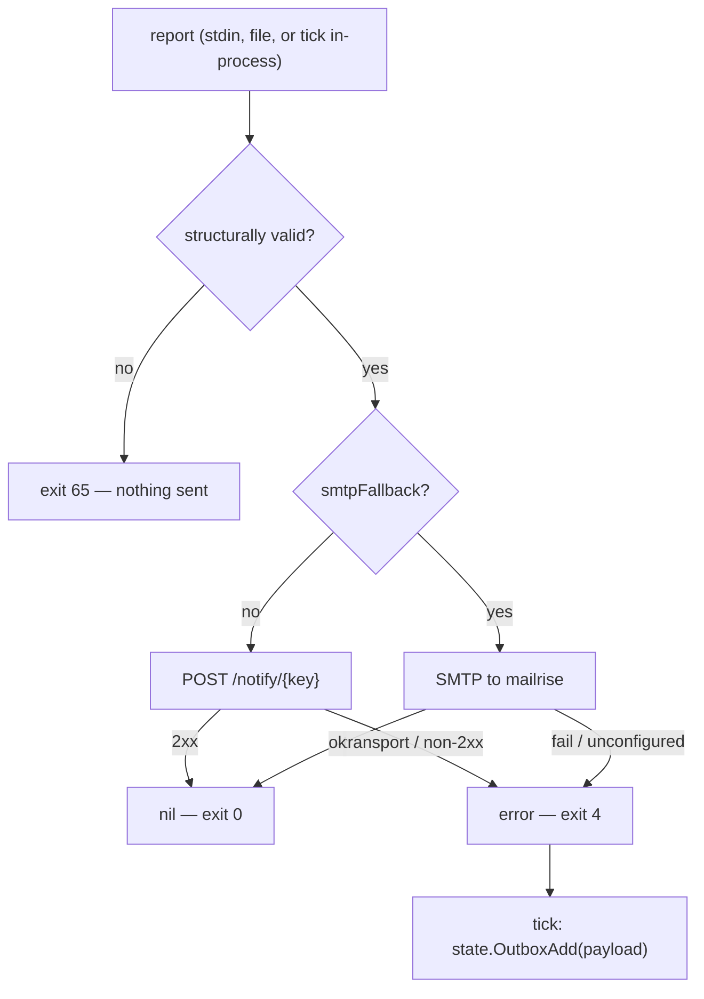

# Contract: notify (Go)

> Conventions C1–C9 in [CONTRACTS.md](../CONTRACTS.md) are binding and win on conflict. Read them first.

`internal/notify` + the `sentinel notify` subcommand: the POST payload, the sanitizer, the SMTP second path and the ops-only apprise seeding. This is the **only** place in the system that knows what the notification service is (ARCHITECTURE §3, design principle 3).

### N.0 Resolved scope (was contested; settled here)

1. **notify sends, it does not decide and it does not queue.** No dedup, no rate limiting, no heartbeat logic, no outbox, no `--retry-outbox`, no writes under `$STATE_DIR` — `state` owns all of that. `notify.Send` returning an error is the whole failure signal; `tick` enqueues.
2. **The SMTP second path is a parameter, not a discovery.** `notify.Send(ctx, cfg, r, smtpFallback bool)`: `true` ⇒ deliver via mailrise SMTP instead of Apprise. `tick` passes `OutboxItem.FallbackSMTP`, which state flips at `OUTBOX_SMTP_AFTER`.
3. **Raw alerts get no second code path.** `runtime` builds a schema-valid report and it goes through `Send` like any other.
4. **All report-derived text is sanitized, never just `evidence`** — `headline`, `body`, `explanation`, `analysis`, `recommendation`, `resolved[]`, `evidence` and the hostname. Markdown structure is added by the renderer *after* sanitization, so a crafted log line can never break Telegram's parser and cause an attacker-triggered notification outage. Components therefore never put markdown in report text.
5. **No secrets in this process.** `TELEGRAM_BOT_TOKEN`/`TELEGRAM_CHAT_ID` are never passed to the sentinel container; the token stays out of the process that parses attacker-controlled log text. `--seed-config` uploads `${APPRISE_CONFIG_FILE}` **verbatim** — an ops one-shot run against an already-rendered file, never invoked by the tick loop.
6. **No temp files anywhere.** Payload bytes, the multipart body and the RFC822 message live in `bytes.Buffer`. notify has no write surface at all.

### N.1 CLI

```
sentinel notify [--dry-run] [--seed-config] [file]
```

`flag.NewFlagSet("notify", flag.ContinueOnError)`, output to stderr.

| Flag | Meaning |
|---|---|
| `--dry-run` | render and print the payload to stdout, send nothing |
| `--seed-config` | upload `${APPRISE_CONFIG_FILE}` to apprise-api and exit |

Rules: `--seed-config` takes no positional argument and does not combine with `--dry-run`; at most one positional argument (the report file, default stdin); any other flag, or a second argument, ⇒ exit 64. `--help` prints usage to stdout and exits 0. There is no `--retry-outbox`.

### N.2 Input

One `report.Report` document, decoded with `encoding/json` (no `DisallowUnknownFields`). Read fields:

| Field | Required | Use |
|---|---|---|
| `status` | yes, `OK`\|`WATCH`\|`ALERT`, exact case | title prefix + Apprise `type` |
| `headline` | yes, non-empty | title tail |
| `body` | yes, non-empty | first body block |
| `findings[]` | no | body sections |
| `findings[].severity` | yes if present, `info`\|`watch`\|`alert` | bullet marker |
| `findings[].component` | yes if present | bullet label |
| `findings[].evidence` | yes if present | quoted, sanitized |
| `findings[].explanation` | yes if present | body text |
| `findings[].analysis` | no | body text when non-empty |
| `findings[].recommendation` | no | body text when non-empty |
| `resolved[]` | no | trailing all-clear block |
| `meta.hostname` | no | title host, falls back to `cfg.Hostname` |

`key`, `first_seen`, `occurrences`, `meta.tick_seq`, `meta.raw` are ignored and never forwarded. `Validate` is structural (presence + enum membership); the schema run happened in `analyze` and again in `state`. A violation ⇒ exit 65 **before** any network call, so a malformed report is never retried forever.

Configuration comes from `*config.Config` (`internal/config` is the single loader, malformed ⇒ exit 78 there): `AppriseURL`, `AppriseKey`, `AppriseConfigFile`, `NotifyTimeout`, `NotifyBodyMax`, `Hostname`, `MailriseHost`, `MailrisePort`, `MailriseUser`, `MailrisePass`, `MailFrom`, `MailTo`. `os.Hostname()` is **forbidden** — inside the container it is the container id.

### N.3 Output

#### N.3.1 POST

```
POST ${APPRISE_URL}/notify/${APPRISE_KEY}
Content-Type: application/json
```

`net/http` with `http.Client{Timeout: cfg.NotifyTimeout}` and `http.NewRequestWithContext`. `client.Do` error = transport failure; status outside `200..299` = HTTP failure, first 200 bytes of the body (`io.LimitReader`) go into the returned error.

Payload — exactly four string fields, all always present, produced by `json.Marshal` (never string concatenation):

| Field | Value |
|---|---|
| `title` | `[<STATUS>] <host>: <headline>` |
| `body` | assembled markdown (N.3.3) |
| `type` | `success` (OK) / `warning` (WATCH) / `failure` (ALERT) |
| `format` | constant `markdown` |

#### N.3.2 Title

`<STATUS>` verbatim from the enum; `<host>` = `meta.hostname` when non-empty else `cfg.Hostname`, sanitized; `<headline>` sanitized, newlines collapsed, truncated to 80 runes; whole title truncated to 120 runes.

```go
// TruncRunes returns s cut to max runes, appending ellipsis when it cut.
func TruncRunes(s string, max int, ellipsis string) string
```

#### N.3.3 Body assembly (deterministic, in this order)

1. Sanitized `body`, newlines preserved.
2. If `findings` is non-empty: blank line, `**Findings**`, then one block per finding in array order:
   ```
   - **<SEVERITY> · <component>** — <explanation>
     `<evidence line 1>`
     _Analysis:_ <analysis>              ← only when non-empty after sanitizing
     _Recommendation:_ <recommendation>  ← only when non-empty after sanitizing
   ```
   `<SEVERITY>` = `strings.ToUpper(severity)`. Evidence: split on `\n`, first 3 lines, each sanitized and cut to 200 runes, each on its own indented backticked line. `explanation`, `analysis`, `recommendation`, `component` are collapsed to one line.
3. If `resolved` is non-empty: blank line, `**Resolved**`, then `- <item>` per sanitized entry.
4. Truncate to `cfg.NotifyBodyMax` runes; if it was cut, append `\n\n_…truncated_`.

```go
// Sanitize drops Telegram markdown metacharacters and control characters so no
// report text can break the parser at the notification layer.
// ponytail: strip instead of escape — a mangled log line is acceptable,
// a permanently rejected Telegram message is not.
func Sanitize(s string) string
```

One `strings.Map`: drop `` ` `` `_` `*` `[` `]`, map every `unicode.IsControl` rune except `\n` to a space, drop invalid UTF-8 (`utf8.RuneError`). Helper `oneLine(s string) string` collapses `\n` and runs of spaces — applied to every field except `body`.

#### N.3.4 Example (the ARCHITECTURE §2.7 CKSUM benchmark)

Input report — the state contract's `decision.report` for the WATCH case, with `meta: {"hostname": "bam", "tick_seq": 412}`. Resulting payload (`key`, `first_seen`, `occurrences`, `meta.tick_seq` ignored; backticks and brackets stripped from all report text):

```json
{
  "title": "[WATCH] bam: 1 checksum error on seagate-zvtazeam-crypt (hotstore mirror)",
  "body": "A single checksum error was recorded on one mirror half of pool hotstore during a running scrub. The mirror partner is clean, the pool is ONLINE, no data loss occurred.\n\n**Findings**\n- **WATCH · zfs** — ZFS detected and repaired one checksum mismatch on a single disk of the hotstore mirror.\n  `zed1284: eid=41 class=checksum pool='hotstore' vdev=seagate-zvtazeam-crypt cksum_errors=1`\n  _Analysis:_ Single event, first occurrence, redundancy intact (mirror partner 0 errors), SMART for this disk clean. Consistent with a transient bit error, not with a failing device. Blast radius: none, the block was repaired from the mirror.\n  _Recommendation:_ Wait for the running scrub to finish. If the counter stays at 1 and SMART stays clean, run zpool clear hotstore and watch the next scrub. If the counter rises across scrubs, replace seagate-zvtazeam-crypt.",
  "type": "warning",
  "format": "markdown"
}
```

#### N.3.5 stdout / stderr

stdout carries machine output only: the `MarshalIndent`ed payload + `\n` under `--dry-run`, nothing otherwise. Everything else is `slog` on stderr with component `notify`: `sent` (`status`, `host`, `path=apprise|smtp`), `post failed` (`http=<code>` or `transport=<err>`), `seeded` (`urls=<n>`). Never logged: `MAILRISE_PASS`, `APPRISE_KEY`, the contents of the seeded config, report or prompt text.

### N.4 Exit codes (subset of the binary-wide table)

| Code | When |
|---|---|
| 0 | sent; or `--dry-run` / `--help` / `--seed-config` completed |
| 1 | marshal or stdout-write failure |
| 4 | delivery failed (or `--seed-config` could not reach apprise-api) — `tick` enqueues the payload; not a supervisor failure |
| 64 | usage error |
| 65 | input is not valid JSON, or fails the N.2 structural check |

`notify.Run` returns `(int, error)` and never calls `os.Exit`, so tests assert codes directly.

### N.5 Error behaviour (ARCHITECTURE §5)



| Failure | Behaviour |
|---|---|
| apprise-api unreachable, refused, or timing out | `client.Do` error ⇒ return error, exit 4. No retry inside one invocation — the next tick's `OutboxTake` is the retry. |
| apprise-api 4xx/5xx (including a Telegram rejection surfacing as 424/500) | identical; the error text is `http <code>: <first 200 bytes>` |
| `smtpFallback == true` with `MAILRISE_USER` or `MAILRISE_PASS` empty | the fallback is **not attempted** — `mailrise.conf` requires SMTP AUTH unconditionally, so an unauthenticated attempt would only fail at the moment the path is needed. Error `smtp fallback unconfigured`, exit 4, item stays queued. |
| `--seed-config` with apprise down | exit 4; the caller logs and continues, sends fail into the outbox until the config is seeded |
| agy down | out of scope — `analyze` produces the fallback report and notify sends it like any other |

#### N.5.1 SMTP second path

`net/smtp`, no external dependency:

1. `net.DialTimeout` with `cfg.NotifyTimeout` + `smtp.NewClient` on `net.JoinHostPort(MailriseHost, MailrisePort)`.
2. `c.Auth(plainAuthNoTLS{user, pass, host})` — a ~15-line local `smtp.Auth` implementing PLAIN without stdlib's TLS requirement. `ponytail: mailrise is a LAN-only plaintext listener (mailrise.conf tls: off); switch to smtp.PlainAuth over STARTTLS when the listener gets a cert.`
3. `c.Mail(MailFrom)`, `c.Rcpt(MailTo)`, `c.Data()`.
4. Message with CRLF endings: `From:`, `To:`, `Subject:` (`mime.QEncoding.Encode("utf-8", title)`), `Date:` (RFC1123Z), `MIME-Version: 1.0`, `Content-Type: text/plain; charset=utf-8`, blank line, then `payload.Body` verbatim.
5. `c.Quit()`.

### N.6 Filesystem contract

Reads: the optional report file argument and `${APPRISE_CONFIG_FILE}` (`:ro`, `--seed-config` only). **Writes: none, anywhere.** No `/tmp`, no `$STATE_DIR`, no `/host/*`.

### N.7 Package layout and exported API

```
internal/notify/notify.go        # Run, Send, Validate
internal/notify/render.go        # BuildPayload, Sanitize, TruncRunes
internal/notify/smtpfallback.go  # sendMail, plainAuthNoTLS
internal/notify/seed.go          # SeedConfig
```

```go
package notify

type Payload struct {
    Title  string `json:"title"`
    Body   string `json:"body"`
    Type   string `json:"type"`
    Format string `json:"format"`
}

// Run executes one CLI invocation. args excludes the "notify" subcommand.
func Run(ctx context.Context, cfg *config.Config, args []string, stdin io.Reader, stdout io.Writer) (int, error)

// Send renders and delivers one report. smtpFallback selects the mailrise second path.
func Send(ctx context.Context, cfg *config.Config, r report.Report, smtpFallback bool) error

func BuildPayload(r report.Report, cfg *config.Config) Payload
func Validate(r report.Report) error
func Sanitize(s string) string
func TruncRunes(s string, max int, ellipsis string) string

// SeedConfig uploads APPRISE_CONFIG_FILE verbatim via POST /add/{key}. Ops one-shot.
func SeedConfig(ctx context.Context, cfg *config.Config) (urls int, err error)

var (
    ErrInvalidInput = errors.New("invalid report") // → 65
    ErrSend         = errors.New("delivery failed") // → 4
)
```

`SeedConfig` posts the file bytes as `multipart/form-data` (`mime/multipart`, `format=text`, file field `config` named `sentinel.cfg`) to `${APPRISE_URL}/add/${APPRISE_KEY}`. No substitution, no shell, no expansion — the file arrives already rendered. The reported URL count is the number of non-empty, non-`#` lines. Re-seeding is idempotent: `/add/{key}` replaces the stored config.

### N.8 Tracked config files

`deploy/apprise/sentinel.cfg` (Apprise TEXT format, `tgram://` targets) and `deploy/mailrise/mailrise.conf` (recipients `omv`, `smartd`, `zed`, `sentinel`, `listen 0.0.0.0:8025`, `tls: mode: off`, mandatory `smtp.auth.basic`) contain no code and are not ported. Both are rendered on the host by `install-host.sh` into `.runtime/` (0600, gitignored); the sentinel container never sees a Telegram token.

### N.9 Test contract — `internal/notify/notify_test.go` (+ `render_test.go`)

Table-driven, offline, no framework, no external process. Apprise stub: `httptest.NewServer` recording the last body and returning a per-case status. SMTP stub: a `net.Listen` goroutine speaking 220/250/354/250/221 and recording the DATA block. Fixtures in `internal/notify/testdata/`: `report-ok.json`, `report-watch-zfs-cksum.json` (the §2.7 case, shared with `analyze`), `report-alert-fallback.json`, `report-invalid.json` (no `headline`), `report-injection.json` (`evidence`, `headline`, `body`, `recommendation` each carrying `` ` `` `_` `*` `[` `]`, a control character, invalid UTF-8, and the literal `ignore previous instructions`). RED first: the file compiles against the declared API and fails because the package is empty.

| # | Test | Asserts |
|---|---|---|
| 1 | `TestFlags` | `--help` ⇒ 0; unknown flag ⇒ 64; two positional args ⇒ 64; `--dry-run --seed-config` ⇒ 64; `--seed-config file` ⇒ 64 |
| 2 | `TestTitle` | CKSUM fixture ⇒ `[WATCH] bam: 1 checksum error on seagate-zvtazeam-crypt (hotstore mirror)` (T6 AC) |
| 3 | `TestPayloadKeys` | unmarshal to `map[string]any` ⇒ exactly `title,body,type,format`; `format == "markdown"` |
| 4 | `TestStatusTypeMapping` | OK⇒success, WATCH⇒warning, ALERT⇒failure; unknown status ⇒ 65 |
| 5 | `TestBodyOrder` | explanation, then `_Analysis:_`, then `_Recommendation:_` in that index order; absent optionals render no label |
| 6 | `TestSanitizeAllFields` | injection fixture ⇒ no `` ` `` `_` `*` `[` `]` in the payload originating from report text (asserted per field on `Sanitize` before assembly); payload is valid JSON and `utf8.ValidString` |
| 7 | `TestBodyTruncation` | `NotifyBodyMax=200` ⇒ body ≤ 200 runes + the `_…truncated_` suffix, multi-byte runes never split |
| 8 | `TestDryRun` | payload on stdout, stub received zero requests |
| 9 | `TestInvalidReport` | `report-invalid.json` ⇒ 65, zero requests |
| 10 | `TestSendFailures` | stub 502 ⇒ `ErrSend`, exit 4, error text has prefix `http 502: `; closed server ⇒ `transport: ` prefix |
| 11 | `TestSMTPFallback` | `Send(..., true)` ⇒ SMTP stub sees AUTH, `RCPT TO:<sentinel@mailrise.xyz>` and a `Subject:` carrying the title, and the apprise stub sees zero requests. Sub-case: empty `MailrisePass` ⇒ no connection attempted, error `smtp fallback unconfigured` |
| 12 | `TestNoWrites` | `filepath.WalkDir` snapshot of the test root before/after every case ⇒ zero new or modified paths, `os.TempDir()` unchanged (A1, N.6) |
| 13 | `TestRetryByteIdentical` | the same report bytes rendered twice ⇒ identical payload bytes, so a state-queued retry is byte-identical to the original send |
| 14 | `TestRawAlertRoundTrip` | a runtime-built raw-alert report (plain `<ts> <priority-name> <message>` lines, a 4000-rune kernel message, control characters, invalid UTF-8) survives `Validate → BuildPayload` with a valid-JSON payload within the rune caps |
| 15 | `TestSeedConfig` | a fixture config ⇒ multipart body contains the file bytes verbatim, stderr reports `urls=1`, exit 0; closed server ⇒ exit 4 |
| 16 | `TestHostnameSource` | `meta.hostname` wins; otherwise `cfg.Hostname`; `os.Hostname()` never used (asserted by setting `cfg.Hostname` to a value differing from the machine's) |
| 17 | `TestNoSecretsInRepo` | walk from `../..`, skip `.git`, `.env`, `.runtime/` ⇒ no match for `[0-9]{8,}:AA`, and no `MAILRISE_PASS=` with a value other than the `.env.example` placeholder (T1 AC "no secrets in git") |
| 18 | `TestE2E` (`t.Skip` unless `SENTINEL_E2E=1`) | `apprise` and `mailrise` healthy; sending `report-watch-zfs-cksum.json` exits 0; an SMTP send to `omv@mailrise.xyz` with the configured auth succeeds |

Cases 1–17 run offline and are the RED/GREEN gate.

---

