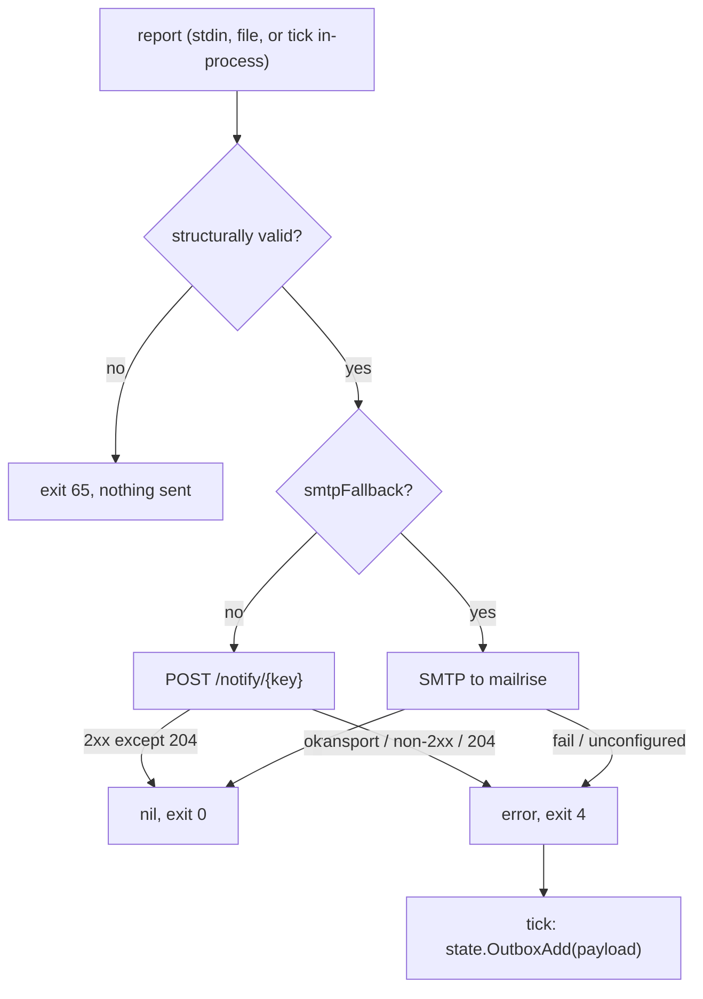

# Contract: notify (Go)

> Conventions C1–C9 in [CONTRACTS.md](../CONTRACTS.md) are binding and win on conflict. Read them first.

`internal/notify` + the `sentinel notify` subcommand: the POST payload, the sanitizer, the SMTP second path and the ops-only apprise seeding. This is the **only** place in the system that knows what the notification service is (ARCHITECTURE §3, design principle 3).

### N.0 Resolved scope (was contested; settled here)

1. **notify sends, it does not decide and it does not queue.** No dedup, no rate limiting, no heartbeat logic, no outbox, no `--retry-outbox`, no writes under `$STATE_DIR`, `state` owns all of that. `notify.Send` returning an error is the whole failure signal; `tick` enqueues.
2. **The SMTP second path is a parameter, not a discovery.** `notify.Send(ctx, cfg, r, smtpFallback bool)`: `true` ⇒ deliver via mailrise SMTP instead of Apprise. `tick` passes `OutboxItem.FallbackSMTP`, which state flips at `OUTBOX_SMTP_AFTER`.
3. **Raw alerts get no second code path.** `runtime` builds a schema-valid report and it goes through `Send` like any other.
4. **All report-derived text is sanitized, never just `evidence`**, `headline`, `body`, `explanation`, `analysis`, `recommendation`, `resolved[]`, `evidence` and the hostname. Markdown structure is added by the renderer *after* sanitization, so a crafted log line can never break Telegram's parser and cause an attacker-triggered notification outage. Components therefore never put markdown in report text.
5. **No secrets in this process.** `TELEGRAM_BOT_TOKEN`/`TELEGRAM_CHAT_ID` are never passed to the sentinel container; the token stays out of the process that parses attacker-controlled log text. `--seed-config` uploads `${APPRISE_CONFIG_FILE}` **verbatim**, an ops one-shot run against an already-rendered file, never invoked by the tick loop.
6. **No temp files anywhere.** Payload bytes, the multipart body and the RFC822 message live in `bytes.Buffer`. notify has no write surface at all.

### N.1 CLI

```
sentinel notify [--dry-run] [--seed-config] [file]
```

`flag.NewFlagSet("notify", flag.ContinueOnError)`, output to stderr.

| Flag | Meaning |
|---|---|
| `--dry-run` | render and print the payload to stdout, send nothing |
| `--seed-config` | upload `${APPRISE_CONFIG_FILE}` to apprise-api and exit |

Rules: `--seed-config` takes no positional argument and does not combine with `--dry-run`; at most one positional argument (the report file, default stdin); any other flag, or a second argument, ⇒ exit 64. `--help` prints usage to stdout and exits 0. There is no `--retry-outbox`.

### N.2 Input

One `report.Report` document, decoded with `encoding/json` (no `DisallowUnknownFields`). Read fields:

| Field | Required | Use |
|---|---|---|
| `status` | yes, `OK`\|`WATCH`\|`ALERT`, exact case | title prefix + Apprise `type` |
| `headline` | yes, non-empty | title tail |
| `body` | yes, non-empty | first body block |
| `findings[]` | no | body sections |
| `findings[].severity` | yes if present, `info`\|`watch`\|`alert` | bullet marker |
| `findings[].component` | yes if present | bullet label |
| `findings[].evidence` | yes if present | quoted, sanitized |
| `findings[].explanation` | yes if present | body text |
| `findings[].analysis` | no | body text when non-empty |
| `findings[].recommendation` | no | body text when non-empty |
| `resolved[]` | no | trailing all-clear block |
| `meta.hostname` | no | title host, falls back to `cfg.Hostname` |

`key`, `first_seen`, `occurrences`, `meta.tick_seq`, `meta.raw` are ignored and never forwarded. `Validate` is structural (presence + enum membership); the schema run happened in `analyze` and again in `state`. A violation ⇒ exit 65 **before** any network call, so a malformed report is never retried forever.

Configuration comes from `*config.Config` (`internal/config` is the single loader, malformed ⇒ exit 78 there): `AppriseURL`, `AppriseKey`, `AppriseConfigFile`, `NotifyTimeout`, `NotifyBodyMax`, `Hostname`, `MailriseHost`, `MailrisePort`, `MailriseUser`, `MailrisePass`, `MailFrom`, `MailTo`. `os.Hostname()` is **forbidden**, inside the container it is the container id.

### N.3 Output

#### N.3.1 POST

```
POST ${APPRISE_URL}/notify/${APPRISE_KEY}
Content-Type: application/json
```

`net/http` with `http.Client{Timeout: cfg.NotifyTimeout}` and `http.NewRequestWithContext`. `client.Do` error = transport failure; status outside `200..299` = HTTP failure, first 200 bytes of the body (`io.LimitReader`) go into the returned error. **`204 No Content` is a FAILURE, despite being 2xx.** apprise returns 204 when the configuration key is not registered: nothing was sent anywhere, to anyone. Verified against the live stack 2026-08-17, 200 means delivered, 424 means Telegram refused it, 204 means the key does not exist. Treating any 2xx as success is the single worst defect available in this component: every notification is silently dropped while every log line says `sent`. The same rule applies on the retry path, a 204 must never `OutboxAck`.

Payload, exactly four string fields, all always present, produced by `json.Marshal` (never string concatenation):

| Field | Value |
|---|---|
| `title` | `[<STATUS>] <host>: <headline>` |
| `body` | assembled markdown (N.3.3) |
| `type` | `success` (OK) / `warning` (WATCH) / `failure` (ALERT) |
| `format` | constant `markdown` |

#### N.3.2 Title

`<STATUS>` verbatim from the enum; `<host>` = `meta.hostname` when non-empty else `cfg.Hostname`, sanitized; `<headline>` sanitized, newlines collapsed, truncated to 80 runes; whole title truncated to 120 runes.

```go
// TruncRunes returns s cut to max runes, appending ellipsis when it cut.
func TruncRunes(s string, max int, ellipsis string) string
```

#### N.3.3 Body assembly (deterministic, in this order)

Both bodies share one skeleton and differ only in emphasis syntax. `GAP` below is the single character **U+2800 BRAILLE PATTERN BLANK** on a line of its own.

```
<body>
GAP
<b>| **</b><SEVERITY> <component>:<b>| **</b>
<explanation>
GAP
<b>| **</b>Evidence:<b>| **</b>
<code>| `</code>| ` around each evidence line
GAP
<b>| **</b>Analysis:<b>| **</b>          ← alert severity only, and only when non-empty
<analysis>
GAP
<b>| **</b>Recommendation:<b>| **</b>    ← only when non-empty
<recommendation>
GAP
<b>| **</b>Resolved:<b>| **</b>
<one entry per line>
```

1. `body` first, newlines preserved.
2. Then one block per finding in array order, in the shape above. There is **no `Findings` header**, the severity/component line already labels the block, and a header above a single finding is a header on a list of one.

   **Every rule below was measured against a real Telegram client on 2026-08-18, not chosen for looks. Do not "tidy" any of them away.**
   - **An empty line is collapsed and buys nothing.** Probes with one and with two consecutive empty lines arrived with neither.
   - **A line holding only whitespace is also collapsed on the apprise path**, an ASCII space and a U+00A0 NBSP were both trimmed to empty and dropped. They *do* survive over SMTP, which is the trap: a gap that works on the fallback path and vanishes on the primary one.
   - **U+2800 BRAILLE PATTERN BLANK survives on both paths** because it is a printable character, not whitespace, so nothing trims it. It is the only vertical spacing available. A zero-width space (U+200B) also worked, and was rejected as the more likely of the two to be stripped later by a client that treats it as formatting.
   - **Indentation is a lie once a line wraps.** A four-space indent holds on the first rendered line and every continuation starts hard left, and long lines are exactly the evidence and recommendation strings that most need grouping. Nothing is indented; each element gets a labelled heading line instead.
   - A leading `- ` bullet, a `·` between severity and component, and an `, ` before the explanation were all removed as generated filler that costs horizontal space on a narrow screen. A colon does the same work, and is what `syslog`, `smartd` and `zed` already use.

   `<SEVERITY>` = `strings.ToUpper(severity)`. `explanation`, `analysis`, `recommendation`, `component` are collapsed to one line.

   **`analysis` is rendered for `alert` findings only.** It is the longest field in the payload and it explains *why this is or is not serious*, which an operator needs when woken at 3am for an alert, and does not need for a watch they will read over coffee. A watch finding still carries its evidence and its recommendation, so nothing actionable is lost. This is a deliberate cut for readability on a phone: the full analysis remains in the report document, in history, and in the next tick's prompt.

   **Evidence is rendered verbatim inside a code span and is NOT passed through `Sanitize`.** Split on `\n`, first 3 lines, each cut to 200 runes, each on its own indented backticked line. Inside a code span every markdown metacharacter is already literal, so the only character that can break the parser is a backtick, replace `` ` `` with `'` in evidence and change nothing else. Stripping `_` there corrupted the one field the analyze contract guarantees is "copied verbatim from FACTS": `cksum_errors=1` reached the operator as `cksumerrors=1`, which does not match what they will grep for in their own logs. Control characters and invalid UTF-8 are still removed.
3. If `resolved` is non-empty: `GAP`, the `Resolved:` heading, then one sanitized entry per line.
4. Truncate to `cfg.NotifyBodyMax` runes; if it was cut, append `\n\n_…truncated_`.

```go
// Sanitize drops Telegram markdown metacharacters and control characters so no
// report text can break the parser at the notification layer.
// ponytail: strip instead of escape, a mangled log line is acceptable,
// a permanently rejected Telegram message is not.
func Sanitize(s string) string
```

One `strings.Map`: drop `` ` `` `_` `*` `[` `]`, map every `unicode.IsControl` rune except `\n` to a space, drop invalid UTF-8 (`utf8.RuneError`). Helper `oneLine(s string) string` collapses `\n` and runs of spaces, applied to every field except `body`.

**What the N.3.3 rules removed from this example, and why it is worth seeing:** there is one finding, so no `**Findings**` header. Its severity is `watch`, so no `_Analysis:_` block, the analysis is still in the report document, in history and in the next tick's prompt, just not pushed to a phone. And `cksum_errors=1` appears with its underscore intact, because evidence is no longer passed through `Sanitize`. The earlier version of this example carried all three, and the operator's first real message showed why none of them belonged there.

#### N.3.6 HTML body (the SMTP path)

```go
// BuildHTMLBody renders the same report as N.3.3 as HTML, for delivery over
// SMTP with Content-Type: text/html; charset=utf-8.
func BuildHTMLBody(cfg *config.Config, r report.Report) string
```

Same skeleton, same order, same `GAP` separators, same `NotifyBodyMax` truncation. Emphasis is `<b>…</b>` where the markdown body uses `**…**`, and evidence lines are wrapped in `<code>…</code>` where the markdown body uses backticks. No other tags: no `<html>`, `<body>`, `<br>`, `<p>` or `<div>`, mailrise passes the body through to apprise, and Telegram's HTML mode accepts only a small tag set. Newlines stay newlines.

**Verified live 2026-08-18:** mailrise selects the notification format from the mail's `Content-Type`, so `text/html` renders bold and monospace on Telegram exactly as the apprise path does. An earlier plain-text version of this section produced a correctly readable but unformatted message; this replaces it.

**Escaping, this is the part that must not be got wrong.** Every report-derived string on this path (`headline`, `body`, `explanation`, `analysis`, `recommendation`, `resolved[]`, `evidence` and the hostname) passes through `stripUnsafe` and then `html.EscapeString`, **before** any tag is added:

```go
// stripUnsafe removes what may never appear in the wire body regardless of
// markup: invalid UTF-8, and control characters other than '\n'. It is the
// non-markdown half of Sanitize, extracted so both paths can share it.
func stripUnsafe(s string) string

prose:    func(s string) string { return html.EscapeString(stripUnsafe(s)) },
evidence: func(s string) string { return html.EscapeString(stripUnsafe(s)) },
```

Kernel evidence routinely contains `<` and `>`, `sd 0:0:0:0: [sda]`, `<mce>`, and an unescaped one truncates or mangles the message.

**`Sanitize`'s markdown stripping is what this path drops, not its other two guarantees.** An earlier wording of this section said "nothing passes through `Sanitize`", which silently discarded the invalid-UTF-8 and control-character removal that `Sanitize` also performed. Reproduced at 1197e26: evidence containing `\x00`, `\x07` and `\xff\xfe` produced a body that was not valid UTF-8 and carried a NUL, in a message declaring `charset=utf-8`. **RFC 5321 §2.3.1 forbids NUL in DATA**, so mailrise or any conforming hop may reject or truncate it, and SMTP is reached only after apprise has already failed. A crafted kernel line could therefore kill the last remaining channel at the moment it is the only one left, which exceeds ARCHITECTURE §4's guarantee that a successful injection costs "wrong text in a report".

`stripUnsafe` costs nothing in fidelity: it removes only bytes that cannot legally appear in a UTF-8 SMTP body at all. `cksum_errors=1` and `<mce>` survive it untouched, which is the property this section exists to protect.

**Escaping preserves fidelity where stripping destroyed it.** `html.EscapeString` is lossless and reversible: `cksum_errors=1` stays `cksum_errors=1`, and a `<` arrives as a `<` in the rendered client even though the wire carries `&lt;`. That is strictly better than the markdown path's constraint, and it is why adding a parser to the fallback route is an acceptable trade here, the property being protected is that the operator reads exactly what the collector saw, and escaping keeps it.

**The subject line is not HTML.** `Subject:` carries the same title as the apprise `title` field, MIME-encoded per N.5.1, with no tags and no escaping.

#### N.3.4 Example (the ARCHITECTURE §2.7 CKSUM benchmark)

> **This example is normative and must be updated whenever N.3.3 changes.** It went stale three rounds running during T6 and was implemented around each time; it is the block a reader copies, so a stale one reproduces itself.


Input report, the state contract's `decision.report` for the WATCH case, with `meta: {"hostname": "bam", "tick_seq": 412}`. Resulting payload (`key`, `first_seen`, `occurrences` and `meta.tick_seq` are ignored). Note what is and is not stripped, because it differs by field: prose fields go through `Sanitize`, which drops `` ` `` `_` `*` `[` `]`; **evidence does not**, it keeps brackets and underscores and only has its backticks replaced, which is why `cksum_errors=1` appears here intact.

```json
{
  "title": "[WATCH] bam: 1 checksum error on seagate-zvtazeam-crypt (hotstore mirror)",
  "body": "A single checksum error was recorded on one mirror half of pool hotstore during a running scrub. The mirror partner is clean, the pool is ONLINE, no data loss occurred.\n\u2800\n**WATCH zfs:**\nZFS detected and repaired one checksum mismatch on a single disk of the hotstore mirror.\n\u2800\n**Evidence:**\n`zed1284: eid=41 class=checksum pool='hotstore' vdev=seagate-zvtazeam-crypt cksum_errors=1`\n\u2800\n**Recommendation:**\nWait for the running scrub to finish. If the counter stays at 1 and SMART stays clean, run zpool clear hotstore and watch the next scrub. If the counter rises across scrubs, replace seagate-zvtazeam-crypt.",
  "type": "warning",
  "format": "markdown"
}
```

#### N.3.5 stdout / stderr

stdout carries machine output only: the `MarshalIndent`ed payload + `\n` under `--dry-run`, nothing otherwise. Everything else is `slog` on stderr with component `notify`: `sent` (`status`, `host`, `path=apprise|smtp`), `post failed` (`http=<code>` or `transport=<err>`), `seeded` (`urls=<n>`). Never logged: `MAILRISE_PASS`, `APPRISE_KEY`, the contents of the seeded config, report or prompt text.

**`<err>` must be redacted before it is logged or returned.** A `net/http` transport error is a `*url.Error` carrying the full request URL, whose last path segment is `${APPRISE_KEY}`, so logging the error verbatim publishes the key into retained container logs on every apprise outage, and these two sentences would otherwise be mutually unsatisfiable. Strip the URL (or replace the key segment) in the error text at every site that logs it, wraps it, or returns it to a caller that will. The same applies to any status message built by interpolating the endpoint.

### N.4 Exit codes (subset of the binary-wide table)

| Code | When |
|---|---|
| 0 | sent; or `--dry-run` / `--help` / `--seed-config` completed |
| 1 | marshal or stdout-write failure |
| 4 | delivery failed (or `--seed-config` could not reach apprise-api), `tick` enqueues the payload; not a supervisor failure |
| 64 | usage error |
| 65 | input is not valid JSON, or fails the N.2 structural check |

`notify.Run` returns `(int, error)` and never calls `os.Exit`, so tests assert codes directly.

### N.5 Error behaviour (ARCHITECTURE §5)



| Failure | Behaviour |
|---|---|
| apprise-api unreachable, refused, or timing out | `client.Do` error ⇒ return error, exit 4. No retry inside one invocation, the next tick's `OutboxTake` is the retry. |
| apprise-api 4xx/5xx (including a Telegram rejection surfacing as 424/500) | identical; the error text is `http <code>: <first 200 bytes>` |
| `smtpFallback == true` with `MAILRISE_USER` or `MAILRISE_PASS` empty | the fallback is **not attempted**, `mailrise.conf` requires SMTP AUTH unconditionally, so an unauthenticated attempt would only fail at the moment the path is needed. Error `smtp fallback unconfigured`, exit 4, item stays queued. |
| `--seed-config` with apprise down | exit 4; the caller logs and continues, sends fail into the outbox until the config is seeded |
| agy down | out of scope, `analyze` produces the fallback report and notify sends it like any other |

#### N.5.1 SMTP second path

`net/smtp`, no external dependency:

1. `net.DialTimeout` with `cfg.NotifyTimeout` + `smtp.NewClient` on `net.JoinHostPort(MailriseHost, MailrisePort)`.
2. `c.Auth(plainAuthNoTLS{user, pass, host})`, a ~15-line local `smtp.Auth` implementing PLAIN without stdlib's TLS requirement. `ponytail: mailrise is a LAN-only plaintext listener (mailrise.conf tls: off); switch to smtp.PlainAuth over STARTTLS when the listener gets a cert.`
3. `c.Mail(MailFrom)`, `c.Rcpt(MailTo)`, `c.Data()`.
4. Message with CRLF endings: `From:`, `To:`, `Subject:` (`mime.QEncoding.Encode("utf-8", title)`), `Date:` (RFC1123Z), `MIME-Version: 1.0`, `Content-Type: text/html; charset=utf-8`, blank line, then **the HTML body (N.3.6), never `payload.Body`**.

   `payload.Body` is markdown, and it renders as markdown only because the JSON payload carries `format: markdown` alongside it. Over SMTP there is no such field: mailrise forwards the text as it stands and the operator receives literal `**Findings**` and `_Analysis:_`. Verified live 2026-08-18. This is the LLM-free path, the one that must be readable when the supervisor is down, so it is the last place an unreadable message is acceptable.
5. `c.Quit()`.

### N.6 Filesystem contract

Reads: the optional report file argument and `${APPRISE_CONFIG_FILE}` (`:ro`, `--seed-config` only). **Writes: none, anywhere.** No `/tmp`, no `$STATE_DIR`, no `/host/*`.

### N.7 Package layout and exported API

```
internal/notify/notify.go        # Run, Send, Validate
internal/notify/render.go        # BuildPayload, Sanitize, TruncRunes
internal/notify/smtpfallback.go  # sendMail, plainAuthNoTLS
internal/notify/seed.go          # SeedConfig
```

```go
package notify

type Payload struct {
    Title  string `json:"title"`
    Body   string `json:"body"`
    Type   string `json:"type"`
    Format string `json:"format"`
}

// Run executes one CLI invocation. args excludes the "notify" subcommand.
func Run(ctx context.Context, cfg *config.Config, args []string, stdin io.Reader, stdout io.Writer) (int, error)

// Send renders and delivers one report. smtpFallback selects the mailrise second path.
func Send(ctx context.Context, cfg *config.Config, r report.Report, smtpFallback bool) error

func BuildPayload(r report.Report, cfg *config.Config) Payload
func Validate(r report.Report) error
func Sanitize(s string) string
func TruncRunes(s string, max int, ellipsis string) string

// SeedConfig uploads APPRISE_CONFIG_FILE verbatim via POST /add/{key}. Ops one-shot.
func SeedConfig(ctx context.Context, cfg *config.Config) (urls int, err error)

var (
    ErrInvalidInput = errors.New("invalid report") // → 65
    ErrSend         = errors.New("delivery failed") // → 4
)
```

`SeedConfig` posts the file bytes as `multipart/form-data` (`mime/multipart`, `format=text`, file field `config` named `sentinel.cfg`) to `${APPRISE_URL}/add/${APPRISE_KEY}`. No substitution, no shell, no expansion, the file arrives already rendered. The reported URL count is the number of non-empty, non-`#` lines. Re-seeding is idempotent: `/add/{key}` replaces the stored config.

### N.8 Tracked config files

`deploy/apprise/sentinel.cfg` (Apprise TEXT format, `tgram://` targets) is a tracked template only, it is never rendered, never copied onto a host, and contains no real token. The live configuration lives entirely inside apprise's own `apprise-config` docker volume, seeded through the API (`SeedConfig`, above, or an equivalent `curl POST /add/{key}`); writing a file to apprise's `/config` directly does not register a key (deploy/README.md, "Seed the apprise config key").

`mailrise.conf` (recipients `omv`, `smartd`, `zed`, `sentinel`, `listen 0.0.0.0:8025`, `tls: mode: off`, mandatory `smtp.auth.basic`) is a real host file, not a template, but the tracked `deploy/mailrise/mailrise.conf.example` it comes from is. It is written one of two ways, and lands in a different place depending on which: by hand (`cp` the example, fill in real values) at `deploy/mailrise/mailrise.conf` for the manual `--env-file` setup path, or rendered from that same example by `install.sh`'s Step 0 at `$STACK_DIR/mailrise/mailrise.conf` for the `curl | sudo bash` path, which is not necessarily under `deploy/` at all. Either way the file ends up at mode **`0644`**, gitignored, never `0600`, mailrise reads it as a non-root container user, and `0600` is exactly the mode that crash-loops the container (deploy/README.md). The sentinel container never sees a Telegram token either way: it never mounts this file.

### N.9 Test contract, `internal/notify/notify_test.go` (+ `render_test.go`)

Table-driven, offline, no framework, no external process. Apprise stub: `httptest.NewServer` recording the last body and returning a per-case status. SMTP stub: a `net.Listen` goroutine speaking 220/250/354/250/221 and recording the DATA block. Fixtures in `internal/notify/testdata/`: `report-ok.json`, `report-watch-zfs-cksum.json` (the §2.7 case, shared with `analyze`), `report-alert-fallback.json`, `report-invalid.json` (no `headline`), `report-injection.json` (`evidence`, `headline`, `body`, `recommendation` each carrying `` ` `` `_` `*` `[` `]`, a control character, invalid UTF-8, and the literal `ignore previous instructions`). RED first: the file compiles against the declared API and fails because the package is empty.

| # | Test | Asserts |
|---|---|---|
| 1 | `TestFlags` | `--help` ⇒ 0; unknown flag ⇒ 64; two positional args ⇒ 64; `--dry-run --seed-config` ⇒ 64; `--seed-config file` ⇒ 64 |
| 2 | `TestTitle` | CKSUM fixture ⇒ `[WATCH] bam: 1 checksum error on seagate-zvtazeam-crypt (hotstore mirror)` (T6 AC) |
| 3 | `TestPayloadKeys` | unmarshal to `map[string]any` ⇒ exactly `title,body,type,format`; `format == "markdown"` |
| 4 | `TestStatusTypeMapping` | OK⇒success, WATCH⇒warning, ALERT⇒failure; unknown status ⇒ 65 |
| 5 | `TestBodyOrder` | explanation, then `_Analysis:_`, then `_Recommendation:_` in that index order; absent optionals render no label |
| 6 | `TestSanitizeAllFields` | injection fixture ⇒ no `` ` `` `_` `*` `[` `]` in the payload originating from report text (asserted per field on `Sanitize` before assembly); payload is valid JSON and `utf8.ValidString` |
| 7 | `TestBodyTruncation` | `NotifyBodyMax=200` ⇒ body ≤ 200 runes + the `_…truncated_` suffix, multi-byte runes never split |
| 8 | `TestDryRun` | payload on stdout, stub received zero requests |
| 9 | `TestInvalidReport` | `report-invalid.json` ⇒ 65, zero requests |
| 10 | `TestSendFailures` | stub 502 ⇒ `ErrSend`, exit 4, error text has prefix `http 502: `; closed server ⇒ `transport: ` prefix |
| 11 | `TestSMTPFallback` | `Send(..., true)` ⇒ SMTP stub sees AUTH, `RCPT TO:<sentinel@mailrise.xyz>` and a `Subject:` carrying the title, and the apprise stub sees zero requests. Sub-case: empty `MailrisePass` ⇒ no connection attempted, error `smtp fallback unconfigured` |
| 12 | `TestNoWrites` | `filepath.WalkDir` snapshot of the test root before/after every case ⇒ zero new or modified paths, `os.TempDir()` unchanged (A1, N.6) |
| 13 | `TestRetryByteIdentical` | the same report bytes rendered twice ⇒ identical payload bytes, so a state-queued retry is byte-identical to the original send |
| 14 | `TestRawAlertRoundTrip` | a runtime-built raw-alert report (plain `<ts> <priority-name> <message>` lines, a 4000-rune kernel message, control characters, invalid UTF-8) survives `Validate → BuildPayload` with a valid-JSON payload within the rune caps |
| 15 | `TestSeedConfig` | a fixture config ⇒ multipart body contains the file bytes verbatim, stderr reports `urls=1`, exit 0; closed server ⇒ exit 4 |
| 16 | `TestHostnameSource` | `meta.hostname` wins; otherwise `cfg.Hostname`; `os.Hostname()` never used (asserted by setting `cfg.Hostname` to a value differing from the machine's) |
| 18 | `TestE2E` (`t.Skip` unless `SENTINEL_E2E=1`) | `apprise` and `mailrise` healthy; sending `report-watch-zfs-cksum.json` exits 0; an SMTP send to `omv@mailrise.xyz` with the configured auth succeeds |

Cases 1–17 run offline and are the RED/GREEN gate.

---

