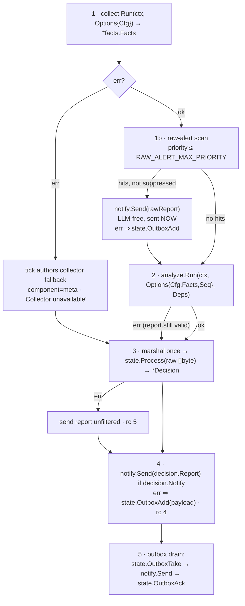

# Contract: runtime (Go)

> Conventions C1–C9 in [CONTRACTS.md](../CONTRACTS.md) are binding and win on conflict. Read them first.

Scope: `deploy/Dockerfile`, the `sentinel tick` and `sentinel health` subcommands (loop + orchestration, replacing `entrypoint.sh` + `tick.sh`), `internal/config`, `internal/logging`, the `sentinel` service in `docker-compose.yml`, `install-host.sh`, `.github/workflows/build.yml`. TODO **T7**, except the tick orchestration which lands in **T6** (`internal/runtime` table tests) and is re-verified inside the image in T7.

Everything this contract says obeys the Conventions; it adds only what the Conventions leave to the runtime.

---

### R1. `deploy/Dockerfile`

Two stages, `CGO_ENABLED=0`, no bash/jq/curl/coreutils in the runtime layer.

**Build interface**

```
docker build -f deploy/Dockerfile -t sentinel:dev \
  --build-arg AGY_URL=<https url to the agy linux-amd64 tarball> \
  --build-arg AGY_SHA256=<hex> \
  .
```
Build context = repo root.

| ARG | Required | Default | Meaning |
|---|---|---|---|
| `AGY_URL` | **yes** | — | download URL of the Antigravity CLI release tarball (linux/amd64). Empty ⇒ build fails with `ERROR: AGY_URL build-arg is required`. Ops input — never a guessed URL. |
| `AGY_SHA256` | **yes** | — | expected sha256 of that tarball; mismatch fails the build |
| `AGY_VERSION` | no | `unknown` | OCI label only |
| `GO_IMAGE` | no | `golang:1.25-trixie` | builder base |
| `VERSION` | no | `dev` | stamped into `main.version` via `-ldflags` |

**Stage 1 — builder (`${GO_IMAGE}`)**
- `COPY go.mod go.sum ./` → `go mod download` (own layer, cached).
- `COPY . .`
- `gofmt -l .` (must be empty), `go vet ./...`, `go test ./...` — any failure fails the build. This is where the T6 tables gate the image.
- `CGO_ENABLED=0 GOOS=linux GOARCH=amd64 go build -trimpath -ldflags "-s -w -X main.version=${VERSION}" -o /out/sentinel ./cmd/sentinel`
- `agy`: download `${AGY_URL}`, verify `${AGY_SHA256}` with `sha256sum -c`, unpack, place at `/out/agy`.

**Stage 2 — runtime (`debian:trixie-slim`)** — matches the target's Debian 13 journal format (ARCHITECTURE §2.7).
- apt, `--no-install-recommends`, lists deleted in the same layer, exactly: `systemd` (provides `journalctl`), `lm-sensors`, `ca-certificates`, `tzdata`.
  Explicitly **not** installed: `jq`, `curl`, `bash` as a dependency, `smartmontools`, `zfsutils-linux`. HTTP is `net/http`, JSON is `encoding/json`, hashing is `crypto/sha256`.
- User `sentinel`, uid **10001**, gid **10001**, home `/home/sentinel` (unused — `$HOME` is `$AGY_HOME`, a persistent named volume).
- `COPY --from=builder /out/sentinel /usr/local/bin/sentinel` and `/out/agy` → `/usr/local/bin/agy`, both mode `0555`, owner `root:root`.
- **No `/opt/sentinel`, no prompt or schema files.** `role.md`, `report.schema.json` and `facts.schema.json` are `go:embed`ed in their owning packages (C1); the image ships two binaries and nothing writable.
- Build-time verification (any failure fails the build): `sentinel --version`, `agy --version`, `journalctl --version`, `sensors -v`.
- `ENV LANG=C.UTF-8 TZ=UTC PATH=/usr/local/bin:/usr/bin:/bin`
- `USER sentinel`, `WORKDIR /`, `ENTRYPOINT ["/usr/local/bin/sentinel"]`, `CMD ["tick", "--loop"]`.
- OCI labels `org.opencontainers.image.source`, `.revision`, `.version=${AGY_VERSION}`.
- No `HEALTHCHECK` in the image — compose owns it (one owner).

---

### R2. `sentinel tick` and `sentinel health`

```
sentinel tick [--loop|--once] [--state-dir PATH]
sentinel health
```

| Flag | Default | Meaning |
|---|---|---|
| `--loop` | off | run forever: validate, then tick every `TICK_INTERVAL` seconds, sequentially. Container entrypoint mode. |
| `--once` | on when `--loop` absent | run exactly one tick, print its report to stdout, exit with the tick's code |
| `--state-dir` | `$STATE_DIR` | override for tests |

`--loop` together with `--once`, any unknown flag, any positional argument ⇒ exit `64`.

`sentinel health` takes no flags: exit `0` iff `$STATE_DIR/heartbeat` exists and its mtime is younger than `3 × TICK_INTERVAL`, else `1`. It is the compose healthcheck and reads nothing else.

**Orchestration is in-process.** `tick` calls `collect.Run`, `analyze.Run`, `state.Process`, `notify.Send` as Go functions (C8). Only `journalctl`, `sensors -j` and `agy` are exec'd, each under `context.WithTimeout`. There is no exit-code round-tripping between components.

**Startup sequence** (`--loop`, and once before the single tick in `--once`)

1. `config.Load()` (R7). Failure ⇒ `ERROR` naming the variable ⇒ exit `78`.
2. Filesystem preflight:
   - `$STATE_DIR` exists and is writable — miss ⇒ exit `69`;
   - `/tmp` writable, at least one of `$HOST_JOURNAL_DIR` / `$HOST_JOURNAL_VOLATILE_DIR` readable and non-empty, `$HOST_PROC/uptime` readable — any miss ⇒ `ERROR` naming the exact path ⇒ exit `78`.
   There is no prompt/schema path check: both are embedded.
3. Assert `/usr/local/bin` is not writable (proves `read_only: true` took effect). Writable ⇒ `WARN`, continue — never block ticks on a lint.
4. Seed agy home: `MkdirAll($AGY_HOME, 0700)`, copy `$AGY_SECRET_DIR/*` into it (regular files only, mode `0600`), `os.Setenv("HOME", $AGY_HOME)`. Missing or empty secret dir ⇒ `WARN runtime agy credentials absent — analysis will fall back`, continue: the raw-alert path must survive without the LLM.

   **`$AGY_HOME` is a persistent named volume, NOT tmpfs.** agy refreshes its OAuth token as it runs; on tmpfs that refresh is lost at every restart, and headless mode **cannot** re-authenticate — it prints an OAuth URL nobody will ever see and exits non-zero. The analyzer would then be permanently down after the first container restart, with the raw-alert path as the only surviving coverage. A `docker compose restart` must not cost the LLM stage.

   **Seeding from `$AGY_SECRET_DIR` is an UNVERIFIED assumption and T8 must prove it empirically.** Measured on macOS 2026-08-16: agy's session is bound to the OS keychain (`svce=gemini`, `acct=antigravity`), and copying the entire `~/.gemini` tree into a fresh `HOME` did **not** restore authentication — only the original `HOME` worked. Linux has no keychain, so file-based credentials are expected to be portable there, but "expected" is not "verified". Before rollout, T8 runs the container with a seeded `$AGY_HOME` and confirms a real analysis (`status` from a live call, non-zero `usage.input_tokens`) rather than a fallback. If seeding does not work on Linux either, the LLM stage cannot run unattended and that must be known before the 24h trial, not during it.

   `// ponytail: agy-home is a named volume because a lost token refresh means the analyzer never comes back — headless cannot re-auth.`
5. `MkdirAll` of `history`, `active-alerts`, `outbox`, `raw-alerts`, `deep-queue` under `$STATE_DIR`, mode `0700`.
6. `signal.NotifyContext(ctx, syscall.SIGTERM, syscall.SIGINT)`; the sleep between ticks is `select { case <-ctx.Done(): case <-time.After(interval) }`, so shutdown is prompt. A tick already in flight gets 5 s, then its context is cancelled.
7. Loop body: `seq := nextTickSeq()` (R3.1), run the tick, log `WARN tick rc=<n>` on non-zero, never terminate the loop.
8. On shutdown: log `INFO runtime stopped ticks=<n>` and exit `0` within 5 s (compose `stop_grace_period` is 15 s).

`--loop` terminates only with `0` (signal), `78` (config or mount preflight) or `69` (state dir) — the state-dir case is the specialization of startup validation named in C2. Every other failure is logged and the loop continues.

---

### R3. Tick semantics

#### R3.1 Tick sequence number

One counter, one file: `$STATE_DIR/tick-seq`, ASCII decimal, no trailing newline, owned exclusively by `tick` (C1). It is read, incremented and written atomically (`os.CreateTemp` in `$STATE_DIR` + `Rename`, mode `0644`) before step 1, and passed to `analyze.Run` as `Seq`. `collect` and `state` never touch it. Missing or unparseable ⇒ start at `1` and `WARN`.

#### R3.2 Step order



Step 1b runs **before** analysis and its notification is dispatched immediately, so a crashing or quota-blocked agy cannot delay or swallow a critical kernel event (ARCHITECTURE design principle 4).

`tick` authors **only** the collector fallback. When `analyze.Run` returns `(*report.Report, error)` with a non-nil error, that report is already a valid fallback carrying its own stable key (C8) — `tick` passes it through `state` unchanged and records exit code `3`. `tick` never builds an analyzer fallback.

The outbox drain runs once per tick, in the order shown, and is the only retry path. `state` owns `outbox/`; `notify` only sends. **This order is authoritative; contracts/state.md S.1's diagram is illustrative and does not override it.** Draining after the add is deliberate — a payload queued by this tick's failed send is retried by this same tick rather than waiting a full interval.

One consequence to know before tuning: `OutboxTake` increments and persists `attempts` on every take, so a tick that fails advances the counter twice — once for the immediate drain of the payload it just queued, once on the next tick. `OUTBOX_SMTP_AFTER=3` therefore reaches the mailrise fallback in roughly two ticks, not three. This is a faster fallback to the LLM-free path, which is the safe direction, but the configured number is not the number of ticks an operator would predict from its name.

Every document `tick` authors (collector fallback, raw alert) passes `report.Validate` before it reaches `notify`. A document that fails validation is logged at `ERROR` and replaced by a minimal valid ALERT with the validation error as evidence — the system never drops an alert because of its own marshaling bug.

#### R3.3 Raw-alert trigger — exact

Operates on the typed `facts.Kernel` section (C5). The section wrapper is probed first: `Err != ""` ⇒ treat as a scan failure (below), never as "no entries".

```go
type RawCandidate struct {
	Entry facts.Entry
	Key   string // dedup.Key("kernel", Entry.Message)
}

func Candidates(f *facts.Facts, maxPriority int) []RawCandidate
```

- Candidates are kernel entries with `Priority <= maxPriority`, newest first.
- The key is `dedup.Key("kernel", entry.Message)` (C6). Priority is not part of the key. `runtime` computes no normalizer of its own.
- A candidate is **suppressed** iff `$STATE_DIR/raw-alerts/<key>` exists and its mtime is newer than `RAW_ALERT_REPEAT_SECONDS`. Otherwise it is **sent** and the marker is written (content: RFC3339 UTC timestamp of the send, mode `0644`, temp+rename). `RAW_ALERT_REPEAT_SECONDS=0` suppresses nothing.
- Markers older than `RAW_ALERT_MARKER_TTL_HOURS` are unlinked at the start of each tick.
- Empty candidate list ⇒ no raw alert, no marker write, straight to step 2.
- **Failure of the scan itself** (kernel section carries `error`, facts shape drift) ⇒ a raw alert with `headline = "Raw-alert scan failed — critical kernel events may be unseen"` and the reason in `body`, then the tick continues. The safety path fails loud, never silent.
- **The scan-failure alert is marker-suppressed like any other raw alert**, under the reserved key `scan-failed`, honouring the same `RAW_ALERT_REPEAT_SECONDS` window and the same TTL sweep. **Its exit code is NOT suppressed: every failing tick still returns the non-zero code, every time.** Without this the failure repeats to a human on every tick — at the default `TICK_INTERVAL=300` that is 288 Telegram messages a day for one broken `journalctl`, and an operator who mutes the bot then misses the genuine hardware alert behind it. Alert fatigue loses events exactly as effectively as a swallowed alert does, so "fails loud, never silent" is kept where it cannot be muted — the exit code (`rc=2` on every failing tick) and the per-tick `WARN tick rc=2` log line — while the human channel is told once per window. **`sentinel health` is deliberately NOT one of those channels and must not be read as one:** it stats `heartbeat` mtime only, and `state.Process` rewrites that on every tick (S-D4), so a container whose `journalctl` has been broken for hours still reports healthy. That is correct for a liveness probe — C4 and R2 define it as nothing more — but it means the healthcheck does not cover a blind critical-event scanner, and monitoring must watch the exit code for that. This is deliberately the one suppressor the raw path trusts, for the same reason the per-candidate markers are: a `state`-layer bug must not be able to swallow it.
- The raw report **bypasses `state`** for dedup — the marker file above is deliberately the only suppressor, so a state-layer bug cannot swallow a critical alert. Delivery is not bypassed: a failed raw POST goes to `state.OutboxAdd` like any other payload and sets exit code `4`.

#### R3.4 Raw-alert payload

A valid `report.Report`, so `notify` needs no special case, and plain text only — `notify` sanitizes every report-derived string (C8), so the body carries no fences and no brackets.

- `status`: always `"ALERT"`.
- `headline`: `"<n> critical kernel event(s) on <hostname>"`, truncated to 80 runes.
- `body`: an intro line, then at most `RAW_ALERT_MAX_LINES` lines `<ts> <priority-name> <message>`, then `"… (<k> more suppressed)"` when candidates exceed the cap.
- `findings`: one per embedded line, `severity: "alert"`, `component: "kernel"`, `evidence` = the message, `key` set, `analysis`/`recommendation` omitted — a raw alert makes no claim it has not verified (A9). Capped at 20 by `RAW_ALERT_MAX_LINES` (`findings.maxItems`).
- `resolved`: always `[]`.
- `meta`: `{hostname, tick_seq, raw: true}`.

```json
{
  "status": "ALERT",
  "headline": "2 critical kernel event(s) on bam",
  "body": "Raw kernel alert, sent without analysis (LLM-free path).\n\n2026-08-15T09:04:11Z crit mce: Hardware Error: Machine check events logged\n2026-08-15T09:04:11Z crit EDAC MC0: 1 CE memory read error on DIMM_A1\n\nA full analysis follows in the next report if the analyzer is available.",
  "findings": [
    {
      "severity": "alert",
      "component": "kernel",
      "evidence": "mce: Hardware Error: Machine check events logged",
      "explanation": "Kernel logged a priority-2 (crit) message. Sent unanalysed on the LLM-free critical path.",
      "key": "3f9a1c7d0b2e4551"
    },
    {
      "severity": "alert",
      "component": "kernel",
      "evidence": "EDAC MC0: 1 CE memory read error on DIMM_A1",
      "explanation": "Kernel logged a priority-2 (crit) message. Sent unanalysed on the LLM-free critical path.",
      "key": "a2044be91cc7d380"
    }
  ],
  "resolved": [],
  "meta": { "hostname": "bam", "tick_seq": 412, "raw": true }
}
```

#### R3.5 Collector fallback

Built by `tick` only when `collect.Run` returns an error: `status = "ALERT"`, `headline = "Collector unavailable"`, `body` = the captured error and stderr tail (max 2000 runes), one finding `{severity:"alert", component:"meta", evidence:<error text>, explanation:"collect failed: <error>", key: dedup.Key("meta", "collector unavailable")}`, `resolved: []`, `meta` set. The key is stable across ticks on purpose, so `state` re-notifies on the ALERT window instead of every tick. It passes through `state` like any report.

#### R3.6 Truncation

Truncation of `facts.json` to `FACTS_MAX_BYTES` belongs to `collect`; `runtime` neither implements nor overrides it. Runtime relies on one invariant and tests it (E13): **entries with `Priority <= RAW_ALERT_MAX_PRIORITY` are never dropped**, so a crit line always reaches the raw-alert scan. When `meta.truncated` is true, `tick` logs `WARN tick facts truncated`. Non-empty `meta.collector_errors` ⇒ `WARN` with the section names; the tick proceeds and the analyzer reports them.

#### R3.7 Stdout

`--once`: exactly one line — the compact JSON of the document handed to `notify`, or of the document `state` suppressed. `--loop`: nothing on stdout. All human output is stderr (C7).

#### R3.8 Error behaviour vs. ARCHITECTURE §5

| Failure | tick does |
|---|---|
| agy down/timeout/quota | `analyze` returns its own valid fallback report with a non-nil error ⇒ passed to `state` unchanged, exit `3`. Raw alerts already went out in step 1b. |
| Apprise down | `notify.Send` error ⇒ `state.OutboxAdd(payload)` — `state` is the only outbox writer. Exit `4`. Retry is step 5's take/send/ack drain; after `OUTBOX_SMTP_AFTER` failures `state` marks the item and `tick` calls `notify.Send(..., smtpFallback=true)`, which delivers via mailrise SMTP. |
| `facts.json` over budget | `collect`'s concern; `tick` logs `WARN tick facts truncated`. |
| Collector section failed | `WARN` with the section names, tick proceeds. |
| `state` fails | report is sent unfiltered (delivery beats dedup), exit `5` — **except `resolved[]`, which is emptied first.** `analyze` emits `resolved[]` as 16-hex dedup keys and `state` is what substitutes the stored headline (state S.3(e)); bypassing `state` therefore forwards raw keys to a human, who reads `- f3dae427610efc88` and learns nothing. Emptying is correct rather than lossy: a resolution is an all-clear, and on the one path where `state` is broken we do not know which alerts genuinely closed. Delivery beats dedup applies to findings, not to all-clears we can no longer substantiate. |
| Tick overlap | impossible by construction — sequential loop, single goroutine. |

#### R3.9 Filesystem contract

Reads `$STATE_DIR/**` and the ro host mounts of C4. Writes **only**: `$STATE_DIR/{tick-seq, raw-alerts/*}` directly; `$STATE_DIR/{history,active-alerts,outbox,deep-queue}/**` indirectly through `state` and `analyze`; `/tmp/**` (`$AGY_HOME`, plus `facts-<seq>.json` / `report-<seq>.json` dumps only when `LOG_LEVEL=DEBUG`, unlinked at tick end). It never writes `heartbeat` — `state.Process` owns it (C1).

---

### R4. `deploy/docker-compose.yml` — service `sentinel`

Only this service is in scope; `apprise` and `mailrise` come from T1 and are referenced, not redefined.

```yaml
services:
  sentinel:
    image: ghcr.io/thiscantbeserious/agentic-server-supervisor/sentinel:${SENTINEL_TAG:-latest}
    container_name: sentinel
    restart: unless-stopped
    command: ["tick", "--loop"]
    depends_on:
      apprise:
        condition: service_healthy
    read_only: true
    cap_drop: ["ALL"]
    security_opt: ["no-new-privileges:true"]
    user: "10001:10001"
    group_add: ["${JOURNAL_GID:?JOURNAL_GID missing — run install-host.sh}"]
    pids_limit: 256
    mem_limit: 512m
    stop_grace_period: 15s
    environment:
      TICK_INTERVAL: "${TICK_INTERVAL:-300}"
      TICK_WINDOW: "${TICK_WINDOW:-10m}"
      DEEP_WINDOW: "${DEEP_WINDOW:-24h}"
      SECTION_TIMEOUT: "${SECTION_TIMEOUT:-10}"
      JOURNAL_MAX_RECORDS: "${JOURNAL_MAX_RECORDS:-20000}"
      FACTS_MAX_BYTES: "${FACTS_MAX_BYTES:-262144}"
      SERVICES_MAX_BYTES: "${SERVICES_MAX_BYTES:-65536}"
      STATE_DIR: "/state"
      HOST_JOURNAL_DIR: "/host/journal"
      HOST_JOURNAL_VOLATILE_DIR: "/host/journal-volatile"
      HOST_PROC: "/host/proc"
      HOST_ROOT: "/host/root"
      HOST_RASDAEMON: "/host/rasdaemon"
      SENTINEL_HOSTNAME: "${SENTINEL_HOSTNAME:-}"
      AGY_BIN: "agy"
      AGY_HOME: "/state/agy-home"   # persistent volume, never tmpfs (token refresh)
      AGY_SECRET_DIR: "/run/secrets/agy"
      AGY_PRINT_TIMEOUT: "${AGY_PRINT_TIMEOUT:-120s}"
      AGY_HARD_TIMEOUT: "${AGY_HARD_TIMEOUT:-150s}"
      HISTORY_N: "${HISTORY_N:-5}"
      HISTORY_KEEP: "${HISTORY_KEEP:-50}"
      DEEP_ENABLED: "${DEEP_ENABLED:-1}"
      DEEP_TIMEOUT: "${DEEP_TIMEOUT:-30s}"
      RAW_ALERT_MAX_PRIORITY: "${RAW_ALERT_MAX_PRIORITY:-2}"
      RAW_ALERT_MAX_LINES: "${RAW_ALERT_MAX_LINES:-20}"
      RAW_ALERT_REPEAT_SECONDS: "${RAW_ALERT_REPEAT_SECONDS:-3600}"
      RAW_ALERT_MARKER_TTL_HOURS: "${RAW_ALERT_MARKER_TTL_HOURS:-168}"
      RENOTIFY_ALERT_SEC: "${RENOTIFY_ALERT_SEC:-3600}"
      RENOTIFY_WATCH_SEC: "${RENOTIFY_WATCH_SEC:-21600}"
      STALE_ALERT_SEC: "${STALE_ALERT_SEC:-86400}"
      HEARTBEAT_HOUR: "${HEARTBEAT_HOUR:-8}"
      OUTBOX_MAX: "${OUTBOX_MAX:-50}"
      OUTBOX_SMTP_AFTER: "${OUTBOX_SMTP_AFTER:-3}"
      APPRISE_URL: "http://apprise:8000"
      APPRISE_KEY: "${APPRISE_KEY:-sentinel}"
      APPRISE_CONFIG_FILE: "${APPRISE_CONFIG_FILE:-/config/sentinel.cfg}"
      NOTIFY_TIMEOUT: "${NOTIFY_TIMEOUT:-15}"
      NOTIFY_BODY_MAX: "${NOTIFY_BODY_MAX:-3500}"
      MAILRISE_HOST: "mailrise"
      MAILRISE_PORT: "8025"
      MAILRISE_USER: "${MAILRISE_SMTP_USER:?MAILRISE_SMTP_USER missing}"
      MAILRISE_PASS: "${MAILRISE_SMTP_PASS:?MAILRISE_SMTP_PASS missing}"
      SENTINEL_MAIL_FROM: "${SENTINEL_MAIL_FROM:-sentinel@mailrise.xyz}"
      SENTINEL_MAIL_TO: "${SENTINEL_MAIL_TO:-sentinel@mailrise.xyz}"
      LOG_LEVEL: "${LOG_LEVEL:-INFO}"
      TMPDIR: "/tmp"
      TZ: "UTC"
    volumes:
      - /var/log/journal:/host/journal:ro
      - /run/log/journal:/host/journal-volatile:ro
      - /etc/machine-id:/etc/machine-id:ro
      - /var/lib/rasdaemon:/host/rasdaemon:ro
      - /proc:/host/proc:ro
      - /sys:/host/sys:ro
      - /etc/os-release:/etc/os-release:ro
      - type: bind
        source: /
        target: /host/root
        read_only: true
        bind: { propagation: rslave }
      - type: bind
        source: ${AGY_CREDENTIALS_DIR:?AGY_CREDENTIALS_DIR missing}
        target: /run/secrets/agy
        read_only: true
      - sentinel-state:/state
    tmpfs:
      - /tmp:rw,noexec,nosuid,nodev,size=64m,mode=1777
    networks: [sentinel-net]
    healthcheck:
      test: ["CMD", "/usr/local/bin/sentinel", "health"]
      interval: 60s
      timeout: 5s
      retries: 3
      start_period: 120s
    logging:
      driver: json-file
      options: { max-size: "10m", max-file: "3" }

volumes:
  sentinel-state:
  apprise-config:

networks:
  sentinel-net:
```

Notes that are contract, not commentary:

- The `environment:` block is the **complete C3 set** — no component may rely on a default compose does not set. `SENTINEL_HOSTNAME` is passed empty by default, which means "resolve from `$HOST_PROC/sys/kernel/hostname`" (R7).
- `MAILRISE_USER`/`MAILRISE_PASS` are hard-required (`:?`) because mailrise enforces SMTP AUTH unconditionally; the second delivery path must not fail silently at the moment it is needed.
- One network, `sentinel-net`, **not** `internal: true` — apprise needs outbound internet for Telegram, and `depends_on: service_healthy` plus DNS resolution of `apprise` require both services on the same non-internal network. `sentinel` publishes no ports; only `apprise` and `mailrise` publish, bound to a LAN interface.
- The healthcheck is `sentinel health` — no shell, no `$$` interpolation trap.
- The apprise config volume is seeded by the `apprise` service (T1). The sentinel container gets **no `/config` mount and no `TELEGRAM_*` variables**: the bot token stays out of the process that parses attacker-controlled log text. `APPRISE_CONFIG_FILE` is present only because `notify --seed-config` is an ops one-shot; the runtime never invokes it.
- `.env.example` lists every variable compose interpolates **without a default** — every `:?` and every bare `${VAR}` — including `SENTINEL_TAG`, `AGY_CREDENTIALS_DIR`, `JOURNAL_GID`, `MAILRISE_SMTP_USER`, `MAILRISE_SMTP_PASS`, since an unset one either fails the stack or silently interpolates empty. Variables with a `:-default` are **not** copied in: their default already lives in the compose file and in CONTRACTS.md C3, and a third copy in `.env.example` is a third place for them to drift. An operator who wants to change one reads C3. Exactly one top-level `volumes:` and one `networks:` block in the file.
- **agy credential mount:** agy holds an OAuth credential file plus config in the operator's home directory. That directory is mounted read-only at `/run/secrets/agy`; startup copies it into tmpfs so agy can refresh its access token without a writable host path. `AGY_CREDENTIALS_DIR` lives in `.env` (0600, gitignored) with the note "the container never writes back — re-authenticate on the host and restart sentinel". Docker `secrets:` is not used: it supports single files, agy needs a directory.
- Any `:?` variable unset ⇒ `docker compose up` fails immediately. Fail fast beats a container that silently cannot read the journal or authenticate to mailrise.

Invariants asserted by the container test: no `ports:` on `sentinel`; every bind `read_only: true`; the only rw surfaces are the `sentinel-state` volume and the `/tmp` tmpfs; `privileged`, `devices`, `cap_add` never appear.

---

### R5. `deploy/install-host.sh`

`// ponytail: the one deliberate bash artifact. It runs on the host as root before the image exists, needs apt-get and systemctl, and shipping a second Go binary to bam to write three config files is more moving parts than a 120-line idempotent script. Upgrade path: a "sentinel install-host" subcommand if the host part ever grows.`

**CLI**
```
install-host.sh [--check] [--dry-run] [--mailrise-host HOST] [--mailrise-port PORT] [--env-file PATH] [-h|--help]
```

| Flag | Default | Meaning |
|---|---|---|
| `--check` | off | report drift, change nothing; exit `0` if converged, `1` if not |
| `--dry-run` | off | print every action it would take, change nothing, exit `0` |
| `--mailrise-host` | `127.0.0.1` | SMTP host smartd/ZED mail is delivered to |
| `--mailrise-port` | `8025` | SMTP port |
| `--env-file` | `./.env` | file that receives `JOURNAL_GID=` |

Requires root (`EUID=0`), else exit `77`. Requires Debian/`apt-get` + `systemctl`, else exit `69`.

**Steps** (in order, each independently idempotent)
1. `apt-get install -y --no-install-recommends rasdaemon lm-sensors msmtp msmtp-mta` — skipped per package when `dpkg-query -W -f='${Status}'` already reports installed.
2. `systemctl enable --now rasdaemon` — skipped when already enabled **and** active.
3. Write `/etc/msmtprc`: smarthost `--mailrise-host:--mailrise-port`, `from sentinel@<hostname>`. Mode `0600`, owner `root:root`.

   **When `MAILRISE_SMTP_USER`/`MAILRISE_SMTP_PASS` are present in the env file, write exactly:**
   ```
   auth plain
   tls off
   user <MAILRISE_SMTP_USER>
   password <MAILRISE_SMTP_PASS>
   ```

   **`auth on` does not work here and neither does omitting the credentials.** Both were specified in earlier drafts of this clause and both were measured failing against real msmtp 1.8.28 on Debian 13, with a server advertising `AUTH PLAIN LOGIN` exactly as mailrise does:
   - `auth on` with credentials ⇒ exit `69`, `cannot use a secure authentication method`. `auth on` means "auto-select the safest method", and msmtp's policy refuses PLAIN and LOGIN — the only methods a plaintext listener offers — under auto-selection. Adding `tls off` does not change it.
   - `auth on` without credentials ⇒ the same exit `69`, with `--debug` reporting `user = (not set)`, `password = (not set)`.
   - `auth plain` + `tls off` with credentials ⇒ exit `0`, real AUTH PLAIN handshake, mail delivered.

   Naming the method explicitly is what bypasses the auto-selection guard.

   **This is the same policy the Go side already had to work around, and the two must stay recognisable as one decision.** `internal/notify/smtpfallback.go` carries `plainAuthNoTLS`, a local `smtp.Auth`, precisely because Go's stdlib `smtp.PlainAuth` also refuses PLAIN over a non-TLS connection. `auth plain` is msmtp's equivalent of that bypass. Both exist for one reason: mailrise is a LAN-only plaintext listener (`mailrise.conf` `tls: off`). **Upgrade path, for both at once:** when the listener gets a certificate, this becomes `auth on` + STARTTLS and `plainAuthNoTLS` becomes `smtp.PlainAuth`. Change them together or the two SMTP clients drift apart.

   This is the production branch, not an edge case — R4 hard-requires both variables with `:?`, so on any real host they are set. And `auth off` is not a fallback, because mailrise enforces SMTP AUTH unconditionally (see the `smtpFallback` unconfigured rule in contracts/notify.md N.4). **Neither branch delivering means smartd and ZED cannot send mail at all** — that is the host-side LLM-free path, the one carrying SMART failures and ZFS pool events, and it would fail silently with `sentinel health` staying green.

   `password` in cleartext on the host is why this file is `0600 root:root`. That mode is not decoration: it is the whole containment for a credential that must exist in a file msmtp can read non-interactively. `passwordeval` is deliberately not used — it buys indirection, not secrecy, and adds a second failure mode on the path that runs when the supervisor is down.
4. smartd: ensure `/etc/smartd.conf` contains exactly one managed line
   `DEVICESCAN -a -o on -S on -n standby,q -W 4,45,55 -m smartd@mailrise.xyz -M exec /usr/share/smartmontools/smartd-runner`, inside the marker block. Restart `smartd` only if the block changed.
5. ZED: ensure `/etc/zfs/zed.d/zed.rc` sets `ZED_EMAIL_ADDR="zed@mailrise.xyz"`, `ZED_EMAIL_PROG="msmtp"`, `ZED_NOTIFY_VERBOSE=1` inside the marker block. Restart `zfs-zed` only if changed. No `/etc/zfs/zed.d/` ⇒ `WARN`, skip, do not fail.
6. `getent group systemd-journal | cut -d: -f3` ⇒ upsert `JOURNAL_GID=<gid>` in `--env-file` (replace on differing value, append if absent, never duplicate). Group missing ⇒ exit `70`.
7. Print a summary: which steps changed, which were already converged, and `changed=<n>`.

**Idempotency contract.** Every file is edited only between
```
# >>> agentic-server-supervisor (managed) >>>
…
# <<< agentic-server-supervisor (managed) <<<
```
Content outside the markers is never modified. Rendering the block is a pure function of flags + host facts, so a second run is byte-identical. **Asserted:** two consecutive real runs produce identical sha256 for every touched file, and the second reports `changed=0` and restarts no service. A pre-existing unmanaged `-m` line in `smartd.conf` is **commented out where it stands** — the original line prefixed with `# disabled by agentic-server-supervisor: ` — and the fact recorded in the managed block's preamble and in the run summary. An earlier wording said it was "left in place, commented out … inside the managed block's preamble", which is self-contradictory and was implemented literally: the original stayed live at the top of the file while only a commented copy appeared in the block, so smartd kept honouring the operator's previous mail target while the summary reported it handled. Two active `-m` targets is also not merely untidy — real smartd refused to start on such a file (`Unable to register device /dev/sda … Exiting`), which would take the SMART path down entirely. The original text is never deleted: it is the operator's configuration and the `.bak-<epoch>` copy plus the comment are how they get it back.

**Exit codes** (host script, deliberately its own table — it is not the `sentinel` binary): `0` converged / `--check` clean / `--dry-run` done · `1` `--check` found drift · `64` usage · `69` unsupported host · `70` `systemd-journal` group missing · `75` package install or service restart failed (transient, safe to re-run) · `77` not root.

**Filesystem:** reads `/etc/os-release`, `/etc/smartd.conf`, `/etc/zfs/zed.d/zed.rc`, `/etc/msmtprc`, `--env-file`. Writes those same paths via `mktemp` + `install -m <mode>` atomic replace, with a `.bak-<epoch>` copy on first modification only. This script runs on the **host**, outside the read-only container promise; it is the one artifact that writes, it writes nothing under `/var` or `/home`, and it runs only in T8 after explicit approval.

---

### R6. `.github/workflows/build.yml`

**Trigger:** `push` on `main` limited to `cmd/**`, `internal/**`, `deploy/**`, `test/**`, `go.mod`, `go.sum`, `.github/workflows/build.yml`; `pull_request` on the same paths (build only, no push); `workflow_dispatch`.

`deploy/**` is load-bearing and was missing: without it a Dockerfile-only change does not rebuild, and T8's `docker compose pull` on `bam` then returns a stale image that silently does not contain the change just made. `supervisor/**` was listed and does not exist in this repository — a leftover from the shell-script layout C1 abolished.

**Permissions:** `contents: read`, `packages: write`. Built-in `GITHUB_TOKEN` only — no repository secrets (PLAN §2.9).

**Job `test`**, `runs-on: ubuntu-latest`: `actions/checkout@v4` → `actions/setup-go@v5` (version from `go.mod`) → `gofmt -l .` (must be empty) → `go vet ./...` → `go test -race ./...`.

**Job `build`**, `needs: test`, `runs-on: ubuntu-latest`, `concurrency: group=build-${{ github.ref }}, cancel-in-progress: true`:
1. `actions/checkout@v4`
2. `docker/setup-buildx-action@v3`
3. `docker/login-action@v3` → `registry: ghcr.io`, `username: ${{ github.actor }}`, `password: ${{ secrets.GITHUB_TOKEN }}` — skipped on `pull_request`
4. `docker/metadata-action@v5` → `images: ghcr.io/${{ github.repository }}/sentinel`, tags `type=raw,value=latest,enable={{is_default_branch}}` and `type=sha,format=long,prefix=`
5. `docker/build-push-action@v6` → `context: .`, `file: deploy/Dockerfile`, `platforms: linux/amd64`, `push: ${{ github.event_name != 'pull_request' }}`, tags/labels from step 4, `build-args: AGY_URL=${{ vars.AGY_URL }}`, `AGY_SHA256=${{ vars.AGY_SHA256 }}`, `AGY_VERSION=${{ vars.AGY_VERSION }}`, `VERSION=${{ github.sha }}`, cache `type=gha` in+out.
6. On non-PR runs: `docker pull ghcr.io/${{ github.repository }}/sentinel:${{ github.sha }}` and `docker run --rm <that image> --version` — proves the published image is pullable and runnable.

`AGY_URL`/`AGY_SHA256`/`AGY_VERSION` are repository **variables**, not secrets (public URLs and hashes). Unset ⇒ the Dockerfile's required-arg check fails the run with a clear message — intended. No `continue-on-error` anywhere.

---

### R7. Packages owned by this contract

`cmd/sentinel/main.go`, `internal/config`, `internal/logging`, `internal/runtime`, `test/container_test.go` (layout per C1).

```
internal/runtime/
  tick.go       // Tick(), TickResult, step orchestration
  rawalert.go   // Candidates(), BuildRawReport(), marker suppression + TTL sweep
  fallback.go   // CollectorUnavailable() — the ONLY fallback runtime authors
  loop.go       // Loop(): preflight, agy-home seeding, tick-seq, signals
  health.go     // Health(): heartbeat mtime check
```

```go
package config

type Config struct {
	// runtime
	TickInterval time.Duration
	StateDir     string
	Hostname     string
	LogLevel     slog.Level
	Now          func() time.Time // SENTINEL_NOW override in tests, time.Now otherwise

	// collect
	TickWindow, DeepWindow string // journalctl --since values
	SectionTimeout         time.Duration
	FactsMaxBytes, ServicesMaxBytes int
	HostJournalDir, HostJournalVolatileDir string
	HostProc, HostRoot, HostRasdaemon      string

	// analyze
	AgyBin, AgyHome, AgySecretDir string
	AgyPrintTimeout, AgyHardTimeout, DeepTimeout time.Duration
	HistoryN   int
	DeepEnabled bool

	// raw-alert path
	RawAlertMaxPriority, RawAlertMaxLines int // lines clamped to <= 20
	RawAlertRepeat, RawAlertMarkerTTL     time.Duration

	// state
	HistoryKeep, HeartbeatHour, OutboxMax, OutboxSMTPAfter int
	RenotifyAlert, RenotifyWatch, StaleAlert               time.Duration

	// notify
	AppriseURL, AppriseKey, AppriseConfigFile string
	NotifyTimeout time.Duration
	NotifyBodyMax int
	MailriseHost, MailrisePort, MailriseUser, MailrisePass string
	MailFrom, MailTo string
}

// Load reads C3 once. Any malformed, out-of-range or non-numeric-where-numeric
// value returns ErrConfig naming the variable (never its value) → exit 78.
func Load() (*Config, error)
```

`Hostname` resolution, the single one in the system: `$SENTINEL_HOSTNAME` if non-empty → `$HOST_PROC/sys/kernel/hostname` → `"unknown"`. `AgyHardTimeout` is raised to `AgyPrintTimeout + 30s` when it is lower. `TickWindow` must parse as `^[0-9]+(s|min|h)$` and exceed `TickInterval`, else `ErrConfig`.

```go
package runtime

type TickResult struct {
	Seq       int64
	Report    *report.Report // the document handed to notify, or the one state suppressed
	RawAlerts int
	Notified  bool
	Queued    bool // enqueued to outbox instead of delivered
	ExitCode  int  // C2 table, highest reached
	Err       error
}

func Tick(ctx context.Context, cfg *config.Config, seq int64, d Deps) TickResult
func Loop(ctx context.Context, cfg *config.Config, d Deps) (int, error)
func Health(cfg *config.Config) (int, error)
```

`Deps` holds `collect.Run`, `analyze.Run`, `state.Process`/`OutboxAdd`/`OutboxTake`/`OutboxAck`, `notify.Send` as function values — the only injection seam, so the tests need no subprocess and no network.

---

### R8. Test contract

`go test ./...`, table-driven, stdlib `testing`, hermetic and offline (C9). Every row names the acceptance criterion it maps to, so a failure points at the criterion.

**`internal/runtime` — T6.** Apprise is an `httptest.Server` recorder; `collect`/`analyze`/`state`/`notify` are injected through `Deps`.

| # | Table case | Assertion | Maps to |
|---|---|---|---|
| E1 | `ok_tick` | fixture OK facts + fixture OK report ⇒ `ExitCode == 0`; stdout JSON validates against `report.schema.json` **and** `report.Validate` | T6 AC "full tick" |
| E2 | `notify_title_shape` | recorder receives exactly one `POST /notify/sentinel`; `title` matches `^\[(OK\|WATCH\|ALERT)\] [^:]+: .+$` | T6 AC message shape |
| E3 | `raw_alert_without_agy` | facts built **by `collect` from a journal fixture** containing `priority: 2`, analyze stubbed to return its fallback + error ⇒ a raw POST arrives whose recorder timestamp precedes the fallback POST, `title` starts `[ALERT]`, body contains the raw line | T6 AC "kern.crit ⇒ raw alert without agy", design principle 4 |
| E4 | `raw_alert_dedup` | second identical tick within `RawAlertRepeat` ⇒ no second raw POST; `RawAlertRepeat = 0` ⇒ exactly one more | raw-path dedup |
| E5 | `collect_fails` | ⇒ `ExitCode == 2`, one POST, headline `Collector unavailable`, finding `component == "meta"` | ARCHITECTURE §5 |
| E6 | `analyze_fails` | analyze returns `(fallbackReport, err)` ⇒ `ExitCode == 3`, one POST, the analyzer's own document is delivered byte-identically through `state`, and `runtime` authored no fallback | ARCHITECTURE §5, C8 |
| E7 | `apprise_503` | recorder returns 503 ⇒ `ExitCode == 4`, exactly **one** new file under `$STATE_DIR/outbox/`, written by `state` | ARCHITECTURE §5 |
| E8 | `kernel_section_error` | kernel section carries `{"error": …}` ⇒ POST whose headline contains `Raw-alert scan failed`, `ExitCode != 0` | fail-loud safety path |
| E9 | `raw_alert_delivery_fails` | raw POST 503 ⇒ payload lands in `outbox/`, `ExitCode == 4`, and the next drain re-sends it byte-identically | "no alert is lost" |
| E10 | `no_writes_outside_state` | after a tick, no file anywhere outside `$STATE_DIR` and `os.TempDir()` has an mtime newer than a marker | A1 |
| E11 | `state_dir_whitelist` | after 3 ticks incl. raw alert + outbox + a deep queue entry, the entries directly under `$STATE_DIR` are exactly the C4 whitelist — `heartbeat` present, `heartbeat-date` and `tmp/` absent | A1, C4 |
| E12 | `tick_seq_single_counter` | 3 ticks ⇒ `tick-seq` contains `3`, and `meta.tick_seq` of report *n* equals *n* | C1 ownership |
| E13 | `raw_lines_cap` | 30 crit entries with `RawAlertMaxLines = 20` ⇒ 20 findings, body ends `… (10 more suppressed)`, document validates (`maxItems` 20) | C3 bound |
| E14 | `truncation_preserves_crit` | facts at `FACTS_MAX_BYTES` with a crit entry ⇒ the crit entry survives collect and the raw alert fires | R3.6 invariant |
| E15 | `raw_alert_through_sanitizer` | a crafted kernel line (backticks, brackets, control chars, invalid UTF-8, 4000 runes) survives `collect → Candidates → BuildRawReport → notify.Sanitize` producing a payload within `NOTIFY_BODY_MAX` and no markdown metacharacters | C8, injection surface |
| E16 | `raw_key_matches_dedup` | `Candidates` keys equal `dedup.Key("kernel", msg)` for the same messages | C6 |
| E17 | `config_validation` | bad env sets (`TICK_INTERVAL=abc`, `TICK_INTERVAL=10`, `TICK_WINDOW=5m` with interval 300, `LOG_LEVEL=LOUD`, `RAW_ALERT_MAX_LINES=99`) ⇒ each returns `ErrConfig` naming the variable and never its value | C3, C7 |
| E18 | `shutdown` | `Loop` with a cancelled context returns `(0, nil)` within 5 s and starts no new tick | R2 step 8 |
| E19 | `health` | fresh `heartbeat` ⇒ `0`; mtime older than `3 × TICK_INTERVAL` ⇒ `1`; missing ⇒ `1` | compose healthcheck |

**`test/container_test.go`** (build tag `container`, `go test -tags container ./test`) — T7. Each case prints `PASS`/`FAIL`/`SKIP`; a SKIP is explicit, never a silent pass.

| # | Assertion | Maps to |
|---|---|---|
| C1 | `docker build` succeeds; `docker run --rm sentinel:test id -u` prints `10001`; `sentinel --version` prints the stamped version | container starts unprivileged |
| C2 | With the R4 mount set, `journalctl -D /host/journal -n1` exits `0` with `--group-add $JOURNAL_GID` and non-zero without it | journal via group_add |
| C3 | For **every** ro mount target of R4, creating a file fails; `/usr/local/bin/.w` and `/.w` fail; `/state/.w` and `/tmp/.w` succeed | A1 |
| C4 | `sensors -j` exits `0`, unmarshals into `map[string]any` with ≥ 1 key, and at least one key matches a device name the **test** reads from `/host/sys/class/hwmon/*/name` | ARCHITECTURE §2.6 unverified point |
| C5 | `/host/rasdaemon` is listable; rasdaemon absent on the test host ⇒ explicit `SKIP` | §2.6 unverified point |
| C6 | Under `read_only: true`: `/tmp` writable, `apprise` resolves via DNS, `TZ` is `UTC` | tmpfs/DNS ok |
| C7 | `journalctl -D /host/journal -t zed -n5` exits `0` (0 hits is a pass) | ZED events under `-t zed` |
| C8 | `journalctl -D /host/journal -t smartd` decodes without error (no NVMe ⇒ `SKIP`); a synthetic `Killed process` fixture entry is picked up by the `kernel` section | §2.6 unverified list |
| C9 | `sentinel tick` with `TICK_INTERVAL=abc` ⇒ `78`; with `STATE_DIR` unwritable ⇒ `69`; with neither journal dir readable ⇒ `78`; `--loop --once` ⇒ `64`; a positional argument ⇒ `64` | C2 exit codes |
| C10 | `docker compose config` shows for `sentinel`: `read_only: true`, `cap_drop: [ALL]`, `no-new-privileges:true`, `user: "10001:10001"`, no `ports`, no `privileged`, no `cap_add`, every bind `read_only: true`, no `/config` mount, no `TELEGRAM_*`, and **every** C3 variable present | security model §4 |
| C11 | `SIGTERM` to a running container ⇒ exit `0` within 15 s; `/state/heartbeat` mtime younger than `3 × TICK_INTERVAL`; `sentinel health` exits `0` | R2 shutdown, healthcheck |
| C12 | `install-host.sh --dry-run` on a throwaway rootfs changes nothing; two consecutive real runs yield identical sha256 for every touched file and the second prints `changed=0` and restarts no service | R5 idempotency |
| C13 | `actionlint` passes; the metadata step yields both `latest` and a full-SHA tag; the published image is pulled and `--version` runs | §2.9, "pull from GHCR works" |

**Open ops inputs before T7 can go green:** `AGY_URL` + `AGY_SHA256`, `AGY_CREDENTIALS_DIR` on the host, `MAILRISE_SMTP_USER`/`MAILRISE_SMTP_PASS`, and whether the GHCR package is public (else a one-time `docker login ghcr.io` on `bam`).