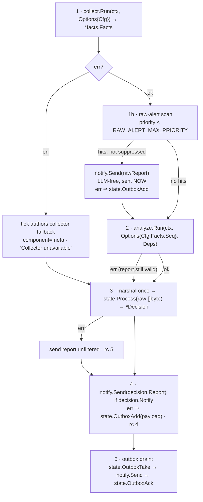

# Contract: runtime (Go)

> Conventions C1–C9 in [CONTRACTS.md](../CONTRACTS.md) are binding and win on conflict. Read them first.

Scope: `deploy/Dockerfile`, the `sentinel tick` and `sentinel health` subcommands (loop + orchestration, replacing `entrypoint.sh` + `tick.sh`), `internal/config`, `internal/logging`, the `sentinel` service in `docker-compose.yml`, `install.sh`, `.github/workflows/ci.yml`. The tick orchestration's own table tests live in `internal/runtime` and are re-verified inside the built image here.

Everything this contract says obeys the Conventions; it adds only what the Conventions leave to the runtime.

---

### R1. `deploy/Dockerfile`

Two stages, `CGO_ENABLED=0`. **No Go toolchain, no build tools and none of the packages listed below in the runtime layer**, but the base is `debian:trixie-slim`, which ships `/bin/bash` and `coreutils` as part of the base image. An earlier wording claimed "no bash/coreutils in the runtime layer", which is measurably false, verified 2026-08-19, and the container tests themselves rely on both. The rule that actually holds is that sentinel **installs** nothing beyond the list below and **executes** only `journalctl`, `sensors -j` and `agy`.

**Build interface**

```
docker build -f deploy/Dockerfile -t sentinel:dev \
  --build-arg AGY_URL_AMD64=<https url to the agy linux-amd64 tarball> \
  --build-arg AGY_SHA512_AMD64=<hex> \
  --build-arg AGY_URL_ARM64=<https url to the agy linux-arm64 tarball> \
  --build-arg AGY_SHA512_ARM64=<hex> \
  .
```
Build context = repo root.

| ARG | Required | Default | Meaning |
|---|---|---|---|
| `AGY_URL_AMD64` / `AGY_URL_ARM64` | **yes** |, | download URL of the Antigravity CLI release tarball for each architecture. The one matching `TARGETARCH` is selected inside the build. Empty for the target being built ⇒ `ERROR: AGY_URL_<ARCH> build-arg is required`. Ops input, resolved from the vendor manifest, never guessed. |
| `AGY_SHA512_AMD64` / `AGY_SHA512_ARM64` | **yes** |, | the **vendor-published** sha512 of the corresponding tarball, copied from the manifest; mismatch fails the build. |
| `AGY_VERSION` | no | `unknown` | OCI label only |

**Where the ops values come from, and why sha512 rather than sha256.** The vendor's own installer (`https://antigravity.google/cli/install.sh`) resolves a platform to an artifact through a manifest:

```
https://antigravity-cli-auto-updater-974169037036.us-central1.run.app/manifests/linux_amd64.json
  -> { "version": ..., "url": ..., "sha512": ... }
```

That manifest publishes **sha512 only**. Requiring a sha256 forced the operator to download the tarball and compute a digest themselves, which proves the file has not changed since *they* fetched it, and proves nothing about what the vendor published. If the fetch was tampered with, the computed sha256 matches the tampered file perfectly. Pinning the vendor's own sha512 is the check that actually constrains the supply chain, so the contract now asks for the digest the vendor signs off on rather than one we generate.

**The tarball does NOT contain a file named `agy`.** Verified against the real artifact 2026-08-19 (version 1.1.15): the archive contains a single ELF x86-64 executable named **`antigravity`**, ~205 MB. The vendor installer extracts it and *installs* it as `agy` (`BINARY_PATH="$TARGET_DIR/agy"`), which is why the installed binary carries that name, and why an implementation written against a synthetic fixture named `agy` builds cleanly and then fails on the real artifact. **The Dockerfile must locate the executable in the tarball and install it as `/usr/local/bin/agy`, not search for a file already called `agy`.**

**A multi-arch push produces a manifest list.** Each build job smoke-tests its own image before the list exists, so the ambiguity a manifest list creates, `docker run` being silently correct on every host, which is how an untested architecture stays untested quietly, never arises: there is no shared tag to resolve at that point, only a digest belonging to one platform. `merge` then verifies the assembled list advertises both. On the rollout host, `docker compose pull` selects amd64 from the list rather than pulling a single-architecture image, same result, different mechanism.

**The image is built for `linux/amd64` AND `linux/arm64`, and both must work.** The vendor ships a distinct artifact per architecture and both are verified:

```
manifests/linux_amd64.json -> linux-x64/cli_linux_x64.tar.gz     ELF x86-64,  sha512 7d6020ca…
manifests/linux_arm64.json -> linux-arm/cli_linux_arm64.tar.gz   ELF aarch64, sha512 2571031d…
```

Both downloaded and checked against the vendor digest on 2026-08-19; each archive contains a single executable named `antigravity`.

**The builder stage is pinned to `$BUILDPLATFORM` and cross-compiles; the runtime stage is not pinned at all.**

```dockerfile
FROM --platform=$BUILDPLATFORM ${GO_IMAGE} AS builder
RUN CGO_ENABLED=0 GOOS=linux GOARCH=${TARGETARCH} go build ...

FROM debian:trixie-slim AS runtime      # no --platform: buildx sets it per target
```

Without the builder pin, buildx runs stage 1 once **per platform**, so the non-native pass executes the entire `gofmt`/`go vet`/`go test ./...` suite under qemu, the measured 5-10x penalty, paid on every push, with `go test` under emulation carrying a real history of timing flakiness that would surface as intermittent red CI blamed on our tests rather than on emulation. The agy download, `sha512sum` and the `tar` of a ~205 MB payload would also run emulated on that pass. `CGO_ENABLED=0` already makes cross-compilation free, so there is nothing to gain by paying for it.

**This pin is not the one that caused the earlier defect, and must not be "fixed" back out as though it were.** That was `--platform=linux/amd64`, a **constant**, on the **runtime** stage, the stage that executes target-architecture code. This is `$BUILDPLATFORM`, a **variable**, on the **builder** stage, which executes nothing but the compiler and the test suite. The first froze the userland while `GOARCH` followed the target and produced an incoherent image; the second cannot, because the only thing it fixes is where compilation happens, and `GOARCH=${TARGETARCH}` still decides what comes out.

**Selection of the agy artifact is by `TARGETARCH`, which buildx supplies**, choosing between the two pinned pairs. That keeps the pin, the operator still supplies exact URLs and vendor digests, and the build never resolves anything from the network on its own, while producing a correct image for either target. `GOARCH=${TARGETARCH}` in the builder and **no `--platform` pin on the runtime stage**: buildx sets the platform per target, and hardcoding one there is what previously let an arm64 build emit an arm64 Go binary into an amd64 userland.

**The architecture assertion tests coherence, not a constant.** Asserting `Architecture == amd64` would fail every legitimate arm64 build. What must hold is that the Go binary's ELF machine, the image manifest's architecture, and the agy binary's ELF machine all agree with the platform that was requested. A three-way mismatch is the defect; a particular value is not.

**The vendor installer is deliberately NOT run at build time.** It resolves to *latest* through the manifest, so piping it into the build would make every rebuild a different analyzer version with no record of which one an image contains, destroying the reproducibility the pinned URL and digest exist to provide, and removing our integrity check in favour of executing whatever the vendor serves at that moment. It also targets a user bin directory and stages through `$HOME/.cache`, neither of which suits a multi-stage build. Pinning is the point; the manifest is how the pin is *found*, not a substitute for it.

**Ops helper:** `deploy/agy-build-args.sh` fetches the manifest and prints the `--build-arg` pair for the current release, so the operator never hand-assembles a URL. They see the version they are about to pin before pinning it. The helper resolves; it does not build.
| `GO_IMAGE` | no | `golang:1.25-trixie` | builder base |
| `VERSION` | no | `dev` | stamped into `main.version` via `-ldflags` |

**Stage 1, builder (`${GO_IMAGE}`)**
- `COPY go.mod go.sum ./` → `go mod download` (own layer, cached).
- `COPY . .`
- `gofmt -l .` (must be empty), `go vet ./...`, `go test ./...`, any failure fails the build. This is where `internal/runtime`'s own table tests gate the image.
- `CGO_ENABLED=0 GOOS=linux GOARCH=amd64 go build -trimpath -ldflags "-s -w -X main.version=${VERSION}" -o /out/sentinel ./cmd/sentinel`
- `agy`: select the URL/digest pair matching `TARGETARCH`, download it, verify with `sha512sum -c`, unpack, locate the **single executable** in the archive (by permission bit, never by filename, the vendor tarball ships it as `antigravity` on both architectures), and place it at `/out/agy`. Zero or more than one executable candidate ⇒ fail the build naming what was found.

**Stage 2, runtime (`debian:trixie-slim`)**, matches the target's Debian 13 journal format (ARCHITECTURE §2.7).
- apt, `--no-install-recommends`, lists deleted in the same layer, exactly: `systemd` (provides `journalctl`), `lm-sensors`, `ca-certificates`, `tzdata`.
  Explicitly **not** installed: `jq`, `curl`, `bash` as a dependency, `smartmontools`, `zfsutils-linux`. HTTP is `net/http`, JSON is `encoding/json`, hashing is `crypto/sha256`.
- User `sentinel`, uid **10001**, gid **10001**, home `/home/sentinel` (unused, `$HOME` is `$AGY_HOME`, a persistent named volume).
- `COPY --from=builder /out/sentinel /usr/local/bin/sentinel` and `/out/agy` → `/usr/local/bin/agy`, both mode `0555`, owner `root:root`.
- **No `/opt/sentinel`, no prompt or schema files.** `role.md`, `report.schema.json` and `facts.schema.json` are `go:embed`ed in their owning packages (C1); the image ships two binaries and nothing writable.
- Build-time verification (any failure fails the build): `sentinel --version`, `journalctl --version`, `sensors -v`, and an **ELF `e_machine` read** of `/usr/local/bin/agy` against `TARGETARCH`.
- `ENV LANG=C.UTF-8 TZ=UTC PATH=/usr/local/bin:/usr/bin:/bin`
- `USER sentinel`, `WORKDIR /`, `ENTRYPOINT ["/usr/local/bin/sentinel"]`, `CMD ["tick", "--loop"]`.
- OCI labels `org.opencontainers.image.source`, `.revision`, `.version=${AGY_VERSION}`.
- No `HEALTHCHECK` in the image, compose owns it (one owner).

---

### R2. `sentinel tick` and `sentinel health`

```
sentinel tick [--loop|--once] [--state-dir PATH]
sentinel health
```

| Flag | Default | Meaning |
|---|---|---|
| `--loop` | off | run forever: validate, then tick every `TICK_INTERVAL` seconds, sequentially. Container entrypoint mode. |
| `--once` | on when `--loop` absent | run exactly one tick, print its report to stdout, exit with the tick's code |
| `--state-dir` | `$STATE_DIR` | override for tests |

`--loop` together with `--once`, any unknown flag, any positional argument ⇒ exit `64`.

`sentinel health` takes no flags: exit `0` iff `$STATE_DIR/heartbeat` exists and its mtime is younger than `3 × TICK_INTERVAL`, else `1`. It is the compose healthcheck and reads nothing else.

**Orchestration is in-process.** `tick` calls `collect.Run`, `analyze.Run`, `state.Process`, `notify.Send` as Go functions (C8). Only `journalctl`, `sensors -j` and `agy` are exec'd, each under `context.WithTimeout`. There is no exit-code round-tripping between components.

**Startup sequence** (`--loop`, and once before the single tick in `--once`)

1. `config.Load()` (R7). Failure ⇒ `ERROR` naming the variable ⇒ exit `78`.
2. Filesystem preflight:
   - `$STATE_DIR` exists and is writable, miss ⇒ exit `69`;
   - `/tmp` writable, at least one of `$HOST_JOURNAL_DIR` / `$HOST_JOURNAL_VOLATILE_DIR` readable and non-empty, `$HOST_PROC/uptime` readable, any miss ⇒ `ERROR` naming the exact path ⇒ exit `78`.
   There is no prompt/schema path check: both are embedded.
3. Assert `/usr/local/bin` is not writable (proves `read_only: true` took effect). Writable ⇒ `WARN`, continue, never block ticks on a lint.
4. Seed agy home: `MkdirAll($AGY_HOME, 0700)`, copy `$AGY_SECRET_DIR` **recursively** into `$AGY_HOME/.gemini` (directories `0700`, regular files `0600`, symlinks skipped, **files already present at the destination are left alone**, **files the process cannot read are skipped and named in a WARN rather than aborting the seed**), `os.Setenv("HOME", $AGY_HOME)`. Missing or empty secret dir ⇒ `WARN runtime agy credentials absent, analysis will fall back`, continue: the raw-alert path must survive without the LLM.

   After seeding, `$AGY_HOME/.gemini/antigravity-cli/settings.json` gets `permission.deny = ["run_command(*)", "write_file(*)", "*"]`, merged into whatever else that file contains and rewritten on **every** start, unlike the rest of the seed. It is policy the container owns, not state agy accumulates: if it depended on the operator's desktop `settings.json`, the container's safety would depend on a file outside the deployment.

   Two reasons, and the second is the load-bearing one. agy is an agent and will decide to run shell commands mid-analysis; in `--print` mode nobody can approve them, so the turn dies (`permission check failed for command "ls -la"`) and returns `status:"ERROR"` with an empty `response`, which the report parser reports as invalid JSON. Measured on the target host: with the deny rules configured, the identical prompt returns `status:"SUCCESS"` and a valid report. And this analyzer's input is attacker-controlled log text, so a tool call the model can be talked into is a prompt injection with a shell on the end of it.

   Bootstrap only, never re-imposed: agy owns `$AGY_HOME` once it runs. It refreshes its OAuth token there, and keeps `antigravity-cli/conversation_summaries.db` and `antigravity-cli/brain/` there. Copying the host tree over that on every start would replace a refreshed token with the host's older one, where no agy runs to keep it current, and would delete accumulated memory on a restart. Re-seeding after the operator authenticates again on the host is therefore explicit: remove `$AGY_HOME/.gemini` and restart.

   Recursive, and into `.gemini`, because that is agy's actual layout: every top-level entry of `~/.gemini` is a directory (`antigravity-cli/`, `config/`) and the credential is `antigravity-cli/antigravity-oauth-token`. The earlier "regular files only, into `$AGY_HOME`" wording described a flat credential file that does not exist, so an implementation obeying it copied nothing and, because the directory was not empty, warned about nothing.

   **`$AGY_HOME` is a persistent named volume, NOT tmpfs.** agy refreshes its OAuth token as it runs; on tmpfs that refresh is lost at every restart, and headless mode **cannot** re-authenticate, it prints an OAuth URL nobody will ever see and exits non-zero. The analyzer would then be permanently down after the first container restart, with the raw-alert path as the only surviving coverage. A `docker compose restart` must not cost the LLM stage.

   **Seeding from `$AGY_SECRET_DIR` is VERIFIED on Linux (2026-08-22).** `~/.gemini` was copied into a fresh `HOME` on the target host and `agy --print` returned `status:"SUCCESS"` with `usage.input_tokens: 13886`, a live call rather than a fallback. The macOS measurement of 2026-08-16 still stands and still differs: there agy's session is bound to the OS keychain (`svce=gemini`, `acct=antigravity`) and copying the tree did **not** restore authentication. Linux has no keychain, the credential is a file, and it is portable. Do not generalise this to macOS. Sign-in methods that need no browser at all also exist in the binary (`AGY_ADC_AUTH` with `GOOGLE_APPLICATION_CREDENTIALS`), but ADC authenticates against a Google Cloud project rather than a personal subscription, so it is not interchangeable with the token path.

   `// ponytail: agy-home is a named volume because a lost token refresh means the analyzer never comes back, headless cannot re-auth.`
5. `MkdirAll` of `history`, `active-alerts`, `outbox`, `raw-alerts`, `deep-queue` under `$STATE_DIR`, mode `0700`.
6. `signal.NotifyContext(ctx, syscall.SIGTERM, syscall.SIGINT)`; the sleep between ticks is `select { case <-ctx.Done(): case <-time.After(interval) }`, so shutdown is prompt. A tick already in flight gets 5 s, then its context is cancelled.
7. Loop body: `seq := nextTickSeq()` (R3.1), run the tick, log `WARN tick rc=<n>` on non-zero, never terminate the loop.
8. On shutdown: log `INFO runtime stopped ticks=<n>` and exit `0` within 5 s (compose `stop_grace_period` is 15 s).

`--loop` terminates only with `0` (signal), `78` (config or mount preflight) or `69` (state dir), the state-dir case is the specialization of startup validation named in C2. Every other failure is logged and the loop continues.

---

### R3. Tick semantics

#### R3.1 Tick sequence number

One counter, one file: `$STATE_DIR/tick-seq`, ASCII decimal, no trailing newline, owned exclusively by `tick` (C1). It is read, incremented and written atomically (`os.CreateTemp` in `$STATE_DIR` + `Rename`, mode `0644`) before step 1, and passed to `analyze.Run` as `Seq`. `collect` and `state` never touch it. Missing or unparseable ⇒ start at `1` and `WARN`.

#### R3.2 Step order



Step 1b runs **before** analysis and its notification is dispatched immediately, so a crashing or quota-blocked agy cannot delay or swallow a critical kernel event (ARCHITECTURE design principle 4).

`tick` authors **only** the collector fallback. When `analyze.Run` returns `(*report.Report, error)` with a non-nil error, that report is already a valid fallback carrying its own stable key (C8), `tick` passes it through `state` unchanged and records exit code `3`. `tick` never builds an analyzer fallback.

The outbox drain runs once per tick, in the order shown, and is the only retry path. `state` owns `outbox/`; `notify` only sends. **This order is authoritative; contracts/state.md S.1's diagram is illustrative and does not override it.** Draining after the add is deliberate, a payload queued by this tick's failed send is retried by this same tick rather than waiting a full interval.

One consequence to know before tuning: `OutboxTake` increments and persists `attempts` on every take, so a tick that fails advances the counter twice, once for the immediate drain of the payload it just queued, once on the next tick. `OUTBOX_SMTP_AFTER=3` therefore reaches the mailrise fallback in roughly two ticks, not three. This is a faster fallback to the LLM-free path, which is the safe direction, but the configured number is not the number of ticks an operator would predict from its name.

Every document `tick` authors (collector fallback, raw alert) passes `report.Validate` before it reaches `notify`. A document that fails validation is logged at `ERROR` and replaced by a minimal valid ALERT with the validation error as evidence, the system never drops an alert because of its own marshaling bug.

#### R3.3 Raw-alert trigger, exact

Operates on the typed `facts.Kernel` section (C5). The section wrapper is probed first: `Err != ""` ⇒ treat as a scan failure (below), never as "no entries".

```go
type RawCandidate struct {
	Entry facts.Entry
	Key   string // dedup.Key("kernel", Entry.Message)
}

func Candidates(f *facts.Facts, maxPriority int) []RawCandidate
```

- Candidates are kernel entries with `Priority <= maxPriority`, newest first.
- The key is `dedup.Key("kernel", entry.Message)` (C6). Priority is not part of the key. `runtime` computes no normalizer of its own.
- A candidate is **suppressed** iff `$STATE_DIR/raw-alerts/<key>` exists and its mtime is newer than `RAW_ALERT_REPEAT_SECONDS`. Otherwise it is **sent** and the marker is written (content: RFC3339 UTC timestamp of the send, mode `0644`, temp+rename). `RAW_ALERT_REPEAT_SECONDS=0` suppresses nothing.
- Markers older than `RAW_ALERT_MARKER_TTL_HOURS` are unlinked at the start of each tick.
- Empty candidate list ⇒ no raw alert, no marker write, straight to step 2.
- **Failure of the scan itself** (kernel section carries `error`, facts shape drift) ⇒ a raw alert with `headline = "Raw-alert scan failed, critical kernel events may be unseen"` and the reason in `body`, then the tick continues. The safety path fails loud, never silent.
- **The scan-failure alert is marker-suppressed like any other raw alert**, under the reserved key `scan-failed`, honouring the same `RAW_ALERT_REPEAT_SECONDS` window and the same TTL sweep. **Its exit code is NOT suppressed: every failing tick still returns the non-zero code, every time.** Without this the failure repeats to a human on every tick, at the default `TICK_INTERVAL=300` that is 288 Telegram messages a day for one broken `journalctl`, and an operator who mutes the bot then misses the genuine hardware alert behind it. Alert fatigue loses events exactly as effectively as a swallowed alert does, so "fails loud, never silent" is kept where it cannot be muted, the exit code (`rc=2` on every failing tick) and the per-tick `WARN tick rc=2` log line, while the human channel is told once per window. **`sentinel health` is deliberately NOT one of those channels and must not be read as one:** it stats `heartbeat` mtime only, and `state.Process` rewrites that on every tick (S-D4), so a container whose `journalctl` has been broken for hours still reports healthy. That is correct for a liveness probe, C4 and R2 define it as nothing more, but it means the healthcheck does not cover a blind critical-event scanner, and monitoring must watch the exit code for that. This is deliberately the one suppressor the raw path trusts, for the same reason the per-candidate markers are: a `state`-layer bug must not be able to swallow it.
- The raw report **bypasses `state`** for dedup, the marker file above is deliberately the only suppressor, so a state-layer bug cannot swallow a critical alert. Delivery is not bypassed: a failed raw POST goes to `state.OutboxAdd` like any other payload and sets exit code `4`.

#### R3.4 Raw-alert payload

A valid `report.Report`, so `notify` needs no special case, and plain text only, `notify` sanitizes every report-derived string (C8), so the body carries no fences and no brackets.

- `status`: always `"ALERT"`.
- `headline`: `"<n> critical kernel event(s) on <hostname>"`, truncated to 80 runes.
- `body`: an intro line, then at most `RAW_ALERT_MAX_LINES` lines `<ts> <priority-name> <message>`, then `"… (<k> more suppressed)"` when candidates exceed the cap.
- `findings`: one per embedded line, `severity: "alert"`, `component: "kernel"`, `evidence` = the message, `key` set, `analysis`/`recommendation` omitted, a raw alert makes no claim it has not verified (A9). Capped at 20 by `RAW_ALERT_MAX_LINES` (`findings.maxItems`).
- `resolved`: always `[]`.
- `meta`: `{hostname, tick_seq, raw: true}`.

```json
{
  "status": "ALERT",
  "headline": "2 critical kernel event(s) on bam",
  "body": "Raw kernel alert, sent without analysis (LLM-free path).\n\n2026-08-15T09:04:11Z crit mce: Hardware Error: Machine check events logged\n2026-08-15T09:04:11Z crit EDAC MC0: 1 CE memory read error on DIMM_A1\n\nA full analysis follows in the next report if the analyzer is available.",
  "findings": [
    {
      "severity": "alert",
      "component": "kernel",
      "evidence": "mce: Hardware Error: Machine check events logged",
      "explanation": "Kernel logged a priority-2 (crit) message. Sent unanalysed on the LLM-free critical path.",
      "key": "3f9a1c7d0b2e4551"
    },
    {
      "severity": "alert",
      "component": "kernel",
      "evidence": "EDAC MC0: 1 CE memory read error on DIMM_A1",
      "explanation": "Kernel logged a priority-2 (crit) message. Sent unanalysed on the LLM-free critical path.",
      "key": "a2044be91cc7d380"
    }
  ],
  "resolved": [],
  "meta": { "hostname": "bam", "tick_seq": 412, "raw": true }
}
```

#### R3.5 Collector fallback

Built by `tick` only when `collect.Run` returns an error: `status = "ALERT"`, `headline = "Collector unavailable"`, `body` = the captured error and stderr tail (max 2000 runes), one finding `{severity:"alert", component:"meta", evidence:<error text>, explanation:"collect failed: <error>", key: dedup.Key("meta", "collector unavailable")}`, `resolved: []`, `meta` set. The key is stable across ticks on purpose, so `state` re-notifies on the ALERT window instead of every tick. It passes through `state` like any report.

#### R3.5b Degraded-analyzer hold

An analyzer outage is only an incident once it has actually LASTED `DEGRADED_ALERT_AFTER` of wall-clock time, not once a certain number of ticks have been observed. `tick` records the unix timestamp of the FIRST tick whose report carries `meta.degraded` (`analyze.md` §5) in `$STATE_DIR/analyzer-fails`, ASCII decimal, written atomically like `tick-seq`, deleted the moment a healthy report arrives. In the file rather than in memory: a restart mid-outage must not hand the analyzer a fresh grace period. The clock used is `tick`'s own single clock read for that tick (`nowFor`/`cfg.Now`, C9), never a second, later read.

While `now - first < DEGRADED_ALERT_AFTER`, `tick` empties `findings` and sets `status = "OK"` before handing the report to `state`, whose message rule 4 then suppresses it. Once elapsed time reaches `DEGRADED_ALERT_AFTER`, the fallback goes through unchanged and `state` alerts on it once, re-notifying on the ALERT window like any other alert. The body is never touched, so the alert still carries the raw kernel lines of the tick that finally sent it. This suppression is applied to a copy handed to `state`; the report `tick` itself holds is never mutated, so R3.8's state-failure path still sends the true, unfiltered document even during the hold window.

`DEGRADED_ALERT_AFTER = 0` alerts on the very first degraded tick: elapsed time at that tick is `0`, and `0 < 0` is false, so nothing is held. This is the deliberate escape hatch for an operator who wants no grace period at all, independent of `TICK_INTERVAL`. With the documented defaults (`TICK_INTERVAL=300s`, `DEGRADED_ALERT_AFTER=900s`), the elapsed-time rule and a tick-counting rule agree on which tick first alerts (the 4th, at 900s elapsed) precisely because 900 is an exact multiple of 300; this is a coincidence of the defaults, not a property of the design, which no longer references `TICK_INTERVAL` at all. Earlier drafts of this hold counted consecutive ticks instead of elapsed time and needed a `ceil(DEGRADED_ALERT_AFTER/TICK_INTERVAL)+1` fencepost correction to reach the same 900s answer; recording elapsed time directly makes that correction, and the tick-counting problem it was fixing, unnecessary.

**The collector-fallback path (R3.5) leaves this marker untouched.** The analyzer did not run that tick either, but a collector failure neither starts nor ends an analyzer outage, and touching the marker on that path is wrong in both directions: clearing it lets a run of unrelated collector failures during a genuine, sustained analyzer outage silence it for as long as the collector keeps flapping (every clear restarts the outage's `first` from scratch); advancing or otherwise crediting it would let collector failures alone manufacture an analyzer-outage alert. Elapsed wall-clock time from the true `first` is exactly what should keep accruing regardless of what happens on unrelated ticks in between, so "untouched" is the only option that is correct on both sides.

A stored `first` that is unparseable, in the future relative to the current clock read (a clock that jumped backwards, which would otherwise make `now - first` negative and hold forever, since a negative value compares less than any positive `DEGRADED_ALERT_AFTER`), or absurdly old (far beyond any credible outage duration, a sign of corruption rather than a genuine multi-year incident) is corrupt: reset to `now` and `WARN`. The reset (degraded=false) path also handles a delete failure: `os.Remove`'s error is checked, and anything other than "already gone" (the ordinary case, silent) is a `WARN`, since a marker that survives a healthy tick lets a later blip ride through a hold that should have started fresh.

Recovery below the threshold is silent, since nothing was ever announced. Recovery from a sustained outage resolves through the normal all-clear path, which by then reports a condition a human actually saw. A marker that fails to persist fails OPEN, not closed: it is reported as not-held so this tick's alert goes through unfiltered rather than held, and is a `WARN`. Trusting whatever was last read instead would mean every subsequent tick re-reads a stale (or, if the disk stays broken, permanently absent) `first` and never crosses the threshold, holding a real outage silent indefinitely; a spurious unfiltered alert on a bad write is the safe failure mode.

A held tick is still recorded to history with its headline intact (`"Analyzer unavailable"`, `status: "OK"`, empty `findings`): the suppression is a notification decision, not a record of what actually happened, so a later reader of that history entry (the next analyze prompt, an operator) sees a deliberately held alert, not a fabricated all-clear.

Deterministic paths are unaffected either way. Raw alerts (R3.3) go out in step 1b, before the analyzer runs at all, and smartd/ZED never involved it.

#### R3.6 Truncation

Truncation of `facts.json` to `FACTS_MAX_BYTES` belongs to `collect`; `runtime` neither implements nor overrides it. Runtime relies on one invariant and tests it (E13): **entries with `Priority <= RAW_ALERT_MAX_PRIORITY` are never dropped**, so a crit line always reaches the raw-alert scan. When `meta.truncated` is true, `tick` logs `WARN tick facts truncated`. Non-empty `meta.collector_errors` ⇒ `WARN` with the section names; the tick proceeds and the analyzer reports them.

#### R3.7 Stdout

`--once`: exactly one line, the compact JSON of the document handed to `notify`, or of the document `state` suppressed. `--loop`: nothing on stdout. All human output is stderr (C7).

#### R3.8 Error behaviour vs. ARCHITECTURE §5

| Failure | tick does |
|---|---|
| agy down/timeout/quota | `analyze` returns its own valid fallback report with a non-nil error ⇒ exit `3`. Passed to `state` unchanged once the outage has lasted `DEGRADED_ALERT_AFTER` (R3.5b), stripped to a suppressed OK document before then. Raw alerts already went out in step 1b. |
| Apprise down | `notify.Send` error ⇒ `state.OutboxAdd(payload)`, `state` is the only outbox writer. Exit `4`. Retry is step 5's take/send/ack drain; after `OUTBOX_SMTP_AFTER` failures `state` marks the item and `tick` calls `notify.Send(..., smtpFallback=true)`, which delivers via mailrise SMTP. |
| `facts.json` over budget | `collect`'s concern; `tick` logs `WARN tick facts truncated`. |
| Collector section failed | `WARN` with the section names, tick proceeds. |
| `state` fails | report is sent unfiltered (delivery beats dedup), exit `5`, **except `resolved[]`, which is emptied first.** `analyze` emits `resolved[]` as 16-hex dedup keys and `state` is what substitutes the stored headline (state S.3(e)); bypassing `state` therefore forwards raw keys to a human, who reads `- f3dae427610efc88` and learns nothing. Emptying is correct rather than lossy: a resolution is an all-clear, and on the one path where `state` is broken we do not know which alerts genuinely closed. Delivery beats dedup applies to findings, not to all-clears we can no longer substantiate. |
| Tick overlap | impossible by construction, sequential loop, single goroutine. |

#### R3.9 Filesystem contract

Reads `$STATE_DIR/**` and the ro host mounts of C4. Writes **only**: `$STATE_DIR/{tick-seq, analyzer-fails, raw-alerts/*}` directly; `$STATE_DIR/{history,active-alerts,outbox,deep-queue}/**` indirectly through `state` and `analyze`; `/tmp/**` (`$AGY_HOME`, plus `facts-<seq>.json` / `report-<seq>.json` dumps only when `LOG_LEVEL=DEBUG`, unlinked at tick end). It never writes `heartbeat`, `state.Process` owns it (C1).

---

### R4. `deploy/docker-compose.yml`, service `sentinel`

Only this service is in scope; `apprise` and `mailrise` are defined by the notification stack and are referenced here, not redefined.

```yaml
services:
  sentinel:
    image: ghcr.io/thiscantbeserious/agentic-server-supervisor/sentinel:${SENTINEL_TAG:-latest}
    container_name: sentinel
    restart: unless-stopped
    command: ["tick", "--loop"]
    depends_on:
      apprise:
        condition: service_healthy
    read_only: true
    cap_drop: ["ALL"]
    security_opt: ["no-new-privileges:true"]
    user: "10001:10001"
    group_add: ["${JOURNAL_GID:?JOURNAL_GID missing, run install.sh}"]
    pids_limit: 256
    mem_limit: 512m
    stop_grace_period: 15s
    environment:
      TICK_INTERVAL: "${TICK_INTERVAL:-300}"
      TICK_WINDOW: "${TICK_WINDOW:-10m}"
      DEEP_WINDOW: "${DEEP_WINDOW:-24h}"
      SECTION_TIMEOUT: "${SECTION_TIMEOUT:-10}"
      JOURNAL_MAX_RECORDS: "${JOURNAL_MAX_RECORDS:-20000}"
      FACTS_MAX_BYTES: "${FACTS_MAX_BYTES:-262144}"
      SERVICES_MAX_BYTES: "${SERVICES_MAX_BYTES:-65536}"
      STATE_DIR: "/state"
      HOST_JOURNAL_DIR: "/host/journal"
      HOST_JOURNAL_VOLATILE_DIR: "/host/journal-volatile"
      HOST_PROC: "/host/proc"
      HOST_ROOT: "/host/root"
      HOST_RASDAEMON: "/host/rasdaemon"
      SENTINEL_HOSTNAME: "${SENTINEL_HOSTNAME:-}"
      AGY_BIN: "agy"
      AGY_HOME: "/state/agy-home"   # persistent volume, never tmpfs (token refresh)
      AGY_SECRET_DIR: "/run/secrets/agy"
      AGY_PRINT_TIMEOUT: "${AGY_PRINT_TIMEOUT:-120s}"
      AGY_HARD_TIMEOUT: "${AGY_HARD_TIMEOUT:-150s}"
      HISTORY_N: "${HISTORY_N:-5}"
      HISTORY_KEEP: "${HISTORY_KEEP:-50}"
      DEEP_ENABLED: "${DEEP_ENABLED:-1}"
      DEEP_TIMEOUT: "${DEEP_TIMEOUT:-30s}"
      RAW_ALERT_MAX_PRIORITY: "${RAW_ALERT_MAX_PRIORITY:-2}"
      RAW_ALERT_MAX_LINES: "${RAW_ALERT_MAX_LINES:-20}"
      RAW_ALERT_REPEAT_SECONDS: "${RAW_ALERT_REPEAT_SECONDS:-3600}"
      RAW_ALERT_MARKER_TTL_HOURS: "${RAW_ALERT_MARKER_TTL_HOURS:-168}"
      DEGRADED_ALERT_AFTER: "${DEGRADED_ALERT_AFTER:-900}"
      RENOTIFY_ALERT_SEC: "${RENOTIFY_ALERT_SEC:-3600}"
      RENOTIFY_WATCH_SEC: "${RENOTIFY_WATCH_SEC:-21600}"
      STALE_ALERT_SEC: "${STALE_ALERT_SEC:-86400}"
      HEARTBEAT_HOUR: "${HEARTBEAT_HOUR:-8}"
      OUTBOX_MAX: "${OUTBOX_MAX:-50}"
      OUTBOX_SMTP_AFTER: "${OUTBOX_SMTP_AFTER:-3}"
      APPRISE_URL: "http://apprise:8000"
      APPRISE_KEY: "${APPRISE_KEY:-sentinel}"
      APPRISE_CONFIG_FILE: "${APPRISE_CONFIG_FILE:-/config/sentinel.cfg}"
      NOTIFY_TIMEOUT: "${NOTIFY_TIMEOUT:-15}"
      NOTIFY_BODY_MAX: "${NOTIFY_BODY_MAX:-3500}"
      MAILRISE_HOST: "mailrise"
      MAILRISE_PORT: "8025"
      MAILRISE_USER: "${MAILRISE_SMTP_USER:?MAILRISE_SMTP_USER missing}"
      MAILRISE_PASS: "${MAILRISE_SMTP_PASS:?MAILRISE_SMTP_PASS missing}"
      SENTINEL_MAIL_FROM: "${SENTINEL_MAIL_FROM:-sentinel@mailrise.xyz}"
      SENTINEL_MAIL_TO: "${SENTINEL_MAIL_TO:-sentinel@mailrise.xyz}"
      LOG_LEVEL: "${LOG_LEVEL:-INFO}"
      TMPDIR: "/tmp"
      TZ: "UTC"
    volumes:
      - /var/log/journal:/host/journal:ro
      - /run/log/journal:/host/journal-volatile:ro
      - /etc/machine-id:/etc/machine-id:ro
      - /var/lib/rasdaemon:/host/rasdaemon:ro
      - /proc:/host/proc:ro
      - /sys:/host/sys:ro
      - /etc/os-release:/etc/os-release:ro
      - type: bind
        source: /
        target: /host/root
        read_only: true
        bind: { propagation: rslave }
      - type: bind
        source: ${AGY_CREDENTIALS_DIR:?AGY_CREDENTIALS_DIR missing}
        target: /run/secrets/agy
        read_only: true
      - sentinel-state:/state
    tmpfs:
      - /tmp:rw,noexec,nosuid,nodev,size=64m,mode=1777
    networks: [sentinel-net]
    healthcheck:
      test: ["CMD", "/usr/local/bin/sentinel", "health"]
      interval: 60s
      timeout: 5s
      retries: 3
      start_period: 120s
    logging:
      driver: json-file
      options: { max-size: "10m", max-file: "3" }

volumes:
  sentinel-state:
  apprise-config:

networks:
  sentinel-net:
```

Notes that are contract, not commentary:

- The `environment:` block is the **complete C3 set**, no component may rely on a default compose does not set. `SENTINEL_HOSTNAME` is passed empty by default, which means "resolve from `$HOST_PROC/sys/kernel/hostname`" (R7).
- `MAILRISE_USER`/`MAILRISE_PASS` are hard-required (`:?`) because mailrise enforces SMTP AUTH unconditionally; the second delivery path must not fail silently at the moment it is needed.
- One network, `sentinel-net`, **not** `internal: true`, apprise needs outbound internet for Telegram, and `depends_on: service_healthy` plus DNS resolution of `apprise` require both services on the same non-internal network. `sentinel` publishes no ports; only `apprise` and `mailrise` publish, bound to a LAN interface.
- The healthcheck is `sentinel health`, no shell, no `$$` interpolation trap.
- The apprise config volume is seeded by the `apprise` service. The sentinel container gets **no `/config` mount and no `TELEGRAM_*` variables**: the bot token stays out of the process that parses attacker-controlled log text. `APPRISE_CONFIG_FILE` is present only because `notify --seed-config` is an ops one-shot; the runtime never invokes it.
- `.env.example` lists every variable compose interpolates **without a default**, every `:?` and every bare `${VAR}`, including `SENTINEL_TAG`, `AGY_CREDENTIALS_DIR`, `JOURNAL_GID`, `MAILRISE_SMTP_USER`, `MAILRISE_SMTP_PASS`, since an unset one either fails the stack or silently interpolates empty. Variables with a `:-default` are **not** copied in: their default already lives in the compose file and in CONTRACTS.md C3, and a third copy in `.env.example` is a third place for them to drift. An operator who wants to change one reads C3. Exactly one top-level `volumes:` and one `networks:` block in the file.
- **agy credential mount:** agy holds an OAuth credential file plus config in the operator's home directory. That directory is mounted read-only at `/run/secrets/agy`; startup copies it into **`$AGY_HOME` = `/state/agy-home`, on the persistent `sentinel-state` volume**, so agy can refresh its access token without a writable host path. **Never tmpfs.** An earlier wording of this line said tmpfs and contradicted CONTRACTS.md C3, R2 step 4 and the `ponytail:` note at R2, all of which require persistence, for a reason that is not stylistic: agy refreshes its OAuth token as it runs, and headless mode cannot re-authenticate a lost one. A tmpfs `$AGY_HOME` therefore works until the first container restart and then the analyzer never comes back, silently falling back for good. `AGY_CREDENTIALS_DIR` lives in `.env` (0600, gitignored) with the note "the container never writes back, re-authenticate on the host and restart sentinel". Docker `secrets:` is not used: it supports single files, agy needs a directory.
- Any `:?` variable unset ⇒ `docker compose up` fails immediately. Fail fast beats a container that silently cannot read the journal or authenticate to mailrise.

Invariants asserted by the container test: no `ports:` on `sentinel`; every bind `read_only: true`; the only rw surfaces are the `sentinel-state` volume and the `/tmp` tmpfs; `privileged`, `devices`, `cap_add` never appear.

---

### R5. `install.sh`

`// ponytail: kept as a single bash script rather than promoted to a Go subcommand, it runs on the host as root before the image exists, needs apt-get and systemctl, and shipping a second Go binary to the host just to write a handful of config files is more moving parts than an idempotent script. Upgrade path: a "sentinel install" subcommand if the host part ever grows.`

**CLI**
```
install.sh [--check] [--dry-run] [--mailrise-host HOST] [--mailrise-port PORT] [--env-file PATH] [--stack-dir PATH] [--ref REF] [-h|--help]
```

| Flag | Default | Meaning |
|---|---|---|
| `--check` | off | report drift, change nothing; exit `0` if converged, `1` if not |
| `--dry-run` | off | print every action it would take, change nothing, exit `0` |
| `--mailrise-host` | `127.0.0.1` | SMTP host smartd/ZED mail is delivered to |
| `--mailrise-port` | `8025` | SMTP port |
| `--env-file` | `./.env` | use this exact env file, unmodified layout; mutually exclusive with `--stack-dir` (usage error, exit `64`, if both given) |
| `--stack-dir` | detected | create/use the compose stack here (Step 0, below); mutually exclusive with `--env-file` |
| `--ref` | `main`, or `$SENTINEL_REF` | git ref `deploy/docker-compose.yml` and `deploy/mailrise/mailrise.conf.example` are fetched from when `--stack-dir` is in effect |

Requires root (`EUID=0`), else exit `77`. Requires Debian/`apt-get` + `systemctl`, else exit `69`.

**Docker preflight (new, runs first, before Step 0 or any other host mutation).** `docker_preflight` checks, in order: the `docker` CLI is on `PATH`; `docker info` succeeds (a reachable daemon); `docker compose version` succeeds (the compose *plugin*, the legacy standalone `docker-compose` binary cannot substitute, and if it is the only thing present the summary says so specifically rather than reporting `docker` as merely "not found"). **Deliberately a warning, not a fatal exit**: steps 1-5 (rasdaemon, msmtp, smartd, ZED) have standalone value on a host that never runs a single container, this script does not install docker itself, and refusing the whole run over a runtime it cannot provide would be strictly worse than reporting the gap and continuing. No exit code is spent on this, it never changes the script's own exit status. What it must never do is let the run summary read as "the stack is ready" when it is not: every downstream note that depends on `DOCKER_OK`/`COMPOSE_OK` (the apprise seed, Step 8 below) says so explicitly in its own line, every run, not only the first one that discovers it missing.

**Step 0 (new): stack creation, only when `--env-file` was not given.** The target invocation is `curl -fsSL https://raw.githubusercontent.com/thiscantbeserious/agentic-server-supervisor/main/install.sh | sudo bash`, nothing copied onto the host first, prompting interactively for what only a human can supply. `--env-file` stays exactly as it always has: given explicitly, Step 0 does not run at all, and the script behaves as every prior version did against that one file. This is the deliberate compatibility seam, the fetch-and-prompt path is additive, not a replacement for a caller who already has a filled env file.

Where the stack lives: `--stack-dir` if given (every mode, always), the operator being explicit beats anything this script could detect, so it skips the scan below entirely. Otherwise `detect_compose_root_candidates` collects every directory that plausibly holds (or should hold) the stack from three signals, records **which signal found it**, and the candidate COUNT decides what happens next, since detection here is not assumed to be unambiguous: a host can have more than one directory matching some signal (a leftover from a migrated install, a second shared folder), and picking one silently would be guessing on the operator's behalf about exactly the thing this design exists to stop guessing about. A prior version chose between only two signals and pattern-matched directory shapes to decide; it worked in fixtures and found nothing at all on the real target host, because both stacks there were created by hand rather than through OMV's own plugin. The fix is not a better pattern, it is asking the tools that already know instead of inferring a shape:

1. **Docker (primary).** `docker_compose_project_roots` asks `docker compose ls --all --format json` which compose projects this host already runs, and takes the PARENT directory of each project's own directory as a candidate root. This is a fact about the running host, independent of naming convention, symlink spelling, or platform, it works on any Docker host, not only an OpenMediaVault one, and it is the only signal that finds a stack created outside OMV's own compose plugin, which is exactly the shape of both stacks on the real target host. The documented JSON shape (`ConfigFiles`, comma-joined when a project uses more than one compose file) has **not been confirmed against a real daemon**, the account on the target host is not in the docker group and interactive `sudo` access was declined (CLAUDE.md keeps that host read-only), so a shape this does not recognise, a missing `docker` CLI, an unreachable daemon, an unsupported `compose ls`, and a project whose working directory no longer exists are all treated as "no candidates from this signal", never as an error; none of them may block the two signals below.
2. **`omv-confdbadm` (secondary).** `omv_confdbadm_compose_root` asks OMV's own config database (`omv-confdbadm read conf.service.compose`, resolving the `sharedfolderref` UUID it carries through `conf.system.sharedfolder`) for the plugin's configured path. This is the only signal that can answer the fresh-install, zero-stacks case a Docker host has no project to report for.

   The binary itself was confirmed against a real OMV host (read-only, per CLAUDE.md): it lives at `/usr/sbin/omv-confdbadm`, not `/usr/bin`, so `omv_confdbadm_bin` tries that absolute path first and falls back to `command -v` rather than trusting a bare name to resolve on every PATH; and it requires root, failing, run without it, not with a clean error but a multi-line Python traceback ending in a config-database load failure, exiting non-zero. `omv_confdbadm_compose_root` treats that as a live threat, not an assumption: the exit status is captured explicitly before any parsing, and the captured output must additionally start with `{` or `[` (the JSON shape this command is documented to emit) before the `sharedfolderref`/`uuid` extraction ever runs, so a traceback landing on stdout by any accident of invocation cannot be scraped for a UUID- or path-shaped substring and handed back as a compose root. Covered by `TestContainer_C12_OmvConfdbadmFailsUgly` against a shimmed binary reproducing the real traceback in three shapes (stderr, stdout, and a non-JSON exit-0 output). The **successful** output shape was verified against a real OMV in the `vm-e2e-omv` VM, and the shape assumed before that was wrong. A shared folder carries no `path` property: `conf.system.sharedfolder` holds `mntentref` and `reldirpath`, and the absolute path is the referenced `conf.system.filesystem.mountpoint` record's `dir` with the relative part joined onto it. Reading a `path` that exists in neither model meant this signal returned false on every real OMV host, so the fresh-install, zero-stacks case it exists to answer was never once answered by it. Both records are fetched with `read --uuid`, which returns the one record rather than the whole table. That matters beyond brevity: a shared folder carries a nested `privileges` value, so its record is not a flat object and a non-greedy `{[^{}]*}` match over a full table settles on the nested value instead of the record containing it. Within a single record `mntentref`, `reldirpath` and `dir` each appear once and never inside the nested value, so a plain field match is unambiguous and no JSON parser is needed.
3. **Structural (tertiary).** `compose_root_looks_omv DIR`, checked over the bounded scan below, is true when `DIR` holds at least one subdirectory shaped the way every OMV-created stack is shaped: `<name>/<name>.yml` with a `<name>/compose.yml` symlink pointing at it. It still earns its place after the two signals above: it is the only one of the three that can find a compose root with no stacks in it *and* no OMV configuration confirming it, an OMV compose plugin freshly enabled but never asked to read from, which happens to also be the fresh-install case this whole design has to get right.

   The symlink comparison resolves both sides (`readlink -f` on `compose.yml` and on its own directory) rather than comparing `readlink`'s raw target against the bare string `<name>.yml`. A real OMV host writes that symlink as an **absolute** path (`compose.yml -> /docker-compose/restic-rest-server/restic-rest-server.yml`, confirmed against a real host), not the relative form every fixture used until this was caught: the earlier bare-string comparison never matched an absolute target, so it silently found nothing on a real host and fell back to the plain layout. Basename equality alone is not enough either: `compose.yml` pointing at a same-named file in a *different* directory must still be rejected, which is the entire reason this check exists, so the resolved target's directory is compared against the resolved `DIR` as well. Covered by `TestContainer_C12_StackLayoutDetectionSymlinkTargetShapes` against all four shapes: plain relative, absolute, dotted relative (`./name.yml`), and same-basename-wrong-directory.

Candidates are deduplicated by resolved path across all three signals; a root found by more than one keeps the **highest-priority** signal's reason, since that is the most concrete thing known about it. Every candidate is shown with that reason, never as a bare path, "two compose projects already here", "OpenMediaVault reports this as its compose folder", "one existing OMV-style stack found here", so a choice between several means something instead of being a quiz.

- **Zero candidates**, reported on stderr ("no compose root detected, using the conventional default"), same as the one- and several-candidate branches report their own outcome, then the conventional `/opt/sentinel` default. An earlier version fell through to that default with no message at all: indistinguishable from a deliberate choice, when it was really "the scan searched and found nothing" on a host where it should have found something.
- **Exactly one**, proposed as the default, with a one-line "detected a possible compose root at … (reason)" on stderr so the operator sees it was found, not decreed.
- **Two or more**, never picked silently. A real run with a controlling terminal gets a numbered list, each entry the path plus its reason, and a final option to type a path of its own. `--check`/`--dry-run`, which must never prompt, report the ambiguity and name every candidate instead of hiding it in what is usually the first preview an operator runs. A real run with no terminal at all refuses outright, `exit 78`, naming every candidate in the message, the same code and the same reasoning the zero-terminal case already uses: without a resolvable directory there is no coherent env file for anything downstream to point at, so writing into a guessed one is worse than stopping.

The structural scan's search locations stay bounded exactly as before, fixed glob patterns one level into `/docker-compose`, the `/srv` shared-folder mount conventions (`dev-disk-by-uuid-*`, `dev-disk-by-label-*`, and `/srv/*` directly), `/opt/*` and `/var/lib/*`, never a recursive walk of `/` or a data disk, which could run for minutes on a large pool and look like a hang. Not exhaustive by design: every candidate listing says so, and a location matching none of these patterns and unreported by Docker or `omv-confdbadm` needs `--stack-dir`, same as any layout this script cannot guess.

With exactly one candidate (or zero), the same real-run/`--check`/`--dry-run`/no-terminal decision applies: offered interactively (Enter accepts it) when a controlling terminal is available; used silently under `--check`/`--dry-run`; refused outright (`exit 78`) on a real run with no terminal and no `--stack-dir`, before touching the host at all, rather than guessing a directory to write into.

`/docker-compose` is **not** hardcoded as the OpenMediaVault compose plugin's root, that path is configuration an operator chose in the OMV UI (the plugin backs onto whichever shared folder was assigned to it, commonly a data disk mount like `/srv/dev-disk-by-uuid-…/docker-compose`, not always the literal string `/docker-compose`), and a script that assumed the literal path would silently fall back to the plain layout on most real OMV hosts, writing `docker-compose.yml`/`.env` into a directory OMV's plugin never enumerates. Layout classification (below) still uses only the structural and `omv-confdbadm` signals, not Docker: Docker says where a stack already runs, not whether that root is laid out the OMV symlink way.

Layout is decided by inspecting the resolved directory's PARENT itself, never by how `STACK_DIR` was chosen: `STACK_DIR` is canonicalized with `readlink -f` first, `dirname` is purely lexical, so a stack directory reached through a symlink into a detected OMV root would otherwise be classified `plain` even though it really is inside the compose root; the files would land in the right place on disk while OMV's plugin, which enumerates by real path, never sees the stack at all. Once resolved, a parent that structurally looks OMV or that `omv-confdbadm` confirms (when the structural check is inconclusive) gets the OMV symlink shape (`sentinel.yml`, `compose.yml → sentinel.yml`, `sentinel.env`, `.env → sentinel.env`, `mailrise/mailrise.conf`) at mode `0700` for the directories, `0600` for `sentinel.env`, `0644` for `mailrise.conf` (a non-root container user reads it, `0600` crash-loops mailrise). Anywhere else gets the plain shape directly, `docker-compose.yml`, `.env`, `mailrise/mailrise.conf`, since a symlink indirection only means something inside an actual OMV compose root. The resolved directory being a *detected* compose root itself, not a stack directory inside one, is refused (`exit 64`) by the same structural/`omv-confdbadm` check, never by comparing against the literal string `/docker-compose`: writing a stack there would drop a stray `docker-compose.yml` into the directory OMV enumerates every other stack from. A directory that merely happens to be *named* `/docker-compose` but is neither structurally shaped nor confirmed by `omv-confdbadm` is not refused, it is an ordinary, if confusingly named, empty directory. `--env-file` used internally by the rest of this script always resolves to the real file, never a symlink: `install`'s atomic replace overwrites its destination rather than following it, and pointed at a symlink it would silently convert the symlink into a regular file, divorcing it from whatever the OMV plugin still thinks is the env file.

`deploy/docker-compose.yml` and `deploy/mailrise/mailrise.conf.example` are fetched from `https://raw.githubusercontent.com/thiscantbeserious/agentic-server-supervisor/<ref>/...` at the resolved `--ref`, the same ref this script itself was fetched from, not blindly `main`, so a script pinned to a tag cannot pull a compose file that has since moved on. Each fetch checks the HTTP status explicitly and that the payload contains an expected signature string (`container_name: sentinel`, `REPLACE_BOT_TOKEN`), a captive portal, a bad ref, or a proxy answering 200 with the wrong body must not be written as if it were the real file. A fetch failure (network, bad ref, curl unavailable and not installable) is transient: `exit 75`, safe to retry. `mailrise.conf` is rendered from the fetched `.example` by substituting its four `REPLACE_*` tokens with real values, the bot token appears twice (the `sentinel:` and `omv:` targets both address the same chat), and is regenerated from `--stack-dir`'s env file on every run rather than hand-edited in place, since this script owns it fully once it exists. Substitution is via `replace_token` (prefix/suffix removal plus plain variable interpolation, `${var%%pat*}`/`${var#*pat}`, never bash's own `${var//pat/rep}` or `sed`'s `s///`), because BOTH of the more obvious mechanisms were measured to treat an unescaped `&` in the replacement text as "the matched text" rather than literal data (`sed`'s convention is documented; bash 5.2's identical behavior in its own pattern substitution is not, and was only found by reproducing it: `x="hello WORLD bye"; echo "${x//WORLD/A&B}"` prints `hello AWORLDB bye`). `sed`'s `/` delimiter collision was the other half of the original defect: a password containing one crashed `sed` outright and left a **zero-byte** `mailrise.conf` that the run summary still reported as "written". After substitution, a `grep -q REPLACE_` fail-closed check refuses to write the file (and does not report success) if any token failed to substitute for any reason, a written-but-corrupted `mailrise.conf` is the one failure mode worse than not writing it at all, since it makes mailrise reject AUTH from the supervisor, `smartd` and ZED while `sentinel health` stays green.

Three values are prompted for when missing and not already present in the env file, the bot token and the mailrise SMTP password with terminal echo off (`read -rs`), the chat id visibly (`read -r`, not a credential), always from `/dev/tty` explicitly, never from stdin: under `curl | sudo bash`, fd 0 *is* the piped script, and reading a prompt from it would silently consume a line of shell source as a secret. A value already present in the env file is never re-prompted for, a re-run after a transient failure only fills in what is still missing. With no terminal and a real run, the missing value is reported and `MISSING_ENV_INPUT` is set (same flag steps 3-5 already use for missing mail credentials): steps that do not depend on it still run, and the whole run still exits `78`. A secret that cannot be obtained is never written as an empty assignment, that is worse than not writing the key at all, since a later idempotency check reading `KEY=` back would wrongly treat it as already satisfied. `--check`/`--dry-run` report a missing value as drift and never prompt; nothing secret appears in their output, only that a prompt is pending.

Everything else about the target stack is derived, never asked: `JOURNAL_GID` by Step 6, below; `MAILRISE_SMTP_USER` defaults to `sentinel`; `AGY_CREDENTIALS_DIR` defaults to the invoking user's home (via `$SUDO_USER`, resolved through `getent passwd`, not root's `$HOME`) plus `/.gemini`; `SENTINEL_TAG` defaults to `latest`; the remaining fields match `deploy/.env.example`'s own defaults. Every one of these goes through the same idempotent upsert as the three prompted values, a field already present in the env file, however it got there, is never overwritten.

**Steps 1-8** (in order, each independently idempotent, unchanged by Step 0 beyond `--env-file` now possibly pointing at a file Step 0 just created)
1. `apt-get install -y --no-install-recommends rasdaemon lm-sensors msmtp msmtp-mta`, skipped per package when `dpkg-query -W -f='${Status}'` already reports installed.
2. `systemctl enable --now rasdaemon`, skipped when already enabled **and** active.
3. Write `/etc/msmtprc`: smarthost `--mailrise-host:--mailrise-port`, `from sentinel@<hostname>`. Mode `0600`, owner `root:root`.

   **When `MAILRISE_SMTP_USER`/`MAILRISE_SMTP_PASS` are present in the env file, write exactly:**
   ```
   auth plain
   tls off
   user <MAILRISE_SMTP_USER>
   password <MAILRISE_SMTP_PASS>
   ```

   **`auth on` does not work here and neither does omitting the credentials.** Both were specified in earlier drafts of this clause and both were measured failing against real msmtp 1.8.28 on Debian 13, with a server advertising `AUTH PLAIN LOGIN` exactly as mailrise does:
   - `auth on` with credentials ⇒ exit `69`, `cannot use a secure authentication method`. `auth on` means "auto-select the safest method", and msmtp's policy refuses PLAIN and LOGIN, the only methods a plaintext listener offers, under auto-selection. Adding `tls off` does not change it.
   - `auth on` without credentials ⇒ the same exit `69`, with `--debug` reporting `user = (not set)`, `password = (not set)`.
   - `auth plain` + `tls off` with credentials ⇒ exit `0`, real AUTH PLAIN handshake, mail delivered.

   Naming the method explicitly is what bypasses the auto-selection guard.

   **This is the same policy the Go side already had to work around, and the two must stay recognisable as one decision.** `internal/notify/smtpfallback.go` carries `plainAuthNoTLS`, a local `smtp.Auth`, precisely because Go's stdlib `smtp.PlainAuth` also refuses PLAIN over a non-TLS connection. `auth plain` is msmtp's equivalent of that bypass. Both exist for one reason: mailrise is a LAN-only plaintext listener (`mailrise.conf` `tls: off`). **Upgrade path, for both at once:** when the listener gets a certificate, this becomes `auth on` + STARTTLS and `plainAuthNoTLS` becomes `smtp.PlainAuth`. Change them together or the two SMTP clients drift apart.

   This is the production branch, not an edge case, R4 hard-requires both variables with `:?`, so on any real host they are set. And `auth off` is not a fallback, because mailrise enforces SMTP AUTH unconditionally (see the `smtpFallback` unconfigured rule in contracts/notify.md N.4). **Neither branch delivering means smartd and ZED cannot send mail at all**, that is the host-side LLM-free path, the one carrying SMART failures and ZFS pool events, and it would fail silently with `sentinel health` staying green.

   `password` in cleartext on the host is why this file is `0600 root:root`. That mode is not decoration: it is the whole containment for a credential that must exist in a file msmtp can read non-interactively. `passwordeval` is deliberately not used, it buys indirection, not secrecy, and adds a second failure mode on the path that runs when the supervisor is down.
4. smartd: ensure `/etc/smartd.conf` contains exactly one managed line
   `DEVICESCAN -a -o on -S on -n standby,q -W 4,45,55 -m smartd@mailrise.xyz -M exec /usr/share/smartmontools/smartd-runner`, inside the marker block. Restart `smartd` only if the block changed.

   **Skipped entirely, never written, on an OpenMediaVault host, this is the platform this project targets, not an edge case.** OMV regenerates `/etc/smartd.conf` from its own config database on every S.M.A.R.T. settings change, plugin update, or reconfigure, and stamps the file with its own header (confirmed against a real host, read-only, per CLAUDE.md):
   ```
   # This file is auto-generated by openmediavault (https://www.openmediavault.org)
   # WARNING: Do not edit this file, your changes will get lost.
   ```
   `file_is_omv_managed` checks for that marker before step4 touches the file at all. When present, step4 writes nothing, restarts nothing, and reports plainly that this host manages smartd through its own configuration and that SMART monitoring/email must be enabled there (the OMV UI's S.M.A.R.T. settings), **not** a failure: no `TRANSIENT_FAIL`, no `changed` increment, no effect on `--check`'s exit status. Writing the managed block anyway would look converged right up until OMV's next regeneration silently discarded it, at which point `smartd` goes back to monitoring nothing and `internal/collect`'s `smart` section reads as an empty, healthy-looking section rather than a broken one, exactly the failure shape this project exists to avoid, with the worst possible timing: it passes every check at rollout and reverts weeks later with nothing connecting cause to effect. Step5/`zed.rc` is checked for the same marker and treated identically (OMV does not currently generate that file, but the check costs nothing and the reasoning is the same if it ever does).

   **Everywhere else (i.e., the marker is absent), writing the file and restarting a running monitoring daemon needs the operator's explicit yes, no flag.** `confirm_monitoring_change` prompts `[y/N]` (via the existing `prompt_with_default`, from `/dev/tty` like every other prompt this script makes, stdin is the piped script under `curl | sudo bash`), Enter or anything but `y`/`yes` means no. This is bigger than writing a config value: it reconfigures and restarts a daemon already monitoring the operator's disks, which is the operator's call, not a side effect of installing a supervisor. `--check`/`--dry-run` never prompt, they report what the prompt would ask and, via the existing preview machinery, what it would write, exactly like every other prompt in this script. With no controlling terminal on a real run, the default is applied and stated explicitly (never assumed consent from silence, the same rule `require_secret` already applies to a missing credential). A decline, for either reason, is reported in the summary along with how to enable monitoring afterward, re-run and answer `y`, or edit the file by hand.

**An opt-in change that defaults to No is not drift, and must not affect `changed` or `--check`'s exit code.** Drift is the system differing from what this script would actually make it; a real, unattended run of this script would not enable SMART/ZED email unless asked, the default is No, so `--check` previewing what a `y` answer would write is not evidence of anything pending. `--check`/`--dry-run` still render that preview (the operator asking `--check` what is available is exactly the use case the preview exists for), reported as `available, would be … if enabled (opt-in, defaults to No, not counted as drift)`, distinct from an ordinary `changed`-incrementing note, and it is never added to `changed`. An earlier version of this script called `confirm_monitoring_change` (which auto-passes under `--check`/`--dry-run` purely so the preview has something to render) and then unconditionally counted the preview as `changed`, so `--check` reported drift on every host where the prompt would default to No, which is every host with no controlling terminal, i.e. every real `curl | sudo bash` run. That made `--check` permanently unable to exit 0 on a fully converged system, exactly the false positive that erodes trust in the one command meant to answer "is this converged."
5. ZED: ensure `/etc/zfs/zed.d/zed.rc` sets `ZED_EMAIL_ADDR="zed@mailrise.xyz"`, `ZED_EMAIL_PROG="msmtp"`, `ZED_NOTIFY_VERBOSE=1` inside the marker block. Restart `zfs-zed` only if changed. No `/etc/zfs/zed.d/` ⇒ `WARN`, skip, do not fail. Same OMV-marker skip and same `[y/N]` confirmation as step4, for the same reasons.
6. `getent group systemd-journal | cut -d: -f3` ⇒ upsert `JOURNAL_GID=<gid>` in `--env-file` (replace on differing value, append if absent, never duplicate). Group missing ⇒ exit `70`.
7. Print a summary: which steps changed, which were already converged, and `changed=<n>`.
8. **(new) apprise seed.** Registers the Telegram target with apprise-api's own HTTP API, `POST /add/<APPRISE_KEY>` (default `sentinel`) with `urls=tgram://<TELEGRAM_BOT_TOKEN>/<TELEGRAM_CHAT_ID>` against `http://<APPRISE_BIND>:8000/add/<key>`, the same registration `deploy/README.md`'s "Seed the apprise config key" documents and `internal/notify/seed.go` performs from inside the container; this is the host-side equivalent, reading straight from `--env-file`'s `TELEGRAM_BOT_TOKEN`/`TELEGRAM_CHAT_ID` rather than a rendered config file, since this script has none to render. Writing `apprise/sentinel.cfg` by hand does **not** register the key (see `deploy/README.md`), `POST /add` is the only real registration.

   **Runs after the stack is up, deliberately never brings it up itself.** `docker compose up -d` is not something this script runs, the operator drives every container lifecycle action (CLAUDE.md); this script only writes and validates config. Concretely: if `DOCKER_OK`/`COMPOSE_OK` (the preflight above) are not both set, the step is skipped with a note naming exactly what remains, install docker, `docker compose up -d` in the stack directory, then re-run this script. If they are set but the POST itself cannot connect, that means the stack has not been brought up yet (or apprise is unhealthy); the same "re-run after `docker compose up -d`" note is given, not a fatal exit. Either way, seeding happens on **whichever run finds the stack already up**, install.sh is safe, and expected, to be re-run purely to complete this step once the operator has started the containers.

   **204 is a failure, not a success**, exactly as it is for `sentinel notify --seed-config` (`contracts/notify.md` N.3.1): apprise-api's own documented behavior for `/add` returning `204` is that the key was **not** registered. This is checked explicitly and reported as a failure, never conflated with the 2xx success case. **Unreachable and reachable-but-rejected are different in kind, and the exit code says so.** A connection failure (`curl`'s own exit status nonzero) is a normal intermediate state, this step runs before the operator has necessarily brought the stack up at all, since install.sh never does that itself, and leaves the run's exit code untouched. A `204` or a non-2xx HTTP response is apprise **answering** and telling us the registration was refused: that is a present failure of the primary notification path, discovered while this step was looking straight at it, and sets `TRANSIENT_FAIL` (`exit 75`) rather than leaving the run to report success. `75`, not a new fatal code: apprise can plausibly still be finishing startup even while already answering HTTP (its config store not yet writable), and re-running this script is the documented remedy for both that case and a genuine rejection alike.

   **Idempotent by construction, not by a separate "already seeded" check.** `POST /add/<key>` is itself an upsert on the apprise-api side, so re-POSTing identical `urls=` on every run that finds the stack up is correct, not something to detect and skip, unlike the marker-block file steps above, there is no local state this step needs to compare against to stay idempotent.

   **The token never reaches curl's argv** (visible to any other process on the host via `ps`), it is piped to `curl --data-urlencode urls@-` on stdin instead, the same discipline the mailrise.conf/msmtprc paths already carry for their own secrets. `--check`/`--dry-run` report what would be registered and never perform the request.

**Idempotency contract.** Every file is edited only between
```
# >>> agentic-server-supervisor (managed) >>>
…
# <<< agentic-server-supervisor (managed) <<<
```
Content outside the markers is never modified. Rendering the block is a pure function of flags + host facts, so a second run is byte-identical. **Asserted:** two consecutive real runs produce identical sha256 for every touched file, and the second reports `changed=0` and restarts no service. A pre-existing unmanaged `-m` line in `smartd.conf` is **commented out where it stands**, the original line prefixed with `# disabled by agentic-server-supervisor: `, and the fact recorded in the managed block's preamble and in the run summary. An earlier wording said it was "left in place, commented out … inside the managed block's preamble", which is self-contradictory and was implemented literally: the original stayed live at the top of the file while only a commented copy appeared in the block, so smartd kept honouring the operator's previous mail target while the summary reported it handled. Two active `-m` targets is also not merely untidy, real smartd refused to start on such a file (`Unable to register device /dev/sda … Exiting`), which would take the SMART path down entirely. The original text is never deleted: it is the operator's configuration and the `.bak-<epoch>` copy plus the comment are how they get it back.

**Exit codes** (host script, deliberately its own table, it is not the `sentinel` binary): `0` converged / `--check` clean / `--dry-run` done · `1` `--check` found drift · `64` usage, including `--env-file` and `--stack-dir` both given · `69` unsupported host · `70` `systemd-journal` group missing · `75` package install or service restart failed, **or Step 0's fetch of `docker-compose.yml`/`mailrise.conf.example` failed** (network, bad `--ref`, curl unavailable), all transient, safe to re-run · `77` not root · `78` **required ops input missing**, `MAILRISE_SMTP_USER`/`MAILRISE_SMTP_PASS` absent from `--env-file`, or (Step 0) no `--stack-dir` resolvable, or one of the three prompted secrets still unknown, in each case with no controlling terminal to ask.

`78` exists because `75` says *transient, safe to re-run* and a missing credential is nothing of the sort: it is permanent until a human edits the file, so rollout automation reading `75` retries forever and never converges. The value matches the `sentinel` binary's own config-error code (C2), which is the same category of fault, a required input the operator has not supplied, even though this script otherwise keeps its own table.

**Neither the docker preflight nor an unreachable apprise in Step 8 spends a new exit code**, both are warnings surfaced only through the run summary's notes, for the reasons given above: this script does not install docker or bring the stack up itself. **A reachable-but-rejected apprise seed (`204`, or a non-2xx status) is different: it sets `TRANSIENT_FAIL`, the existing `exit 75`.** Apprise answered and said the registration failed, that is a present fault, not an intermediate state on the way to one, and reporting it via `exit 0` would tell anything reading `$?` that the run succeeded when the primary notification path is confirmed broken.

**A step whose output cannot work must not run.** When mail is unconfigured, the package absent *or* the credentials missing, steps 4 and 5 are skipped, because pointing `smartd -m` and `ZED_EMAIL_PROG` at an msmtp that cannot deliver is worse than leaving them alone: every SMART failure and pool event then invokes a mailer that silently drops it, while the summary reports the steps as updated. Gate all three on *mail is actually configured*, never on package presence alone, the package being installed says nothing about whether it can send.

**Filesystem:** reads `/etc/os-release`, `/etc/smartd.conf`, `/etc/zfs/zed.d/zed.rc`, `/etc/msmtprc`, `--env-file`. Writes those same paths via `mktemp` + `install -m <mode>` atomic replace, with a `.bak-<epoch>` copy on first modification only. This script runs on the **host**, outside the read-only container promise; it is the one artifact that writes, it writes nothing under `/var` or `/home`, and it runs only during rollout, after explicit approval.

**Network:** Step 0 (skipped when `--env-file` is given) fetches `https://raw.githubusercontent.com/thiscantbeserious/agentic-server-supervisor/<ref>/deploy/docker-compose.yml` and `.../deploy/mailrise/mailrise.conf.example`, read-only; `curl` is installed via `apt-get` if missing. Step 8 (new) `POST`s to `http://<APPRISE_BIND>:8000/add/<APPRISE_KEY>`, the host's own loopback/LAN address, never a remote host, and only once the docker preflight confirms the stack could be up. No other network access anywhere in this script.

---

### R6. `.github/workflows/ci.yml`

**Trigger:** `push` on `main` limited to `cmd/**`, `internal/**`, `deploy/**`, `test/**`, `go.mod`, `go.sum`, `.github/workflows/ci.yml`; `pull_request` on the same paths (build only, no push); `workflow_dispatch`.

`deploy/**` is load-bearing and was missing: without it a Dockerfile-only change does not rebuild, and a later `docker compose pull` on the rollout host then returns a stale image that silently does not contain the change just made. `supervisor/**` was listed and does not exist in this repository, a leftover from the shell-script layout C1 abolished.

**Permissions:** `contents: read`, `packages: write`. Built-in `GITHUB_TOKEN` only, no repository secrets (PLAN §2.9).

**Architecture is a matrix axis, never something a job compensates for.** Each architecture builds and tests on a runner native to it, `ubuntu-24.04` for amd64, `ubuntu-24.04-arm` for arm64, so **no emulation is involved anywhere and `docker/setup-qemu-action` is deliberately absent**. Adding a third architecture is one matrix row and no code change.

This is not a performance preference. An earlier single-runner design built and tested `linux/arm64` under QEMU on an amd64 runner, and the emulation boundary produced a run of failures whose causes were repeatedly misdiagnosed, a wrong-architecture binary reads as an emulation limitation, because both present as `exec … not found`. Removing emulation removes the ambiguity rather than documenting it. If a future change makes a job need binfmt again, that is a signal it is cross-building, and it must fail rather than be papered over with QEMU.

**Job `test`**, `runs-on: ubuntu-24.04`: `actions/checkout@v5` → `actions/setup-go@v5` (version from `go.mod`) → `gofmt -l .` (must be empty) → `go vet ./...` → `go test -race ./...`. Unit suite only; the container suite is its own job below.

**Job `container`**, `needs: test`, matrix over `{platform, arch, runner}` with `fail-fast: false`: `go test -tags container ./test/...` with `SENTINEL_REAL_AGY=1` and the four `AGY_*` variables, so every image the suite builds uses the real vendor artifact.

`fail-fast: false` is deliberate: one architecture failing must not cancel the other, because which architectures fail is the information being sought.

**This job exists because the C-series suite previously ran nowhere in CI.** It executed only on developer machines, under rootless podman, which differs from the runner's rootful BuildKit in ways that have twice produced defects invisible locally, a build arg silently defaulting, and container-created directories the host user cannot remove. The suite must run where the artifacts are actually produced.

**Job `build`**, `needs: test`, matrix over `{platform, arch, runner}` with `fail-fast: false`, `concurrency: group=build-${{ github.ref }}, cancel-in-progress: true`:
1. `actions/checkout@v5`
2. `docker/setup-buildx-action@v3`
3. `docker/login-action@v3` → `registry: ghcr.io`, `username: ${{ github.actor }}`, `password: ${{ secrets.GITHUB_TOKEN }}`, skipped on `pull_request`
4. `docker/metadata-action@v5` → `images: ghcr.io/thiscantbeserious/ops-nanny/sentinel` (a pinned literal, not derived from `github.repository`), tags `type=raw,value=latest,enable={{is_default_branch}}` and `type=sha,format=long,prefix=`
5. `docker/build-push-action@v6` → `context: .`, `file: deploy/Dockerfile`, `platforms: ${{ matrix.platform }}` (**one platform per job**), `outputs: type=image,push-by-digest=true,name-canonical=true`, pushing only on non-PR runs, tags/labels from step 4, `build-args: AGY_URL_AMD64=${{ vars.AGY_URL_AMD64 }}`, `AGY_SHA512_AMD64=${{ vars.AGY_SHA512_AMD64 }}`, `AGY_URL_ARM64=${{ vars.AGY_URL_ARM64 }}`, `AGY_SHA512_ARM64=${{ vars.AGY_SHA512_ARM64 }}`, `AGY_VERSION=${{ vars.AGY_VERSION }}`, `VERSION=${{ github.sha }}`, cache `type=gha` in+out.
6. Each job smoke-tests **its own** pushed digest, natively, no `--platform`, no native-versus-emulated branching, because there is no emulated case. The ELF `e_machine` of both `/usr/local/bin/sentinel` and `/usr/local/bin/agy` is read **before** anything is executed, then both binaries are run.
7. The digest is exported as an artifact for the merge job.

**Job `merge`**, `needs: build`, which waits on every matrix leg, so a manifest list is never assembled from a partial set. It downloads the digests, runs `docker buildx imagetools create` to assemble the list and apply the tags from step 4, then `imagetools inspect` to verify **both** `linux/amd64` and `linux/arm64` are advertised, failing by name if either is absent. Filter on `os == "linux"` when reading the platform list: buildx's attestation manifests carry an `unknown` architecture and would otherwise pollute it.

**One property was deliberately traded away here, and it should not be rediscovered as a bug:** no single job sees both architectures any more. Coverage is compositional, each build job verifies its own image natively, and `merge` verifies both are advertised in the list. That is the correct trade for deleting emulation, but "one place compared the two" is genuinely gone.

**The verification's expectation must never derive from the build.** The container suite takes its expected architecture from `runtime.GOARCH`, fixed by the Go toolchain when the test binary was compiled on the physical runner, and therefore untouchable by any build arg, Dockerfile line, or buildx flag. An earlier design derived both the artifact selection *and* its expected value from `TARGETARCH`; when that variable silently defaulted, every image was built amd64 and the check passed anyway, because it could only prove the artifact agreed with itself. A coherence check whose expectation shares a source with the thing it checks is not a check.

`AGY_URL_AMD64`/`AGY_SHA512_AMD64`/`AGY_URL_ARM64`/`AGY_SHA512_ARM64`/`AGY_VERSION` are repository **variables**, not secrets (public URLs and hashes). **All four architecture values are required**, because both platforms are built on every push, a missing one fails only the platform it belongs to, which is the confusing half-failure worth naming here rather than debugging later. Unset ⇒ the Dockerfile's required-arg check fails the run with a clear message, intended. No `continue-on-error` anywhere.

**`install.sh` is a trigger path.** It sits at the repository root, outside every directory the original path filter listed, so a change to it alone never ran CI at all until this was added. That gap mattered more than most: `install.sh` runs as root against a live host and had, until the jobs below existed, no execution path anywhere that could reach its own exit-0 success line, container test tooling has no systemd PID 1 and no real apt dependency resolver, and a fixture-only suite proves only that the code agrees with whoever wrote the fixtures. That combination once let `install.sh` remove `openmediavault` and ten plugins from a live 16.4T host: `msmtp-mta` provides `mail-transport-agent`, apt resolved the resulting conflict with `postfix` by removing it, and every existing test still passed, because none of them exercised a real package manager.

**Jobs `vm-e2e-debian` and `vm-omv-image`/`vm-e2e-omv`** exist to close exactly that gap: they boot a real kernel under QEMU and run `install.sh` against it, something no container build can do. Kept off the `container` matrix deliberately, that matrix is an architecture axis (one native runner per arch), these jobs are a host-platform axis (plain Debian vs. a real OpenMediaVault install) and always run `amd64`; folding them together would make one matrix answer two unrelated questions.

**KVM acceleration is used when the runner offers it, TCG (software emulation) otherwise, and neither job may skip.** `/dev/kvm` is confirmed present and usable on the standard `ubuntu-24.04` GitHub-hosted runner (verified live, both VM jobs ran under `kvm`, not `tcg`), so acceleration is the normal path here, not the lucky one. It is still not an officially supported or guaranteed feature of the runner image, which is why the TCG fallback stays rather than being treated as dead code: a job that quietly does nothing when its environment is unavailable is the exact failure shape that let `install.sh` go untested this long, and it would be strictly worse here, since this is the one place that failure shape has already cost real data. `test/vm/lib.sh`'s `vm_detect_accel` logs which mode ran and why, so a slow run is explained by its own log rather than left a mystery.

**Variant 1, `vm-e2e-debian`, `needs: test`, runs on every push and pull request.** A minimal Debian trixie `genericcloud` image (`test/vm/fetch-debian-cloud-image.sh`, pinned to a dated snapshot and verified against upstream's own `SHA512SUMS`, never the `latest` symlink, which can move underneath an unrelated push), provisioned by cloud-init for an SSH user and key generated fresh per run. This is the ordinary path: no mail transport agent present, so installing `msmtp-mta` is legitimate and must still happen; no platform-generated config markers, so `install.sh`'s interactive monitoring prompt is reachable; plain stack layout rather than the OMV one. Boots from a copy-on-write overlay of the downloaded base (`qemu-img create -b`), so a run can never contaminate the cached download, and stays cheap enough to run on every push: only the base image download is cached (`actions/cache`, keyed on `fetch-debian-cloud-image.sh`'s own hash), nothing here needs provisioning ahead of time.

**Variant 2, split into `vm-omv-image` (builds and publishes) and `vm-e2e-omv` (pulls and tests), is the valuable half.** It installs OpenMediaVault using its own documented installer script on a Debian base, not a hand-assembled approximation, because a hand-built lookalike would encode the same assumptions that already produced three separate defects: the removal cascade (OMV depends on postfix; proving `install.sh` cannot displace it needs a real OMV that actually depends on it), the platform config markers (OMV really does stamp `/etc/smartd.conf` and `/etc/zfs/zed.d/zed.rc` with an auto-generated header; until this job existed that detection was tested only against headers this project typed itself), and compose-root detection (a detector once shipped that failed on a real OpenMediaVault host because OMV's compose plugin writes `compose.yml` symlinks with **absolute** targets, and every fixture in the suite used the relative form someone imagined instead, so every test passed anyway). `test/vm/provision-omv.sh` installs OMV, installs `openmediavault-compose`, and materialises one real compose stack through OMV's own config database and salt deploy, the only way to produce that absolute-symlink shape for real rather than typing a guess at it.

**A provisioned OMV disk is expensive (a full package installation over the network) and is built once, never per run.** `qemu-img create -f qcow2 -b base.qcow2 -F qcow2 run.qcow2` gives every test run a disposable, near-instant, near-zero-byte overlay; the base itself is opened read-only and a run can never contaminate it, which is what makes sharing it across every branch and every future run safe.

**Published to GHCR, not the GitHub Actions cache, and tagged by content hash, never by a moving tag.** The Actions cache is scoped by branch, a cache written on one branch is invisible to a sibling branch and only the default branch's own cache is readable everywhere, so a provisioned image built on a feature branch would be invisible to every other branch and rebuilt from scratch by each of them, the opposite of the point. GHCR has no such scoping and this project already has the machinery (registry login, push, this same repository's `build`/`merge` jobs). The tag is `sha256(provision-omv.sh + fetch-debian-cloud-image.sh + cloud-init-user-data.tmpl)`, truncated, so a changed script produces a different tag rather than silently overwriting an image other branches still depend on, the same reasoning that keeps every action in this workflow pinned by commit SHA rather than by a tag that can move underneath a consumer.

**Publishing is isolated to its own job holding `packages: write`; the test job holds only `packages: read`.** `vm-omv-image` is the only place in either variant that can push, it never runs on `pull_request` (`if: github.event_name != 'pull_request'`), so a compromised step reachable from a pull request never has write access to this project's registry namespace.

**Both OMV jobs, `vm-omv-image` and `vm-e2e-omv`, are push-only, never on `pull_request`.** `vm-e2e-omv` holds only `packages: read` and would be safe to run there, but a pull request never has a warm image to pull, `vm-omv-image` never runs on one, so every pull request would build the entire OMV image locally on every push to the branch, the single most expensive path either variant has, paid repeatedly for no publishing benefit. The alternative, letting it run and silently skip when nothing is published, was rejected outright: a job that quietly does nothing when its input is missing is the exact failure shape this whole pair of jobs exists to rule out. Push-only is a fixed, visible trigger scope declared in the workflow, not a runtime skip decided by what happens to be cached, and it stays honest about what does and does not run on a pull request. `vm-e2e-omv` still always tries to pull the content-hash tag first (a hit extracts the disk with `docker create`/`docker cp`); on a miss, unpublished (realistically only the first push anywhere that introduces or changes the provisioning script, since every later push to `main` already has `vm-omv-image` running alongside it), it builds the image itself and runs the test against it, but never publishes, it has no write scope to. A cold cache degrades to "this run builds and pays for itself," never to a failure.

**A stale image is worse than no cache, so the pulled disk is checked against its own claim before anything else runs.** `provision-omv.sh` records the OMV and postfix package versions it actually installed into `/etc/vm-e2e-expected-versions` inside the image; `run-omv-e2e.sh` compares that file against the running VM's real `dpkg-query` output as the very first step and fails loudly on any mismatch, catching a corrupted transfer or a tag collision before it could otherwise look like a real, silently wrong, test result.

**Both variants deliberately exercise `--stack-dir`, never `--env-file`.** `--stack-dir` is what the documented `curl | sudo bash` flow actually runs: create the stack, fetch the compose file, prompt for the three secrets, write them. `--env-file` is the older "I already filled in a file myself" path; a suite that only exercised that one would never test stack creation, most of what the installer does today. The two are mutually exclusive by install.sh's own design, passing both is a usage error (exit 64), not a corner case, and an earlier version of this suite hit exactly that: `vm_run_install_checks` unconditionally appended `--env-file` to every invocation regardless of what the caller had already passed. `--stack-dir` with no controlling terminal exits 78 rather than assume consent for a missing secret (R5), so both variants pre-seed the stack's own env file with the three secrets before the first run, arriving at the same place a real operator answering the prompts would, without a terminal to answer them on.

**Assertions both variants share** (`test/vm/lib.sh`'s `vm_run_install_checks`): `install.sh` reaches **exit 0**, the headline this whole pair of jobs exists to prove, since no execution anywhere had reached it before; a representative claimed file exists with the claimed mode; a second run converges at `changed=0`; a following `--check` exits 0; and a `dpkg-query` snapshot taken before and after shows nothing removed. The OMV variant adds the assertions only a real OMV host can make: `postfix` still installed and the OMV plugin package set unchanged after the run (the removal cascade), `/etc/smartd.conf` byte-identical and still carrying OMV's own auto-generated header (the config marker skip), and `install.sh --dry-run`'s own layout line reporting `layout: omv` against the real compose stack `provision-omv.sh` created (the absolute-symlink compose-root detection this job exists to prove against reality rather than an imagined fixture).

**Runtimes are unmeasured as of this writing.** Neither job can be exercised locally, no `qemu-system-x86_64` in this environment, and per this repository's own validation rule (CLAUDE.md), CI is the validator for anything that cannot run without it; nothing here is claimed proven until a real run says so. Provisionally: `vm-e2e-debian` has no expensive dependency (a small cloud image plus a normal `install.sh` run) and is expected to run on every push and pull request without controversy. `vm-omv-image`/`vm-e2e-omv`'s warm-cache path (pull plus overlay boot plus one `install.sh` run) is expected to be comparable; its cold-cache path (a full OMV package installation) is expected to be substantially slower and is the number that should decide whether the OMV variant stays on every push or moves to `main`-only, once measured rather than guessed.

---

### R7. Packages owned by this contract

`cmd/sentinel/main.go`, `internal/config`, `internal/logging`, `internal/runtime`, `test/container_test.go` (layout per C1).

```
internal/runtime/
  tick.go       // Tick(), TickResult, step orchestration
  rawalert.go   // Candidates(), BuildRawReport(), marker suppression + TTL sweep
  fallback.go   // CollectorUnavailable(), the ONLY fallback runtime authors
  loop.go       // Loop(): preflight, agy-home seeding, tick-seq, signals
  health.go     // Health(): heartbeat mtime check
```

```go
package config

type Config struct {
	// runtime
	TickInterval time.Duration
	StateDir     string
	Hostname     string
	LogLevel     slog.Level
	Now          func() time.Time // SENTINEL_NOW override in tests, time.Now otherwise

	// collect
	TickWindow, DeepWindow string // journalctl --since values
	SectionTimeout         time.Duration
	FactsMaxBytes, ServicesMaxBytes int
	HostJournalDir, HostJournalVolatileDir string
	HostProc, HostRoot, HostRasdaemon      string

	// analyze
	AgyBin, AgyHome, AgySecretDir string
	AgyPrintTimeout, AgyHardTimeout, DeepTimeout time.Duration
	HistoryN   int
	DeepEnabled bool

	// raw-alert path
	RawAlertMaxPriority, RawAlertMaxLines int // lines clamped to <= 20
	RawAlertRepeat, RawAlertMarkerTTL     time.Duration

	// state
	HistoryKeep, HeartbeatHour, OutboxMax, OutboxSMTPAfter int
	RenotifyAlert, RenotifyWatch, StaleAlert               time.Duration

	// notify
	AppriseURL, AppriseKey, AppriseConfigFile string
	NotifyTimeout time.Duration
	NotifyBodyMax int
	MailriseHost, MailrisePort, MailriseUser, MailrisePass string
	MailFrom, MailTo string
}

// Load reads C3 once. Any malformed, out-of-range or non-numeric-where-numeric
// value returns ErrConfig naming the variable (never its value) → exit 78.
func Load() (*Config, error)
```

`Hostname` resolution, the single one in the system: `$SENTINEL_HOSTNAME` if non-empty → `$HOST_PROC/sys/kernel/hostname` → `"unknown"`. `AgyHardTimeout` is raised to `AgyPrintTimeout + 30s` when it is lower. `TickWindow` must parse as `^[0-9]+(s|min|h)$` and exceed `TickInterval`, else `ErrConfig`.

```go
package runtime

type TickResult struct {
	Seq       int64
	Report    *report.Report // the document handed to notify, or the one state suppressed
	RawAlerts int
	Notified  bool
	Queued    bool // enqueued to outbox instead of delivered
	ExitCode  int  // C2 table, highest reached
	Err       error
}

func Tick(ctx context.Context, cfg *config.Config, seq int64, d Deps) TickResult
func Loop(ctx context.Context, cfg *config.Config, d Deps) (int, error)
func Health(cfg *config.Config) (int, error)
```

`Deps` holds `collect.Run`, `analyze.Run`, `state.Process`/`OutboxAdd`/`OutboxTake`/`OutboxAck`, `notify.Send` as function values, the only injection seam, so the tests need no subprocess and no network.

---

### R8. Test contract

`go test ./...`, table-driven, stdlib `testing`, hermetic and offline (C9). Every row names the acceptance criterion it maps to, so a failure points at the criterion.

**`internal/runtime`.** Apprise is an `httptest.Server` recorder; `collect`/`analyze`/`state`/`notify` are injected through `Deps`.

| # | Table case | Assertion | Maps to |
|---|---|---|---|
| E1 | `ok_tick` | fixture OK facts + fixture OK report ⇒ `ExitCode == 0`; stdout JSON validates against `report.schema.json` **and** `report.Validate` | full-tick acceptance |
| E2 | `notify_title_shape` | recorder receives exactly one `POST /notify/sentinel`; `title` matches `^\[(OK\|WATCH\|ALERT)\] [^:]+: .+$` | notification message shape |
| E3 | `raw_alert_without_agy` | facts built **by `collect` from a journal fixture** containing `priority: 2`, analyze stubbed to return its fallback + error ⇒ a raw POST arrives whose recorder timestamp precedes the fallback POST, `title` starts `[ALERT]`, body contains the raw line | `kern.crit` ⇒ raw alert without agy, design principle 4 |
| E4 | `raw_alert_dedup` | second identical tick within `RawAlertRepeat` ⇒ no second raw POST; `RawAlertRepeat = 0` ⇒ exactly one more | raw-path dedup |
| E5 | `collect_fails` | ⇒ `ExitCode == 2`, one POST, headline `Collector unavailable`, finding `component == "meta"` | ARCHITECTURE §5 |
| E6 | `analyze_fails` | analyze returns `(fallbackReport, err)` ⇒ `ExitCode == 3`, one POST, the analyzer's own document is delivered byte-identically through `state`, and `runtime` authored no fallback | ARCHITECTURE §5, C8 |
| E7 | `apprise_503` | recorder returns 503 ⇒ `ExitCode == 4`, exactly **one** new file under `$STATE_DIR/outbox/`, written by `state` | ARCHITECTURE §5 |
| E8 | `kernel_section_error` | kernel section carries `{"error": …}` ⇒ POST whose headline contains `Raw-alert scan failed`, `ExitCode != 0` | fail-loud safety path |
| E9 | `raw_alert_delivery_fails` | raw POST 503 ⇒ payload lands in `outbox/`, `ExitCode == 4`, and the next drain re-sends it byte-identically | "no alert is lost" |
| E10 | `no_writes_outside_state` | after a tick, no file anywhere outside `$STATE_DIR` and `os.TempDir()` has an mtime newer than a marker | A1 |
| E11 | `state_dir_whitelist` | after 3 ticks incl. raw alert + outbox + a deep queue entry, the entries directly under `$STATE_DIR` are exactly the C4 whitelist, `heartbeat` present, `heartbeat-date` and `tmp/` absent | A1, C4 |
| E12 | `tick_seq_single_counter` | 3 ticks ⇒ `tick-seq` contains `3`, and `meta.tick_seq` of report *n* equals *n* | C1 ownership |
| E13 | `raw_lines_cap` | 30 crit entries with `RawAlertMaxLines = 20` ⇒ 20 findings, body ends `… (10 more suppressed)`, document validates (`maxItems` 20) | C3 bound |
| E14 | `truncation_preserves_crit` | facts at `FACTS_MAX_BYTES` with a crit entry ⇒ the crit entry survives collect and the raw alert fires | R3.6 invariant |
| E15 | `raw_alert_through_sanitizer` | a crafted kernel line (backticks, brackets, control chars, invalid UTF-8, 4000 runes) survives `collect → Candidates → BuildRawReport → notify.Sanitize` producing a payload within `NOTIFY_BODY_MAX` and no markdown metacharacters | C8, injection surface |
| E16 | `raw_key_matches_dedup` | `Candidates` keys equal `dedup.Key("kernel", msg)` for the same messages | C6 |
| E17 | `config_validation` | bad env sets (`TICK_INTERVAL=abc`, `TICK_INTERVAL=10`, `TICK_WINDOW=5m` with interval 300, `LOG_LEVEL=LOUD`, `RAW_ALERT_MAX_LINES=99`) ⇒ each returns `ErrConfig` naming the variable and never its value | C3, C7 |
| E18 | `shutdown` | `Loop` with a cancelled context returns `(0, nil)` within 5 s and starts no new tick | R2 step 8 |
| E19 | `health` | fresh `heartbeat` ⇒ `0`; mtime older than `3 × TICK_INTERVAL` ⇒ `1`; missing ⇒ `1` | compose healthcheck |

**`test/container_test.go`** (build tag `container`, `go test -tags container ./test`). Each case prints `PASS`/`FAIL`/`SKIP`; a SKIP is explicit, never a silent pass.

| # | Assertion | Maps to |
|---|---|---|
| C1 | `docker build` succeeds; `docker run --rm sentinel:test id -u` prints `10001`; `sentinel --version` prints the stamped version | container starts unprivileged |
| C2 | With the R4 mount set, `journalctl -D /host/journal -n1` exits `0` with `--group-add $JOURNAL_GID` and non-zero without it | journal via group_add |
| C3 | For **every** ro mount target of R4, creating a file fails; `/usr/local/bin/.w` and `/.w` fail; `/state/.w` and `/tmp/.w` succeed | A1 |
| C4 | `sensors -j` exits `0`, unmarshals into `map[string]any` with ≥ 1 key, and at least one key matches a device name the **test** reads from `/host/sys/class/hwmon/*/name` | ARCHITECTURE §2.6 unverified point |
| C5 | `/host/rasdaemon` is listable; rasdaemon absent on the test host ⇒ explicit `SKIP` | §2.6 unverified point |
| C6 | Under `read_only: true`: `/tmp` is writable and `TZ` is `UTC` | container. **Service-name DNS is deliberately not asserted here**, reaching `apprise` by name requires the compose network, which a container-only case cannot create without becoming a compose test, and standing up the whole stack to check one hostname is a worse trade than checking it where the stack already runs. |
| C7 | `journalctl -D /host/journal -t zed -n5` exits `0` (0 hits is a pass) | ZED events under `-t zed` |
| C8 | `journalctl -D /host/journal -t smartd` decodes without error (no NVMe ⇒ `SKIP`); a synthetic `Killed process` fixture entry is picked up by the `kernel` section | §2.6 unverified list |
| C9 | `sentinel tick` with `TICK_INTERVAL=abc` ⇒ `78`; with `STATE_DIR` unwritable ⇒ `69`; with neither journal dir readable ⇒ `78`; `--loop --once` ⇒ `64`; a positional argument ⇒ `64` | C2 exit codes |
| C10 | `docker compose config` shows for `sentinel`: `read_only: true`, `cap_drop: [ALL]`, `no-new-privileges:true`, `user: "10001:10001"`, no `ports`, no `privileged`, no `cap_add`, every bind `read_only: true`, no `/config` mount, no `TELEGRAM_*`, and **every** C3 variable present | security model §4 |
| C11 | `SIGTERM` to a running container ⇒ exit `0` within 15 s; `/state/heartbeat` mtime younger than `3 × TICK_INTERVAL`; `sentinel health` exits `0` | R2 shutdown, healthcheck |
| C12 | `install.sh --dry-run` on a throwaway rootfs changes nothing; two consecutive real runs yield identical sha256 for every touched file and the second prints `changed=0` and restarts no service | R5 idempotency |
| C13 | `actionlint` passes; the metadata step yields both `latest` and a full-SHA tag; the published image is pulled and `--version` runs | §2.9, "pull from GHCR works" |

**Open ops inputs required for this suite to pass:** `AGY_URL` + `AGY_SHA512` (run `deploy/agy-build-args.sh` to resolve both from the vendor manifest), `AGY_CREDENTIALS_DIR` on the host, `MAILRISE_SMTP_USER`/`MAILRISE_SMTP_PASS`, and whether the GHCR package is public (else a one-time `docker login ghcr.io` on the host).