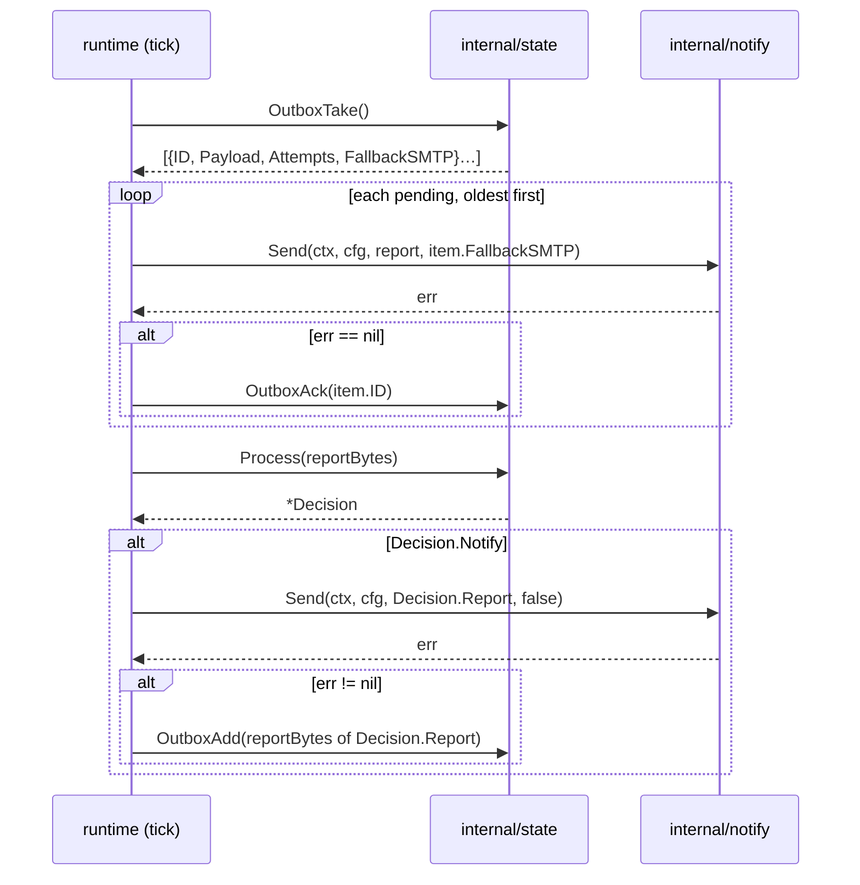

# Contract: state (Go)

> Conventions C1–C9 in [CONTRACTS.md](../CONTRACTS.md) are binding and win on conflict. Read them first.

`internal/state` + the `sentinel state` subcommand. The only component that writes persistent supervisor data, LLM-free, deterministic, and the single decider of **whether a tick notifies at all**. `notify` never decides; it sends what `tick` hands it.

### S.0 Resolved ownership (was contested; settled here)

| # | Decision |
|---|---|
| S-D1 | state owns `${STATE_DIR}/outbox/`, `Add`, `Take`, `Ack`. `notify` has no outbox, no `--retry-outbox`, and never writes under `$STATE_DIR`. |
| S-D2 | The outbox payload is the `decision.report` **document bytes**, so a retry renders a byte-identical POST. `fallback_smtp` is derived from `attempts >= OUTBOX_SMTP_AFTER` and handed to `notify.Send` as an argument, no second SMTP threshold anywhere. |
| S-D3 | state never reads or writes `tick-seq`. The sequence arrives in `Config.TickSeq` from `runtime`. |
| S-D4 | One file `heartbeat`, content `YYYY-MM-DD\n` (last heartbeat day), rewritten on **every** `Process` so its mtime is the liveness marker read by `sentinel health`. No `heartbeat-date`. |
| S-D5 | The dedup key is `internal/dedup`. `analyze` injects `findings[].key`; state consumes it and recomputes only when it is absent. |
| S-D6 | `decision.report` is a normal `report.Report` and **must validate against `report.schema.json`**, including `key`, `first_seen`, `occurrences` and a suppressed report's `status: "OK"`. |
| S-D7 | `resolved[]` never closes a key that appeared in the same tick's `findings[]`. |
| S-D8 | Findings are decoded into `report.Finding`; anything outside the schema is dropped, never passed through. |

### S.1 CLI

> **Tick ordering is owned by contracts/runtime.md R3.2, not by this diagram.** Where the two disagree, R3.2 wins: the outbox drain runs *after* `Process` and `notify.Send`, so a payload queued by a failed send is retried within the same tick. This diagram shows which calls exist and who owns them, not when they run in a tick.


```
sentinel state process             # stdin → decision.json on stdout
sentinel state history [n]         # default 5 → JSON array on stdout
sentinel state outbox-add          # stdin → entry id + "\n" on stdout
sentinel state outbox-take         # → JSON array on stdout
sentinel state outbox-ack <id>     # → nothing on stdout
sentinel health                    # exit 0 iff heartbeat mtime < 3 × TICK_INTERVAL
```

`history [n]` and `outbox-ack <id>` are the only subcommands taking a positional argument; `process` and `outbox-add` read stdin only (no file argument). `sentinel health` is dispatched by `main` to `state.Store.Health()`, `state` grows no `--health` flag.

Call order in one tick (strictly sequential, no locking):



### S.2 Inputs

**`process` stdin**, one `report.Report` document. Not an object, or no `findings` array ⇒ exit 65. Unknown fields are ignored.

**`outbox-add` stdin**, an opaque JSON **object**; state validates only that. In practice the marshaled `decision.report`.

**Files read**, all under `$STATE_DIR`: `heartbeat`, `active-alerts/*.json`, `history/*.json`, `outbox/*.json`. Nothing outside `$STATE_DIR` is read except stdin, and nothing outside it is ever written.

**`Loc` and `TickSeq` must be added to `internal/config` as part of T5**, S.2 lists both as consumed, and neither exists yet. `Loc *time.Location` is resolved once in `Load()` from `TZ` (the validation already calls `time.LoadLocation`; keep the result instead of discarding it), `state` must never call `LoadLocation` per `Process` nor read `os.Getenv("TZ")` itself, because `internal/config` is the single loader (C1). `TickSeq int64` is **not** env-derived: it is set programmatically by `runtime` after `Load()`, and it is the one field in `Config` that is, which S.3(a) already assumes (`cfg.TickSeq` if `> 0`). Touching a T2 package here is correct rather than scope creep: the alternative is state parsing its own environment, which C1 forbids.

**Configuration** arrives as `*config.Config` (`internal/config` is the single loader; a malformed or out-of-range value is fatal there with exit 78, so state contains no env parsing and no "ignore and default" policy). Consumed fields: `StateDir`, `HistoryKeep`, `RenotifyAlertSec`, `RenotifyWatchSec`, `StaleAlertSec`, `HeartbeatHour`, `OutboxMax`, `OutboxSMTPAfter`, `TickInterval` (for `Health`), `Loc` (from `TZ`), `Now` (from `SENTINEL_NOW`, test-only; zero ⇒ `time.Now()`), `TickSeq` (from runtime).

`ponytail: the heartbeat day and hour are evaluated in cfg.Loc. Compose pins TZ=UTC, so "08:00" is 08:00 UTC, 10:00 local on bam in summer. Change TZ, not the code, if the operator wants local mornings.`

### S.3 `Process` behaviour

`now = cfg.Now` if non-zero, else `time.Now().Unix()`.

**a) tick_seq**, first of: `cfg.TickSeq` if `> 0`, `report.meta.tick_seq` if present, else `0`. Never written.

**b) history rotation**, **executed after step (d)**, because it needs that step's post-update records: the input document with **every** finding annotated (`key`, `first_seen`, `occurrences` taken from its active-alert record, notified **and suppressed** alike), all other bytes and the finding order unchanged, written to `history/<now %010d>-<tick_seq %06d>.json`, then delete all but the `HISTORY_KEEP` newest by filename sort (lexical == chronological by construction). Unparsable history files still count against this cap, `state` prunes by filename sort alone and never opens a file to decide whether to keep it. How a reader handles one it kept is that reader's rule, not this one: see `contracts/analyze.md` §6 step 2 for `analyze`'s window.

**Not "verbatim", and not `decision.report` either, both are wrong, for different reasons.** `analyze` deliberately zeroes `first_seen`/`occurrences` on the document it hands over (`analyze.go` §6 step 7), so storing the input unchanged persists zeros; `omitempty` then drops them from the HISTORY projection and the LLM gets back the trend window it had before T4, a key with no growth signal, the exact defect T4 existed to fix, reopened invisibly with T4's own tests still green. Storing `decision.report` instead is worse: it holds only the **notified** findings (rule 1) or none at all (rule 4), so every suppressed finding would look resolved to `computeResolved` on the next tick, and an LLM-free path would start inventing all-clears, precisely what (e) forbids.

**c) stale expiry** (first), every active alert with `now - last_seen > STALE_ALERT_SEC` is deleted silently, no all-clear.

**d) per finding**, in input order. Key = `finding.Key` when non-empty **and matching `^[0-9a-f]{16}$`**, else `dedup.Key(component, evidence)`; the computed key is written back into the outgoing finding so every emitted document carries one.

**The shape check is a containment guard, not a validation nicety, and it must run before any path is built.** The key is joined into `active-alerts/<key>.json`, so a supplied `../../pwned` writes **outside `$STATE_DIR`**, reproduced against the built binary. The exit-5 output validation does not save us: it fires after step (d) has already written the file, so the report is rejected while the write stands, breaking S.2 ("nothing outside it is ever written"), A1 and the C4 whitelist. Recomputing is free because `dedup.Key` output always conforms, and it closes the whole class rather than the reported instance, including `../history/x`, which stays inside `$STATE_DIR` but drops a non-conforming filename into the directory `analyze` sorts and filters, and `..%2f`, which is not decoded and lands as junk.

Reachability is defense in depth rather than a live exploit: `analyze` overwrites `f.Key` on every finding, so today's `tick` pipeline cannot deliver a crafted key. But S-D5 makes `state` contract-bound to *trust* an injected key, `sentinel state process` reads arbitrary stdin as a documented ops path (S.1), and ARCHITECTURE §4 promises that prompt injection's worst case is "wrong text in a report", a write outside the state volume is strictly worse than the guarantee this system makes.

**A containment test must snapshot the PARENT of `$STATE_DIR`.** One rooted at the state dir cannot observe an escape by construction, the tautology trap this project has already hit twice.

| State of `active-alerts/<key>.json` | Decision | `reason` |
|---|---|---|
| absent (or corrupt ⇒ deleted, treated as absent) | **notify** | `new_finding` |
| present, severity rank increased (`info`0 < `watch`1 < `alert`2) | **notify** | `escalation` |
| present, `now - last_notified >= window(severity)` | **notify** | `renotify` |
| otherwise | suppress, `suppressed_count++` |, |

**`info` findings are never notification candidates**: the `new_finding` and `renotify` rows above do not apply to a finding whose severity is `info`; it is processed for its record and annotations exactly as any other finding and then counted into `suppressed_count`. The quiet-tick "all systems normal" finding is contract-mandated (`contracts/analyze.md`, Quiet ticks) and its key is `dedup.Key` over model free-text evidence, so every rephrasing mints a fresh key; a key-scoped suppression therefore cannot hold, severity is the only stable handle. Escalation is unaffected by construction: an incoming `info` can never out-rank a stored severity (rank 0 exceeds nothing), and a stored `info` record seen again at `watch` or `alert` arrives with that higher severity and takes the escalation row, not this gate.

`window(alert) = RENOTIFY_ALERT_SEC`, `window(watch|info) = RENOTIFY_WATCH_SEC`. De-escalation never notifies on its own; it lowers the stored severity and switches the window. The record is rewritten on **every** occurrence (`last_seen`, `severity`, `occurrences`, `tick_seq_last`); `last_notified`/`notify_count` change only when the finding actually enters the outgoing report. **Every** finding, notified and suppressed, is annotated with `key`, `first_seen` and `occurrences` from its (post-update) record. The notified ones carry the annotations into the outgoing report; all of them carry it into the history write of step (b), which is what makes `analyze`'s trend rule answerable.

**e) resolved / all-clear**, each entry of `report.resolved[]` is a 16-hex `dedup.Key`. Reject any entry not matching `^[0-9a-f]{16}$` (drop it, do not error) and compare the remainder against the stored `key` of every active alert **not touched in step (d) this tick** (S-D7). Exact string equality, no normalization, no case folding, no substring matching. **Never build a path from the entry**; it identifies a record already read, and the file to delete is that record's `os.ReadDir` entry name.

**Why keys, and what this replaced.** `analyze` used to render `resolved[]` as the past finding's evidence truncated to 80 runes, because findings have no headline of their own. Matching only on `headline` therefore never matched anything: every all-clear was silently dropped and a genuinely cleared alert sat in `active-alerts/` until `STALE_ALERT_SEC` expired it without ever telling the operator. The accommodation was to match on headline **and** evidence, which worked but left a collision class, two alerts whose evidence agreed in the first 80 runes were indistinguishable, and one entry could close both. `analyze` now emits the key itself (analyze §6 step 7), so the match is exact and both the dual-match rule and the collision class are gone.

The **output** side is unchanged and still human. On match: append the *stored* headline to `all_clear` (deduplicated, first occurrence wins) and delete **the file this record was read from, the directory entry name from `os.ReadDir`, never a path built from the record's own `key` field**, which guarantees exactly one all-clear. A string matching nothing is dropped silently; an LLM must not be able to invent an all-clear. A key that was never notified is deleted without an all-clear.

**Why the deletion must use the directory entry, not the record's `key`.** "Delete the key file" is ambiguous between "the file named by the record's key" and "the file this record was read from", and the two are identical only while keys are trustworthy, the assumption the S.3(d) guard exists because we cannot make. A stored record containing `"key": "../../victim"` steers `os.Remove` outside `$STATE_DIR`, reproduced against a build carrying the S.3(d) guard: the guard stops such a record being *planted* through step (d), but any record already on a live volume from an older build, or corrupted, or hand-edited, still drives the escape. Deleting by `entry.Name()` costs nothing (it is already in hand from the directory read), needs no validation, and is also the *correct* file when the two disagree. `expireStaleAlerts` already does this.

**f) heartbeat**, due when the `heartbeat` file's content is absent or older than today (in `cfg.Loc`) **and** the local hour is `>= HEARTBEAT_HOUR`. The window is open-ended: a container down until 11:00 still sends that day's heartbeat, and never two on one day. The content is set to today whenever **any** notification is emitted (finding, all-clear or heartbeat). The file is rewritten on every `Process` regardless, so its mtime tracks liveness.

**g) message assembly**, at most one message per tick, first matching rule:

1. `notified` non-empty ⇒ `status` = highest notified severity (`alert→ALERT`, `watch→WATCH`); `findings` = the notified findings **plus this tick's `info` findings**, annotated, in input order, the info ride-along keeps the analyzer's "everything else" context on a message already being sent without ever causing one, and `status` is derived from the notified findings alone (an `info` can therefore never be the highest, the `info→OK` mapping is unreachable here since the S.3(d) gate keeps info out of `notified`); `headline`/`body` verbatim from input; `resolved` = `all_clear`; `reason` = the reason of the **first** notified finding in input order.
2. else `all_clear` non-empty ⇒ `status="OK"`, `headline="Resolved: <first>"` (`+ " (+N more)"` when >1) **truncated to 80 runes** so the schema bound holds; `body` = one `- ` bullet per entry; `reason="all_clear"`.
3. else heartbeat due **and the input document does not carry `meta.degraded`** ⇒ `status="OK"`, `headline="Daily heartbeat: all clear"`, `body="No open findings. <k> ticks since <RFC3339 UTC of the oldest kept history entry>."` (`k` = number of kept history files). **When `k == 0` the timestamp is `now`**, i.e. `cfg.Now` when set, else the live clock captured once at the top of `Process`, never a second `time.Now()` call deeper in the code (C9). This case is reachable in production, not theoretical: on a fresh `/state` volume the first heartbeat assembles its body while `history/` is still empty, because the history write happens after step (g), `reason="heartbeat"`, `heartbeat=true`. A degraded document that is otherwise due falls through to rule 4 instead: the analyzer did not run this tick, so "all clear" is not a claim the document can back up, and the heartbeat file stays due until a healthy tick can send it honestly.
4. else `notify=false`, `reason="suppressed"`, `status="OK"`, `findings=[]`, `resolved=[]`, `headline`/`body` verbatim from input.

Rule 4's `status="OK"` is what keeps a suppressed document schema-valid (`status` = highest finding severity, and there are no findings).

### S.4 Output

#### `process` → `decision.json` on stdout (compact, one line + `\n`)

| Field | Type | Meaning |
|---|---|---|
| `notify` | bool | send `.report` or not |
| `reason` | string | `new_finding`\|`escalation`\|`renotify`\|`all_clear`\|`heartbeat`\|`suppressed` |
| `tick_seq` | int64 | this tick's sequence number |
| `suppressed_count` | int | findings withheld by re-notify windows or the S.3(d) info gate |
| `active_count` | int | open keys after this tick |
| `heartbeat` | bool | this message *is* the daily heartbeat |
| `report` | object | a `report.Report` that validates against `report.schema.json` |

```json
{
  "notify": true,
  "reason": "escalation",
  "tick_seq": 289,
  "suppressed_count": 1,
  "active_count": 2,
  "heartbeat": false,
  "report": {
    "status": "ALERT",
    "headline": "ZFS checksum errors on hotstore rising (1 -> 7)",
    "body": "The mirror member seagate-zvtazeam-crypt has accumulated 7 checksum errors since 06:12. The mirror partner is clean, so no data is at risk yet, but the counter is now rising across three consecutive scrub windows instead of staying at 1.",
    "findings": [
      {
        "severity": "alert",
        "component": "zfs",
        "evidence": "Aug 15 09:41:02 bam zed[2914]: eid=143 class=checksum pool='hotstore' vdev=seagate-zvtazeam-crypt cksum_errors=7",
        "explanation": "Checksum errors on one mirror half are no longer isolated; the counter grew from 1 to 7 within 24 h.",
        "analysis": "Trend, not transient. Redundancy intact (mirror partner reports 0 errors, SMART clean). Blast radius limited to hotstore; a second failure would be needed for data loss.",
        "recommendation": "If the counter keeps rising after the next scrub, replace seagate-zvtazeam-crypt. Not executed by the supervisor.",
        "key": "9f2c41ab77de0315",
        "first_seen": 1755155520,
        "occurrences": 14
      }
    ],
    "resolved": ["Load average elevated on bam"]
  }
}
```

#### `history [n]`

JSON array of the `n` newest stored reports, **newest first**, the trend input for `analyze`. Fewer available ⇒ shorter array; none ⇒ `[]`, never `null`. Unparsable files are skipped.

#### `outbox-take`

```json
[{"id":"1755248470-417","payload":{"status":"ALERT","headline":"…","body":"…","findings":[],"resolved":[]},"attempts":1,"fallback_smtp":false}]
```

Oldest first. `attempts` is incremented on every returned entry and persisted before returning. `fallback_smtp` is `true` once `attempts >= OUTBOX_SMTP_AFTER`, the second-path flag ARCHITECTURE §5 requires; `tick` passes it straight into `notify.Send`. state itself sends nothing.

#### `outbox-add`

Prints the new entry id (`<epoch>-<rand3>`, e.g. `1755248470-417`) and a newline, nothing else. At `OUTBOX_MAX` the oldest entry is deleted first, so the volume cannot grow unbounded while Apprise is down.

#### `outbox-ack <id>`

No stdout. Removes exactly one file; unknown id ⇒ exit 5.

### S.5 Filesystem contract

```
$STATE_DIR/
├── heartbeat                   # "YYYY-MM-DD\n", mtime = liveness
├── history/
│   └── 1755248461-000289.json  # input report, annotated per S.3(b), max HISTORY_KEEP
├── active-alerts/
│   └── 9f2c41ab77de0315.json
└── outbox/
    └── 1755248470-417.json     # {"id","payload","attempts","created"}
```

`tick-seq`, `baseline-ports`, `raw-alerts/` and `deep-queue/` live in the same volume but belong to `runtime`/`collect`/`analyze`, state neither reads nor writes them. `/tmp` is not used.

`active-alerts/<key>.json`:

```json
{
  "key": "9f2c41ab77de0315",
  "component": "zfs",
  "evidence_core": "bam zed[2914]: eid=# class=checksum pool='hotstore' vdev=seagate-zvtazeam-crypt cksum_errors=#",
  "headline": "ZFS checksum errors on hotstore rising (1 -> 7)",
  "severity": "alert",
  "first_seen": 1755155520,
  "last_seen": 1755248461,
  "last_notified": 1755248461,
  "notify_count": 2,
  "occurrences": 14,
  "tick_seq_first": 12,
  "tick_seq_last": 289
}
```

`outbox/<id>.json`:

```json
{"id":"1755248470-417","payload":{"status":"ALERT","headline":"…","body":"…","findings":[],"resolved":[]},"attempts":2,"created":1755248470}
```

`payload` is the `decision.report` document verbatim, so a retry re-renders an identical POST.

**A corrupt filename is unreclaimable under the corrupt-content rule, which is why it needs its own.** Those three clauses, skipped, counted, ackable, are mutually unsatisfiable for a name that `outboxIDRe` refuses: no id exists that `OutboxAck` will accept, so the entry can never be removed, yet it keeps consuming the cap forever. `trimOutbox` evicts by lexical filename order, and a junk name sorts after every numeric one, so it is never chosen. Measured on the built binary: 50 junk files, then `outbox-add` on a real ALERT returns a fresh id and **exit 0** while the alert is immediately evicted and `outbox-take` returns nothing, silent alert loss behind a success code, the same false-healthy class this component already had to fix once. Such a file can never be a legitimate queued alert (`OutboxAdd` cannot produce the name), so reclaiming it is the only reading that satisfies S.7's "no alert is lost".

```go
// ponytail: no lock file, the tick loop is strictly sequential (ARCHITECTURE §5).
// Add flock only if ticks ever run in parallel.
```

### S.6 Exit codes (subset of the binary-wide table)

| Code | When |
|---|---|
| 0 | success, including `notify=false` and an empty outbox |
| 1 | marshal or stdout-write failure |
| 5 | state failed: `outbox-ack` with an unknown id, unreadable/unwritable record ⇒ `tick` sends the report unfiltered |
| 64 | unknown/missing subcommand, unexpected positional argument, `outbox-ack` without an id |
| 65 | stdin is not valid JSON, `process` input has no `findings` array, `outbox-add` input is not a JSON object |
| 69 | `$STATE_DIR` missing, not a directory, or not writable (probed by creating and removing a temp file) |

Nothing goes to stdout on a non-zero exit; diagnostics go to stderr through `internal/logging`.

### S.7 Error behaviour (ARCHITECTURE §5)

| Failure | Behaviour |
|---|---|
| Analyzer fallback report (`status=ALERT`, "Analyzer unavailable", `component: "meta"`, stable key) | processed like any report, a persistent agy outage re-notifies on the ALERT window (1 h), not every 5 min |
| Collector fallback report | identical handling, its own stable key |
| Apprise down | `tick` calls `OutboxAdd`; retried on every following tick via `OutboxTake`; `attempts` increments; `fallback_smtp` flips true at `OUTBOX_SMTP_AFTER`, which is how the SMTP second path is reached |
| Raw alert fails to send | `tick` queues it through the same `OutboxAdd`, no alert is lost |
| Corrupt `active-alerts/*.json` | deleted, finding treated as new (one extra notification, never a crash) |
| Corrupt `history/*.json` | skipped by `History`, still counted for rotation |
| Corrupt `outbox/*.json` **content** (valid `<epoch>-<rand3>.json` name) | skipped by `OutboxTake`, still counted against `OUTBOX_MAX`, removable by `OutboxAck` |
| Corrupt outbox **filename** (does not match `^[0-9]+-[0-9]{3}\.json$`) | **evicted first by `trimOutbox`, before any well-formed entry**, and never counted as capacity that a real alert could occupy |
| `meta.collector_errors[]` in facts | not state's concern, arrives as a normal WATCH finding and dedups like any other |
| `$STATE_DIR` unwritable | exit 69 immediately; `tick` sends the report unfiltered so no alert is lost to a state failure |
| `resolved[]` naming an unknown key, a currently-active one, or a non-hex string | ignored, no all-clear |

### S.8 Package layout and exported API

```
internal/state/state.go    # Store: New, Process, History, Health
internal/state/alerts.go   # ActiveAlert load/save/expire
internal/state/outbox.go   # OutboxAdd/Take/Ack, cap enforcement
internal/state/atomic.go   # writeAtomic(dir, name string, b []byte, mode os.FileMode) error
```

```go
package state

type Decision struct {
    Notify          bool          `json:"notify"`
    Reason          string        `json:"reason"`
    TickSeq         int64         `json:"tick_seq"`
    SuppressedCount int           `json:"suppressed_count"`
    ActiveCount     int           `json:"active_count"`
    Heartbeat       bool          `json:"heartbeat"`
    Report          report.Report `json:"report"`
}

type ActiveAlert struct {
    Key          string `json:"key"`
    Component    string `json:"component"`
    EvidenceCore string `json:"evidence_core"`
    Headline     string `json:"headline"`
    Severity     string `json:"severity"`
    FirstSeen    int64  `json:"first_seen"`
    LastSeen     int64  `json:"last_seen"`
    LastNotified int64  `json:"last_notified"`
    NotifyCount  int    `json:"notify_count"`
    Occurrences  int    `json:"occurrences"`
    TickSeqFirst int64  `json:"tick_seq_first"`
    TickSeqLast  int64  `json:"tick_seq_last"`
}

type OutboxEntry struct { // on disk
    ID       string          `json:"id"`
    Payload  json.RawMessage `json:"payload"`
    Attempts int             `json:"attempts"`
    Created  int64           `json:"created"`
}

type OutboxItem struct { // OutboxTake output
    ID           string          `json:"id"`
    Payload      json.RawMessage `json:"payload"`
    Attempts     int             `json:"attempts"`
    FallbackSMTP bool            `json:"fallback_smtp"`
}

type Store struct{ /* cfg *config.Config */ }

func New(cfg *config.Config) (*Store, error)          // ErrStateDir → exit 69
func (s *Store) Process(raw []byte) (*Decision, error) // history stores the input annotated per S.3(b), never verbatim
func (s *Store) History(n int) ([]json.RawMessage, error)
func (s *Store) OutboxAdd(raw []byte) (string, error)
func (s *Store) OutboxTake() ([]OutboxItem, error)
func (s *Store) OutboxAck(id string) error            // ErrUnknownID → exit 5
func (s *Store) Health() error                        // nil iff heartbeat mtime younger than 3 × TickInterval; cmd maps any error to exit 1

var (
    ErrStateDir  = errors.New("state dir not writable") // → 69
    ErrBadInput  = errors.New("invalid input json")     // → 65
    ErrUnknownID = errors.New("unknown outbox id")      // → 5
)
```

### S.9 Test contract, `internal/state/state_test.go`

Every case builds a `*config.Config` with a fresh `t.TempDir()` and an explicit `Now`. **RED first**: the whole file is written and run before `internal/state` exists; the expected initial failure is `undefined: state.New` on every case.

| # | Case | Assertion |
|---|---|---|
| S1 | **history annotation, the cross-component assertion (C9)**: one `Process` with one notified and one suppressed finding | the written `history/*.json` carries non-zero `occurrences` **and** `first_seen` on **both** findings, and its name matches `^[0-9]{10}-[0-9]{6}\.json$`. Read the file from disk, asserting on the returned `Decision` proves nothing about what `analyze` will later read |
| S2 | no stray files in `history/` after several `Process` calls | `os.ReadDir(history/)` contains only `*.json`; a leftover `.tmp-*` evicts a real report from `analyze`'s window, which sorts by name and keeps the newest N |
| S3 | `Health()` with a fresh heartbeat / stale / missing file | nil, then non-nil, then non-nil; `cmd` maps non-nil to exit 1 |
| 1 | same WATCH finding, 3 ticks, `Now` +5 min each | exactly 1 notification: tick 1 `notify=true`; ticks 2–3 `notify=false`, `reason="suppressed"`, `suppressed_count=1`, `status="OK"` |
| 2 | tick 4 with `severity:"alert"` | `notify=true`, `reason="escalation"`, with case 1: T5's AC "exactly 1 notification + 1 escalation" |
| 3 | WATCH finding at +5 h 59 min / +6 h 1 min | suppressed / `renotify` |
| 4 | ALERT finding at +59 min / +1 h 1 min | suppressed / `renotify` |
| 5 | report with `resolved:["<key>"]`, finding absent from `findings[]`, twice | first ⇒ `notify=true`, `reason="all_clear"`, one entry carrying the **stored headline**, key file gone; second ⇒ `notify=false` |
| 6 | `resolved` naming a never-active key, and separately a non-hex string | both ⇒ `notify=false`, `report.resolved == []`; the non-hex entry is dropped without error |
| 7 | two findings sharing a headline; next tick one persists and the report resolves the other's key | the persisting key survives, the other closes, `report.resolved` has exactly 1 entry (S-D7). Add: two alerts whose evidence agrees in its first 80 runes, resolving one must not close the other, the case the old evidence match could not distinguish |
| 8 | all-clear headline of 80 runes + `(+2 more)` | emitted `headline` ≤ 80 runes and validates |
| 9 | 60 reports processed | `len(history/) == 50`, newest present, oldest 10 gone, names sort chronologically |
| 10 | outbox | 2× `OutboxAdd` ⇒ `OutboxTake` returns 2 oldest-first with `attempts=1`; two more takes ⇒ `fallback_smtp=true` at attempt 3; `OutboxAck` removes exactly one; `OutboxAck("bogus")` ⇒ `ErrUnknownID`; 60 adds ⇒ 50 kept, oldest dropped; payload round-trips byte-identically |
| 11 | heartbeat | 07:59 + empty report ⇒ `notify=false`; 08:01 ⇒ `heartbeat=true`, `reason="heartbeat"`; same day again ⇒ `false`; next day 11:00 ⇒ `true` |
| 12 | heartbeat suppression | an ALERT notified at 09:00 ⇒ no heartbeat that day; `heartbeat` content == today |
| 13 | liveness | the `heartbeat` file's mtime advances on **every** `Process`, including a fully suppressed one; `Health()` is nil there and non-nil after backdating the mtime past `3 × TICK_INTERVAL` |
| 14 | stale expiry | active alert with `last_seen` 25 h old + empty report ⇒ key file gone, `notify=false`, `resolved == []` |
| 15 | error paths | non-JSON ⇒ `ErrBadInput`; object without `findings` ⇒ `ErrBadInput`; nonexistent `StateDir` ⇒ `ErrStateDir`; truncated `active-alerts/*.json` ⇒ no error, finding re-notified as `new_finding`; corrupt `history/*.json` ⇒ skipped, still rotated |
| 16 | write containment (A1) | snapshot the filesystem around a full `Process`; every modified path is under `StateDir`, and the run succeeds with the process working directory set to a `0o555` dir |
| 17 | `History(5)` | 5 newest, newest first; empty dir ⇒ `[]`, not `null` |
| 18 | tick_seq is read-only | no `tick-seq` file is created or modified; `cfg.TickSeq` wins over `meta.tick_seq`, which wins over `0` |
| 19 | key reuse | a finding arriving with `key` set keeps it byte-for-byte; a finding without one gets `dedup.Key(component, evidence)`, and one shared test proves `analyze` and `state` derive the identical key from the same evidence |
| 20 | schema agreement | every `decision.report` from cases 1–14 validates against `report.schema.json`, suppressed and all-clear documents included |
| 21 | CLI exit codes | the §S.6 mapping via `cmd/sentinel`, and `outbox-add` prints only the id + `\n` |
| 22 | info gate | 3 ticks, one `info` finding each with **distinct evidence** (distinct keys) ⇒ every tick `notify=false`, `reason="suppressed"`, `suppressed_count=1`; all 3 records exist with `notify_count=0`; the history write still carries non-zero `key`/`first_seen`/`occurrences` on the gated finding |
| 23 | info escalation survives the gate | tick 1 `info`, tick 2 same evidence at `watch` ⇒ `notify=true`, `reason="escalation"` |
| 24 | info ride-along | one `alert` + one `info` in the same tick ⇒ `notify=true`, `status="ALERT"`, emitted `findings` = both, input order, the info one annotated |
| 25 | heartbeat not swallowed | fresh `StateDir`, 08:01, report with one `info` finding ⇒ `heartbeat=true`, `reason="heartbeat"`, never `new_finding` |

---

